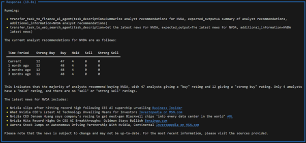
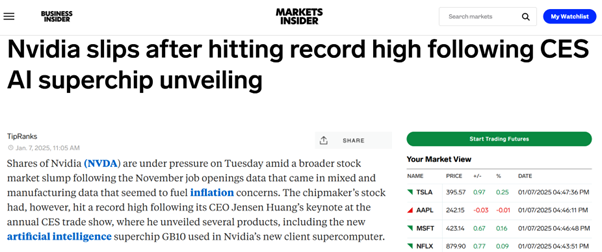

# 🌟 **Multi-Agent Application for Web Search and Financial Analysis**

## 📖 **Overview**
This project demonstrates the use of a **multi-agent system** to perform tasks like financial analysis and web searches using the `phi` framework. The application employs two specialised agents that collaborate to fulfill user queries dynamically and provide responses in a structured format.

### **Agents Included**:
1. **Web Search Agent**: Uses DuckDuckGo to retrieve web-based information.
2. **Finance AI Agent**: Retrieves financial data, including:
   - Stock prices
   - Analyst recommendations
   - Company news

The application dynamically processes tasks and outputs results in **Markdown** for better readability.

## 🚀 **Key Features**
- **Multi-Agent System**: Seamless collaboration between agents to handle complex queries.
- **Dynamic Outputs**: Responses are enriched with tables, links, and Markdown formatting.
- **Specialised Tools**: Integration with DuckDuckGo and YFinanceTools for targeted functionalities.

## 🛠️ **Setup Instructions**

### 1. **Environment Setup**
1. Clone the repository and navigate to the project directory.
2. Create a virtual environment using Python 3.10:
   ```bash
   python -m venv myenv
   ```
3. Activate the virtual environment:
   - **Windows**:
     ```bash
     myenv\Scripts\activate
     ```
   - **Mac/Linux**:
     ```bash
     source myenv/bin/activate
     ```

### 2. **Install Dependencies**
📦 Install the required libraries:
```bash
pip install phi dotenv
```

### 3. **Run the Application**
▶️ Execute the script to start the server:
```bash
python multi_agent.py
```

## 📂 **Application Workflow**

### 1. **Executing a Query**
When you run the application, it initialises the agents and processes the query:  
**"Summarise analyst recommendation and share the latest news for NVDA"**

📸 **Console**:



The output includes:
- **Analyst Recommendations**: Displays the number of analysts with "Buy", "Strong Buy", "Hold", etc.
- **Latest News**: Summarises headlines with links to full articles.

### 2. **Viewing a News Article**
One of the links from the output leads to a news article discussing **Nvidia's performance** and its AI chip unveiling at CES.

📸 **News Article**:



## 🧠 **Agent Overview**

### **1. Web Search Agent**
🔍 **Purpose**: Performs web searches using DuckDuckGo.

- **Model**: Groq (`llama-3.1-70b-versatile`)
- **Key Features**:
  - Retrieves web-based information.
  - Always includes sources for reliability.

### **2. Finance AI Agent**
📈 **Purpose**: Provides financial insights using YFinanceTools.

- **Model**: Groq (`llama-3.1-70b-versatile`)
- **Key Features**:
  - Retrieves stock prices, analyst recommendations, and company news.
  - Outputs data in well-formatted tables for readability.

## 📜 **Example Interactions**

### **Input Query**:
```
Summarise analyst recommendation and share the latest news for NVDA
```

### **Response**:
#### Analyst Recommendations:
| Time Period | Strong Buy | Buy | Hold | Sell | Strong Sell |
|-------------|------------|-----|------|------|-------------|
| Current     | 12         | 47  | 4    | 0    | 0           |
| 1 month ago | 12         | 48  | 4    | 0    | 0           |

#### Latest News:
- **"Nvidia slips after hitting record high following CES AI superchip unveiling"**  

  [Business Insider](https://www.businessinsider.com)


## 📦 **Project Structure**
```
├── financial_agent.py     # Main application file
├── requirements.txt       # Required dependencies
├── images/                # Folder containing screenshots
    ├── output.png
    ├── news.png
```

## 🌟 **Future Enhancements**
1. Add more financial tools for broader analysis (e.g., Morningstar, Alpha Vantage).
2. Include support for more advanced natural language queries.
3. Optimise the multi-agent collaboration for faster responses.

Feel free to experiment with the application and enhance its capabilities! 🚀
