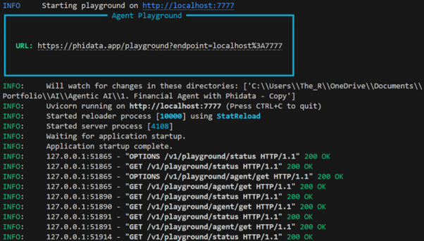
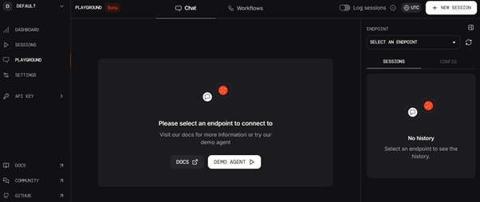
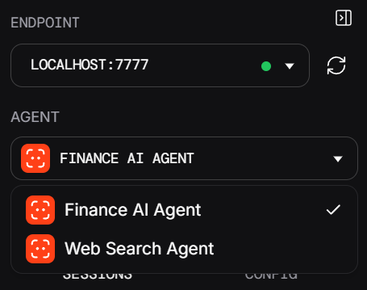
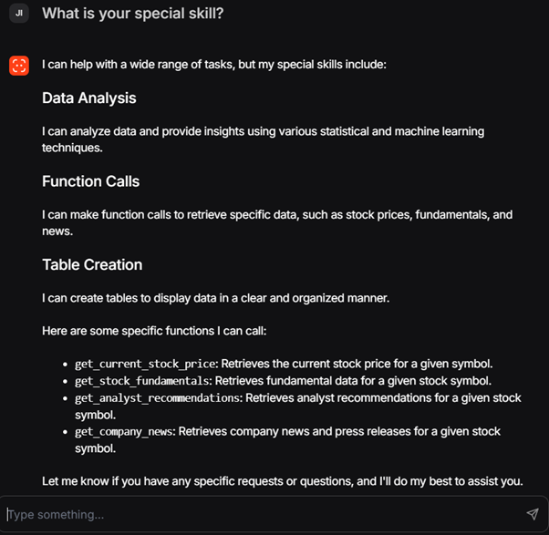
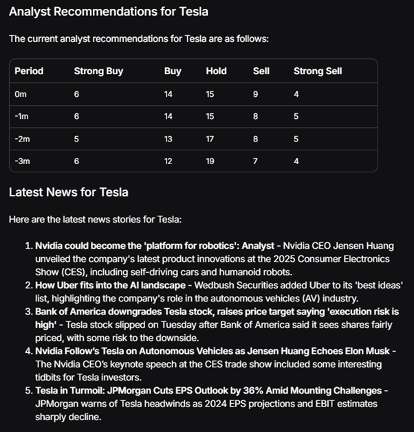
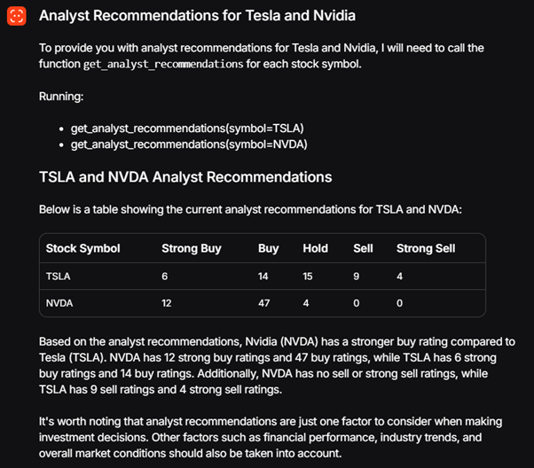

# 🌟 **PhiData Playground Application for Web Search and Financial Analysis**

## 📖 **Overview**
This project demonstrates the creation of a **PhiData Playground**, which serves as an interactive platform for web search and financial analysis. The application leverages a **multi-agent system** powered by the `phi` framework, enabling users to perform tasks such as retrieving stock information, analyst recommendations, and company news, as well as performing web searches.

The application includes:
1. **Web Search Agent**: Uses DuckDuckGo for web searches.
2. **Finance AI Agent**: Retrieves financial data like stock prices, analyst recommendations, and company news using YFinanceTools.

The app is served locally and can be accessed via a browser interface. Below is a detailed explanation of how the application works, including screenshots of its functionality.

## 🚀 **Key Features**
1. **Interactive Playground**: A web-based UI to interact with agents.
2. **Multi-Agent System**: Collaborating agents for efficient query handling.
3. **Customisable**: Easily extendable with new agents and tools.
4. **Markdown Outputs**: Responses are formatted for better readability.

## 🛠️ **Setup Instructions**

### 1. **Environment Setup**
1. Clone the repository and navigate to the project directory.
2. Create a virtual environment using Python 3.10:
   ```bash
   python -m venv myenv
   ```
3. Activate the virtual environment:
   - **Windows**:
     ```bash
     myenv\Scripts\activate
     ```
   - **Mac/Linux**:
     ```bash
     source myenv/bin/activate
     ```

### 2. **Install Dependencies**
📦 Install the required libraries:
```bash
pip install phi dotenv
```

### 3. **Run the Application**
▶️ Execute the script to start the server:
```bash
python playground.py
```

### 4. **Access the Playground**
🌐 Open your browser and navigate to:
```
http://localhost:7777
```

## 📂 **Application Flow**

### 1. **Console Output**
When you run the script, the server starts, and the console displays the connection information. This step creates a link between the application and the **PhiData Playground**.

📸 **Console Output Screenshot**:



### 2. **Accessing the Playground**
Once the server is running, open your browser and navigate to `http://localhost:7777`. You'll see the PhiData Playground interface.

📸 **PhiData Playground Screenshot**:



### 3. **Selecting an Endpoint**
On the right-hand side of the Playground, you can select the `localhost:7777` endpoint to connect to the application. From the dropdown menu, you can also see the agents available in the application.

📸 **Endpoint Selection Screenshot**:


### 4. **Agent Demo**
You can interact with the agents by asking questions or performing tasks. For example, asking the agents "What is your special skill?" provides a response detailing their capabilities.

📸 **Demo Screenshot**:


### 5. **Agent Queries**
Here are examples of queries you can perform:
- Retrieve analyst recommendations for **Tesla** and the latest news.
- Compare the performance of **Nvidia** and **Tesla** stocks.

📸 **Tesla Query Screenshot**:


📸 **Nvidia vs Tesla Comparison Screenshot**:



## 🧠 **Agent Overview**

### **1. Web Search Agent**
🔍 **Purpose**: Performs web searches for user queries using DuckDuckGo.

- **Model**: Groq (`llama-3.1-70b-versatile`).
- **Features**:
  - Retrieves web-based information.
  - Always includes sources in responses.

### **2. Finance AI Agent**
📈 **Purpose**: Provides financial insights using YFinanceTools.

- **Model**: Groq (`llama-3.1-70b-versatile`).
- **Features**:
  - Retrieves stock prices, analyst recommendations, and company news.
  - Displays data in well-formatted tables.


## 📜 **Example Interactions**

### **Input**: "Summarise analyst recommendations for Tesla"
### **Response**:
| Analyst | Recommendation | Rating |
|---------|----------------|--------|
| John Doe | Buy            | 4.5/5  |
| Jane Smith | Hold          | 3.5/5  |


### **Input**: "Compare Nvidia and Tesla stocks"
### **Response**:
| Stock   | Current Price | Analyst Rating | News Highlights                              |
|---------|---------------|----------------|---------------------------------------------|
| Nvidia  | $560          | Buy            | "Nvidia launches new AI chip for data centers." |
| Tesla   | $320          | Hold           | "Tesla faces production delays in new factory." |


## 📦 **Project Structure**
```
├── playground.py         # Main application file
├── requirements.txt      # Required dependencies
├── images/               # Folder containing screenshots
    ├── console.png
    ├── playground.png
    ├── endpoint.png
    ├── demo.png
    ├── tesla.png
    ├── nvi_telsa.png
```

## 🌟 **Future Enhancements**
1. Add more agents for specialised tasks.
2. Integrate additional financial tools (e.g., Morningstar, Alpha Vantage).
3. Improve UI features in the PhiData Playground.

Feel free to experiment with the agents and extend their capabilities! 🚀
