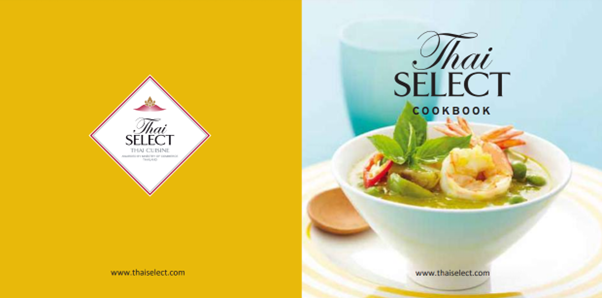
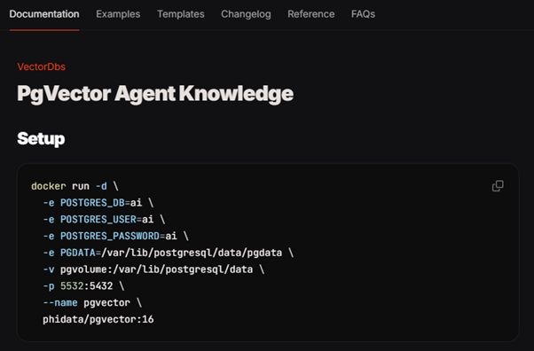
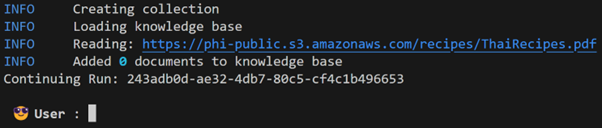
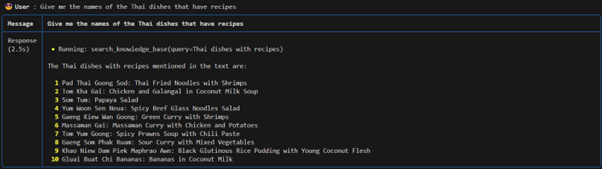
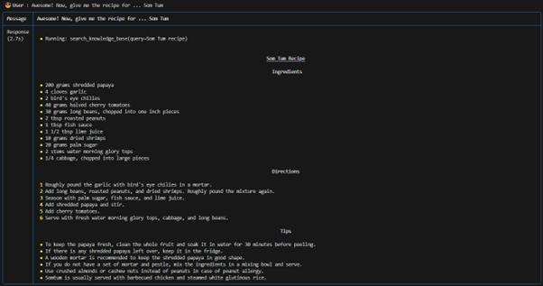
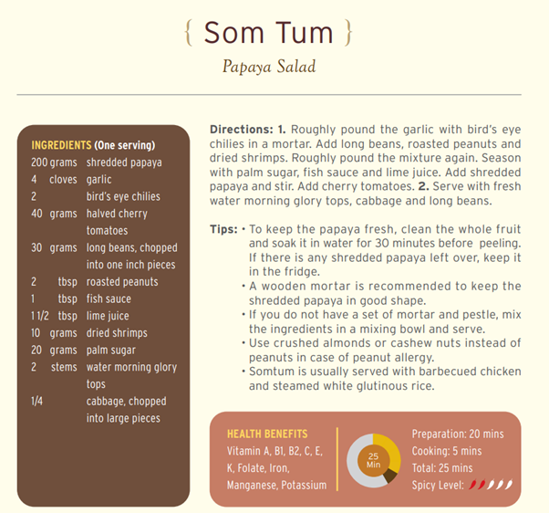

# 🍜 **Thai Recipe Assistant**

## 📖 **Overview**
Welcome to the **Thai Recipe Assistant**, a Retrieval-Augmented Generation (RAG) application designed to provide intelligent query responses using a database of Thai recipes. This project demonstrates how to use a **Postgres vector database** to store embeddings of a PDF file and retrieve detailed answers based on user prompts.

### **Key Features**:
1. Embeds a **Thai recipe cookbook** into a Postgres vector database for intelligent query answering.
2. Uses a **Dockerized Postgres container** for vector storage.
3. Supports complex natural language queries to explore recipes, ingredients, and instructions.
4. Powered by **Groq's large language model (LLM)** for enhanced response accuracy.

## 🌟 **Introductory Image**
This assistant is built on a beautiful collection of **Thai recipes**, captured in this cookbook:

📸 **Thai Recipes Cookbook**:


🖇️ **PDF URL**: [Thai Recipes PDF](https://phi-public.s3.amazonaws.com/recipes/ThaiRecipes.pdf)

## 🔧 **Setting Up the Postgres Vector Database**

To store PDF embeddings, we use a **Dockerized Postgres vector database**. Follow the steps below to set it up:

### **1. Create the Docker Container** 📦
Navigate to the **pgvector** documentation for detailed instructions:
[PgVector Setup](https://docs.phidata.com/vectordb/pgvector)

### **2. Run the Docker Command** 🐋
Copy the following command into your **bash terminal** to create and run the container:

📸 **Setup Command**:


## 🛠️ **Code Walkthrough**

### **1. Knowledge Base**
The assistant uses a **PDF knowledge base** created from the URL provided in the code. Each page of the PDF is embedded into a vector representation for efficient search and retrieval:
```python
knowledge_base = PDFUrlKnowledgeBase(
    urls=["https://phi-public.s3.amazonaws.com/recipes/ThaiRecipes.pdf"],
    vector_db=PgVector2(
        collection="recipes",  # Collection name in the vector DB
        db_url=db_url          # Connection URL for the Postgres database
    )
)
```

### **2. Assistant Configuration**
The assistant is initialised with:
- A **knowledge base** for PDF retrieval.
- A **Groq LLM** for query answering.
- The ability to search the knowledge base and leverage chat history for context:
```python
assistant = Assistant(
    knowledge_base=knowledge_base,
    llm=Groq(model="llama-3.1-8b-instant"),
    search_knowledge=True,
    read_chat_history=True,
    show_tool_calls=True
)
```

## ▶️ **Running the Application**
Once the Docker container is set up and the application is ready, run the following command:
```bash
python pdf_assistant.py
```

### **Console Output**
The assistant will load the PDF into the knowledge base. On the first run, it will add all 14 pages of the PDF as documents. In subsequent runs, it skips re-adding them.

📸 **Loading Knowledge Base**:


## 💬 **Interacting with the Assistant**

### **1. Query: "Give me the names of the Thai dishes that have recipes"**
The assistant provides a neatly formatted list of all the Thai dishes available in the cookbook:

📸 **Dish List Output**:



### **2. Query: "Awesome! Now, give me the recipe for ... Som Tum"**
The assistant retrieves and displays the full recipe and instructions for **Som Tum (Papaya Salad)**.

📸 **Som Tum Recipe Output**:



## 🔍 **Verification**
To verify the assistant's output, we compare its response to the actual recipe in the cookbook. As seen below, the assistant’s instructions are **accurate** and match the source PDF.

📸 **Recipe Verification**:



## 🌐 **How It Works**
1. **Knowledge Base**: The assistant loads the cookbook's recipes into a vector database.
2. **Embeddings**: Each page of the PDF is converted into embeddings using the `PgVector2` module.
3. **Query Answering**: User queries are matched against embeddings to retrieve relevant text.
4. **LLM Responses**: Groq's LLM processes the retrieved text to craft detailed and contextual responses.

## 💡 **Future Enhancements**
1. Add more cookbooks or sources for diverse recipes.
2. Extend query support to handle advanced filters (e.g., ingredients, cooking time).
3. Integrate multilingual support to expand usability globally.

Feel free to try the assistant and explore the wonderful world of **Thai cuisine**! 🍲 Let me know if you’d like further refinements or additional features. 🚀