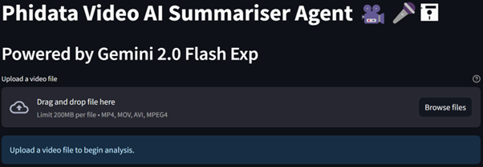
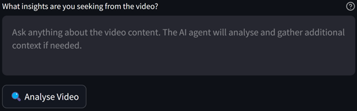
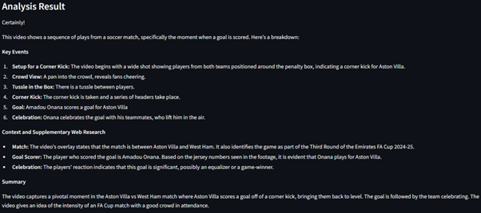

# 🎥 **Phidata Video AI Summariser Agent**

## 📖 **Overview**
Welcome to the **Phidata Video AI Summariser Agent**, a cutting-edge Streamlit web application powered by a multimodal AI agent. This application allows users to upload videos, ask questions about the content, and receive accurate and actionable insights. The application combines the Gemini 2.0 AI model, DuckDuckGo for supplementary research, and Google Generative AI for advanced analysis.

### **Key Features**:
1. 🔍 **Video Analysis**: Upload a video and analyse its content for detailed insights.
2. 🌐 **Multimodal AI Agent**: Combines video content analysis with supplementary web research for enhanced responses.
3. 🔍 **Interactive Queries**: Ask specific questions about the video content, such as key events, players, or context.
4. ✔️ **Accurate Summarisation**: Delivers clear, actionable summaries that enhance user understanding of the video.

## 🔧 **Setup Instructions**
Follow the steps below to set up and run the application.

### **1. Set Up a Virtual Environment**
Run the following commands to create and activate a virtual environment:
```bash
python -m venv env
source env/bin/activate  # On Windows, use `env\Scripts\activate`
```

### **2. Install Dependencies**
Install the required libraries using the `requirements.txt` file:
```bash
pip install -r requirements.txt
```

### **3. Configure API Keys**
Create a `.env` file in the project directory and add your Google Generative AI API key:
```
GOOGLE_API_KEY=your_google_api_key_here
```

### **4. Run the Application**
Start the Streamlit app with the following command:
```bash
streamlit run app.py
```
Once the app is running, open the URL provided in the terminal to access the interface.

## 🎥 **Video Analysis Process**
The application demonstrates its capabilities by analysing a short clip of a football match between **Aston Villa** and **West Ham**. Specifically, it highlights the goal and celebration of **Amadou Onana**, who equalised for Aston Villa.

### **Step 1: Upload Video**
The main interface allows users to upload a video file in MP4, MOV, or AVI formats. The app interface is shown below:



### **Step 2: Enter Prompt**
After uploading the video, users can enter a prompt to ask specific questions about the video. For instance:

"What are the key events in the video?"



### **Step 3: Analysis Output**
The AI agent processes the video, analyses its content, and provides a detailed summary. Below is an example of the analysis output for the Aston Villa vs. West Ham video:



The analysis accurately highlights:
- **Key Events**: The setup for a corner kick, tussle in the box, the goal by Amadou Onana, and the team celebration.
- **Supplementary Context**: The match details, goal scorer, and significance of the celebration.
- **Summary**: A concise overview of the pivotal moment in the match.

### **Step 4: Visual Confirmation**
The screenshot below captures the moment of **Amadou Onana's goal celebration**:


## 🔬 **How It Works**
1. **Upload and Processing**: The uploaded video is temporarily stored and processed using Google Generative AI APIs.
2. **Query Analysis**: The user query is combined with video insights and web research.
3. **AI Summarisation**: The AI agent delivers a detailed response based on the video content and supplementary data.

## 📊 **Future Enhancements**
1. **Multi-Language Support**: Extend support for multilingual queries and summaries.
2. **Additional Media Types**: Enable analysis of audio files and images.
3. **Real-Time Analysis**: Integrate real-time video analysis capabilities for live events.
4. **Export Options**: Allow users to download the analysis as a PDF or text file.

## ⚡ **Conclusion**
The **Phidata Video AI Summariser Agent** is a powerful tool for extracting meaningful insights from video content. Whether you're analysing sports highlights, educational videos, or presentations, this application delivers detailed, accurate, and actionable summaries. Try it today and experience the power of multimodal AI!

Feel free to reach out if you have any questions or need further assistance. 🚀

