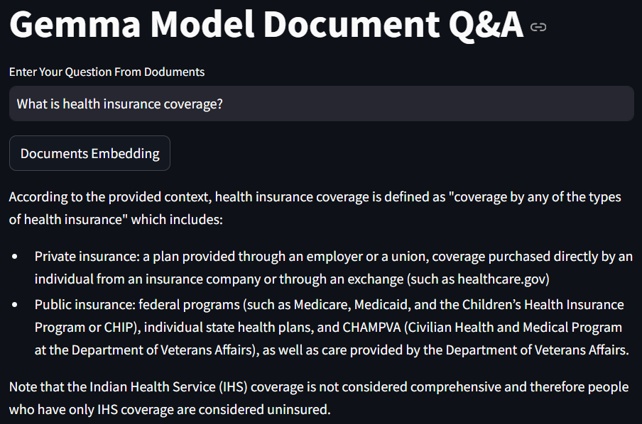

# <span style="color:#4682B4">**End-to-End RAG with Gemma and Groq**</span>

## Overview
This project demonstrates how to use **Gemma embeddings** with Groq's **Llama3 language model** and **LangChain** to create an interactive application for answering document-based queries. The application processes PDF documents, retrieves relevant content using embeddings and vector databases, and generates context-aware responses to user queries.

The project includes:
1. **Document Processing**: Loads and preprocesses PDF-based data.
2. **FAISS Vector Database**: Stores and retrieves document embeddings for similarity-based searches.
3. **Question Answering**: Dynamically processes user queries with the Groq language model and provides context-aware responses.
4. **Interactive User Interface**: A Streamlit-powered UI for user interaction.

## Setup Instructions

### 1. Set Up the Virtual Environment
1. Open the terminal inside the project folder.
2. Initialize Conda for your shell (if not already done):
   ```bash
   conda init
   ```
   Close and reopen the terminal for the changes to take effect.

3. Create a Conda environment with Python 3.10:
   ```bash
   conda create -p myenv python=3.10 -y
   ```
   A folder named `myenv` will be created in the project directory.

### 2. Install Dependencies
Activate the environment and install the dependencies:
```bash
conda activate myenv/
pip install -r requirements.txt
```

### 3. Add a Configuration File
Create a `.env` file in the project directory. This file should include your API keys for Groq and Google:
```plaintext
GROQ_API_KEY="Enter your Groq API key here"
GOOGLE_API_KEY="Enter your Google API key here"
```

### 4. Prepare the PDF Documents
Ensure the PDF documents are stored in a folder named `./us_census` in the project directory. These files will be used to generate embeddings and answer questions.

### 5. Run the Application
Start the Streamlit application:
```bash
streamlit run app.py
```

### 6. Interact with the Application
Navigate to the URL provided by Streamlit to interact with the application. Enter your query into the prompt field to get context-aware answers based on the loaded documents.

## Key Features

### 1. **Document Processing**:
   - Loads and preprocesses PDF documents.
   - Splits documents into manageable text chunks for efficient processing.

### 2. **Embeddings and Vector Databases**:
   - Converts document chunks into vector representations using Gemma embeddings.
   - Stores embeddings in a FAISS vector database for similarity-based searches.

### 3. **Query Execution**:
   - Dynamically processes user queries with the Groq Llama3 model.
   - Retrieves relevant document chunks for context-aware responses.

### 4. **Interactive UI**:
   - Built with Streamlit for a user-friendly experience.
   - Displays response time and relevant document chunks for each query.

## Example Queries
Try the following prompts to explore the application:
1. **"What is the uninsured rate by state in 2022?"**
2. **"How does public health insurance vary by demographic?"**
3. **"Provide insights into Medicaid expansion trends in the documents."**

## Example Response

When asking a question such as **"What is the health insurance coverage?"**, the application retrieves the context and generates a detailed response based on the loaded documents.



Additionally, you can explore the similarity search results to see the specific document chunks used to generate the response:


### Additional Notes
- Ensure the `requirements.txt` file includes all necessary dependencies for LangChain, Groq, Gemma, and Streamlit.
- The `.env` file should be placed in the root directory for secure API key management.
- For optimal performance, ensure your system meets the requirements for running Streamlit and LangChain applications.
- Use high-quality PDF documents to ensure accurate results.
