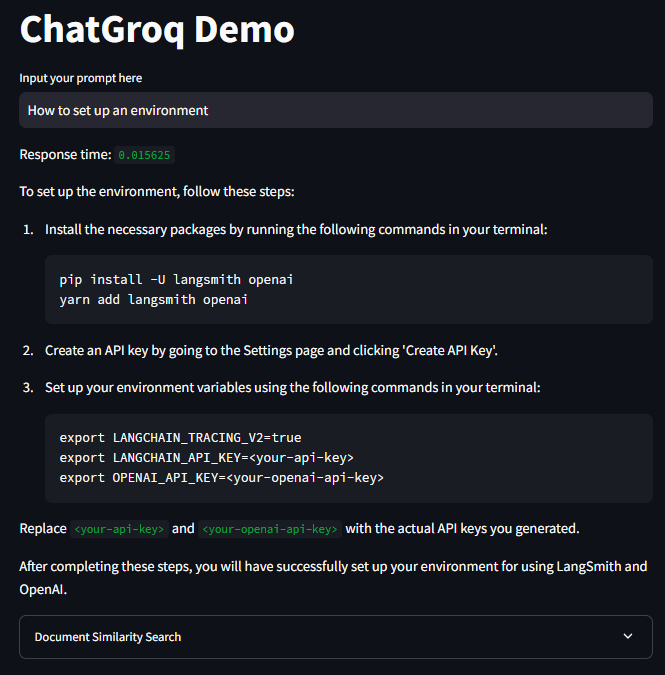

# ChatGroq Demo with LangChain

## Overview
This project demonstrates how to use LangChain with the ChatGroq model to build a dynamic question-answering application. The application retrieves web-based content, processes it with embeddings and vector databases, and answers user queries based on the context.

The project includes:
1. **Web scraping**: Load and process web-based documents using LangChain tools.
2. **FAISS Vector Database**: Store and retrieve document embeddings for similarity-based searches.
3. **Query Execution**: Dynamically process user queries with the ChatGroq language model and provide context-aware responses.

## Setup Instructions

### 1. Set Up the Virtual Environment
1. Open the terminal inside the project folder.
2. Initialise Conda for your shell (if not already done):
   ```bash
   conda init
   ```
   Close and reopen the terminal for the changes to take effect.

3. Create a Conda environment with Python 3.10:
   ```bash
   conda create -p myenv python=3.10 -y
   ```
   A folder named `myenv` will be created in the project directory.

### 2. Install Dependencies
Activate the environment and install the dependencies:
```bash
conda activate myenv/
pip install -r requirements.txt
```

### 3. Add a Configuration File
Create a `.env` file in the project directory. This file should include your API key for ChatGroq:
```plaintext
GROQ_API_KEY="Enter your ChatGroq API key here"
```

### 4. Run the Application
Start the Streamlit application:
```bash
streamlit run app.py
```

### 5. Interact with the Application
Navigate to the URL provided by Streamlit to interact with the application. Enter your query into the prompt field to get context-aware answers based on the loaded LangSmith documentation.

Example response screen:



### Key Features
1. **Embeddings and Vector Databases**:
   - Converts web-based documents into vector representations using Llama 3.1 embeddings.
   - Stores embeddings in a FAISS vector database for similarity-based searches.

2. **Query Execution**:
   - Dynamically processes user queries with the ChatGroq model.
   - Retrieves relevant document chunks for context-aware responses.

3. **Interactive UI**:
   - Built with Streamlit for a user-friendly experience.
   - Displays response time and relevant document chunks for each query.

## Example Queries
Try the following prompts to explore the application:
1. **"How to set up an environment?"**
2. **"Tell me about LangSmith documentation."**
3. **"Explain embeddings in simple terms."**

### Additional Notes
- Ensure the `requirements.txt` file matches the required dependencies for LangChain and ChatGroq.
- The `.env` file should be placed in the root directory for secure API key management.
- For optimal performance, ensure your system meets the requirements for running Streamlit and LangChain applications.

