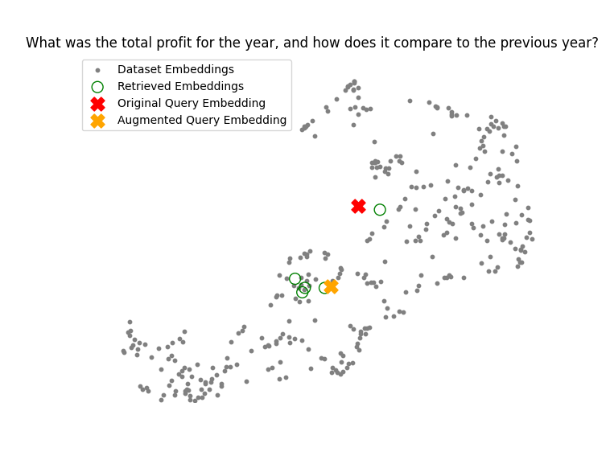

# <span style="color:#4682B4">**Advanced Query Expansion with Hypothetical Answers**</span>

## Overview
📖 This project demonstrates how to enhance a Retrieval-Augmented Generation (RAG) pipeline using **Query Expansion with Hypothetical Answers**. While the **Simple RAG Pipeline** efficiently retrieves and processes documents for answering queries, it has limitations:

### Limitations of Simple RAG:
1. ❌ **Context Gaps**: It might miss important context if the original query is too vague.
2. ❌ **Insufficient Precision**: Retrieval may not fully align with the user's intent, leading to suboptimal answers.
3. ❌ **Difficulty with Ambiguity**: Ambiguous queries may yield irrelevant or incomplete results.

### The Solution: Query Expansion with Hypothetical Answers
One way to overcome these limitations is by **augmenting queries with hypothetical answers**. In this approach:
- A **Language Model (LLM)** generates a hypothetical answer to the user's query.
- This hypothetical answer is combined with the original query and used to retrieve relevant documents from the vector store.
- The enhanced query and the context retrieved from the vector store are then passed onto the LLM for final generation of the answer.

This technique improves context relevance and precision by anchoring retrieval to a more informed representation of the query.

The project includes:
1. **📄 Document Processing**: Loads and preprocesses PDF documents.
2. **✂️ Text Chunking**: Splits documents into manageable chunks for efficient processing.
3. **📊 ChromaDB Vector Database**: Stores and retrieves document embeddings for similarity-based searches.
4. **🧠 Query Expansion**: Uses an LLM to generate hypothetical answers to expand the query.
5. **❓ Question Answering**: Dynamically processes user queries with OpenAI's GPT-3.5-Turbo model.
6. **📉 Visualisation**: Visualises embeddings in a 2D space using UMAP.

## Setup Instructions

### 1. Set Up the Environment
1. Open the terminal inside the project folder.
2. Create a virtual environment using Python 3.10:
   ```bash
   python -m venv myenv
   ```
3. Activate the virtual environment:
   - **Windows**:
     ```bash
     myenv\Scripts\activate
     ```
   - **Mac/Linux**:
     ```bash
     source myenv/bin/activate
     ```

### 2. Install Dependencies
📦 Install the required dependencies:
```bash
pip install -r requirements.txt
```

### 3. Add a Configuration File
🔑 Create a `.env` file in the project directory. This file should include your OpenAI API key:
```plaintext
OPENAI_API_KEY="Enter your OpenAI API key here"
```

### 4. Prepare the Input PDF
🗂️ Ensure the input PDF document is stored in the `data` directory and named `microsoft-annual-report.pdf`. This file will be used to generate embeddings and answer queries.

### 5. Run the Application
▶️ Run the application:
```bash
python advanced_query_expansion.py
```

### 6. Interact with the Application
🖥️ Enter your query when prompted in the terminal to see enhanced context-aware answers and visualise embeddings.

## Key Features

### 1. **📄 Document Processing**
   - **Function**: `PdfReader`
   - **Purpose**: Loads and extracts text from PDF documents.
   - **Output**: List of strings, each representing the text from a PDF page.

### 2. **✂️ Text Chunking**
   - **Functions**:
     - `RecursiveCharacterTextSplitter`
     - `SentenceTransformersTokenTextSplitter`
   - **Purpose**: Splits text into smaller chunks for better embedding performance.
   - **Key Inputs**:
     - `chunk_size`: Maximum size of each chunk.
     - `tokens_per_chunk`: Number of tokens per chunk.
   - **Output**: List of text chunks.

### 3. **📊 ChromaDB Vector Database**
   - **Purpose**: Stores and retrieves embeddings for similarity-based searches.
   - **Key Operations**:
     - `add`: Adds document chunks and embeddings to the database.
     - `query`: Retrieves the most relevant document chunks based on a query.

### 4. **🧠 Query Expansion with LLM**
   - **Function**: `augment_query_generated`
   - **Purpose**: Uses OpenAI GPT-3.5-Turbo to generate a hypothetical answer to the user's query and expands the original query.
   - **Key Inputs**:
     - `query`: User query.
     - `model`: Language model to use.
   - **Output**: Hypothetical answer used to enhance document retrieval.

### 5. **❓ Question Answering**
   - **Function**: `main`
   - **Purpose**: Combines the original query with the hypothetical answer to retrieve documents and generate the final response.
   - **Output**: Context-aware answer based on relevant document chunks.

### 6. **📉 Embedding Visualisation**
   - **Function**: `visualise_embeddings`
   - **Purpose**: Visualises document and query embeddings in a 2D space using UMAP.
   - **Output**: Scatter plot showing dataset embeddings, query embeddings, and augmented query embeddings.

## Example Queries and Output

### Example Query
💡 **Query**: "What was the total profit for the year, and how does it compare to the previous year?"

### Example Output
```plaintext
In the fiscal year ending December 31, 2021, our company recorded a total profit of $1.2 million. This represents a 15% increase compared to the previous fiscal year, where our total profit was $1 million. This growth can be attributed to our successful cost-saving initiatives and increased revenue streams.
```

### Visualisation Example
Below is the embedding visualisation generated for the query and the retrieved documents. It can be seen that the **augmented query embedding** is much closer to the retrieved embeddings than the original query's embedding ✅



## Additional Notes
- ⚙️ Ensure the `requirements.txt` file includes all necessary dependencies for OpenAI, ChromaDB, and dotenv.
- 🔒 The `.env` file should be placed in the root directory for secure API key management.
- 📜 Use high-quality PDF documents to ensure accurate and relevant results.
- ✂️ Customise the `chunk_size` and `tokens_per_chunk` parameters based on the document size and application requirements.

---
**For further inquiries or enhancements, please contact the project maintainer.**
