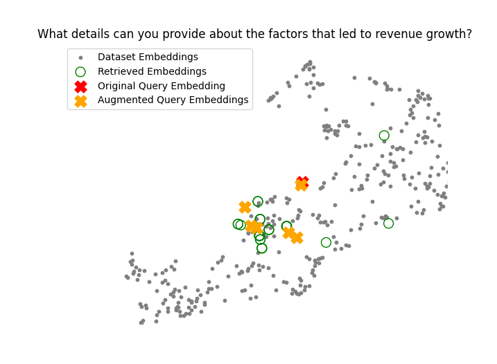

# <span style="color:#4682B4">**Query Expansion with Multiple Queries**</span>

## Overview
📖 This project demonstrates how to enhance a Retrieval-Augmented Generation (RAG) pipeline using **Query Expansion with Multiple Queries**. While traditional RAG systems effectively retrieve and process documents, they can face certain limitations:

### Limitations of Simple RAG:
1. ❌ **Context Gaps**: It might miss important context if the original query is too vague.
2. ❌ **Insufficient Precision**: Retrieval may not fully align with the user's intent, leading to suboptimal answers.
3. ❌ **Difficulty with Ambiguity**: Ambiguous queries may yield irrelevant or incomplete results.

### The Solution: Query Expansion with Multiple Queries
This approach builds upon the **Query Expansion with Hypothetical Answers** model. Instead of only providing the original query and a single hypothetical answer to the vector store, this model generates **multiple related queries** using an LLM. These queries, along with the original query, are fed into the vector store to retrieve context-augmented results. The aggregated context is then passed along with the original query to the LLM to generate a comprehensive final response.

This technique improves precision and context relevance by broadening the scope of document retrieval and anchoring it to a more comprehensive representation of the query.

The project includes:
1. **📄 Document Processing**: Loads and preprocesses PDF documents.
2. **✂️ Text Chunking**: Splits documents into manageable chunks for efficient processing.
3. **📊 ChromaDB Vector Database**: Stores and retrieves document embeddings for similarity-based searches.
4. **🧠 Query Expansion**: Uses an LLM to generate related queries.
5. **❓ Context Retrieval and Aggregation**: Retrieves and aggregates document chunks for each query.
6. **📉 Visualisation**: Visualises embeddings in a 2D space using UMAP.

## Setup Instructions

### 1. Set Up the Environment
1. Open the terminal inside the project folder.
2. Create a virtual environment using Python 3.10:
   ```bash
   python -m venv myenv
   ```
3. Activate the virtual environment:
   - **Windows**:
     ```bash
     myenv\Scripts\activate
     ```
   - **Mac/Linux**:
     ```bash
     source myenv/bin/activate
     ```

### 2. Install Dependencies
📦 Install the required dependencies:
```bash
pip install -r requirements.txt
```

### 3. Add a Configuration File
🔑 Create a `.env` file in the project directory. This file should include your OpenAI API key:
```plaintext
OPENAI_API_KEY="Enter your OpenAI API key here"
```

### 4. Prepare the Input PDF
🗂️ Ensure the input PDF document is stored in the `data` directory and named `microsoft-annual-report.pdf`. This file will be used to generate embeddings and answer queries.

### 5. Run the Application
▶️ Run the application:
```bash
python query_expansion_multiple.py
```

### 6. Interact with the Application
🖥️ Enter your query when prompted in the terminal to see enhanced context-aware answers and visualise embeddings.

## Key Features

### 1. **📄 Document Processing**
   - **Function**: `PdfReader`
   - **Purpose**: Loads and extracts text from PDF documents.
   - **Output**: List of strings, each representing the text from a PDF page.

### 2. **✂️ Text Chunking**
   - **Functions**:
     - `RecursiveCharacterTextSplitter`
     - `SentenceTransformersTokenTextSplitter`
   - **Purpose**: Splits text into smaller chunks for better embedding performance.
   - **Key Inputs**:
     - `chunk_size`: Maximum size of each chunk.
     - `tokens_per_chunk`: Number of tokens per chunk.
   - **Output**: List of text chunks.

### 3. **📊 ChromaDB Vector Database**
   - **Purpose**: Stores and retrieves embeddings for similarity-based searches.
   - **Key Operations**:
     - `add`: Adds document chunks and embeddings to the database.
     - `query`: Retrieves the most relevant document chunks based on a query.

### 4. **🧠 Query Expansion with LLM**
   - **Function**: `generate_multi_query`
   - **Purpose**: Uses OpenAI GPT-3.5-Turbo to generate related queries based on the user's original query.
   - **Key Inputs**:
     - `query`: User query.
     - `model`: Language model to use.
   - **Output**: List of related queries to expand document retrieval.

### 5. **❓ Context Retrieval and Aggregation**
   - **Function**: `main`
   - **Purpose**: Retrieves relevant document chunks for each query, aggregates them, and passes them to the LLM for the final response.
   - **Output**: Comprehensive, context-aware answer.

### 6. **📉 Embedding Visualisation**
   - **Function**: `visualise_embeddings`
   - **Purpose**: Visualises document and query embeddings in a 2D space using UMAP.
   - **Output**: Scatter plot showing dataset embeddings, query embeddings, and augmented query embeddings.

## Example Queries and Output

### Generated Queries
💡 **Original Query**: "What details can you provide about the factors that led to revenue growth?"

Generated Queries:
- Can you elaborate on the main products or services that contributed to the revenue growth?
- What market conditions or trends positively impacted revenue generation?
- Were there any strategic partnerships or acquisitions that directly influenced the increase in revenue?
- How did pricing strategies or changes in pricing structure affect revenue growth?
- Did any geographical expansion or entry into new markets contribute to the rise in revenue?

### Context Retrieval
For each query (original and generated), the vector store retrieves relevant embeddings, and the following contexts are printed:
```plaintext
Query: Can you elaborate on the main products or services that contributed to the revenue growth?
Results:
sales and marketing expenses increased $934 million or 4%...
--------------------------------------------------------------------------------
segment revenue and operating income were as follows...
--------------------------------------------------------------------------------
```

### Final Answer
The aggregated context and original query are passed to the LLM, resulting in a final response:
```plaintext
The factors that led to revenue growth include:
- Microsoft cloud revenue increased by 22% to $111.6 billion.
- Office commercial products and cloud services revenue increased by 10% driven by Office 365 commercial growth of 13%.
- Dynamics products and cloud services revenue increased by 16% driven by Dynamics 365 growth of 24%.
- Server products and cloud services revenue increased by 19% driven by Azure and other cloud services growth of 29%.
- Search and news advertising revenue increased by $617 million or 5% excluding traffic acquisition costs.
```

### Visualisation Example
Below is the embedding visualisation generated for the query and the retrieved documents. It can be seen that the **multiple queries** generate many more retrieved embeddings to add additional context relative to the Query Expansion with Hypothetical Answer approach ✅



## Additional Notes
- ⚙️ Ensure the `requirements.txt` file includes all necessary dependencies for OpenAI, ChromaDB, and dotenv.
- 🔒 The `.env` file should be placed in the root directory for secure API key management.
- 📜 Use high-quality PDF documents to ensure accurate and relevant results.
- ✂️ Customise the `chunk_size` and `tokens_per_chunk` parameters based on the document size and application requirements.

---
**For further inquiries or enhancements, please contact the project maintainer.**