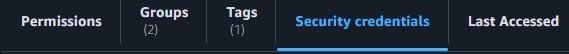
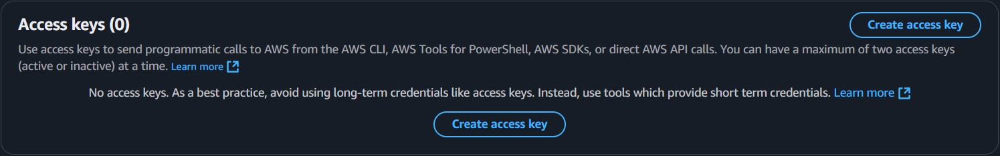
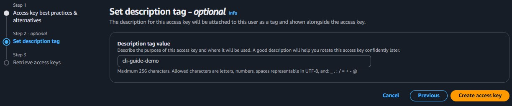
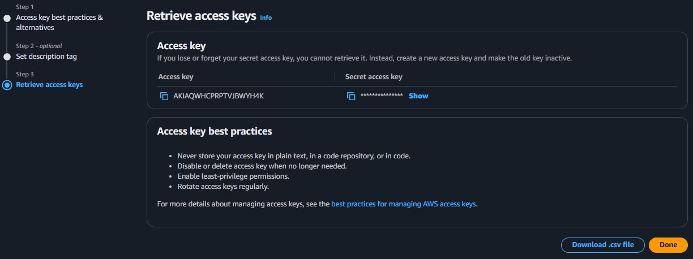
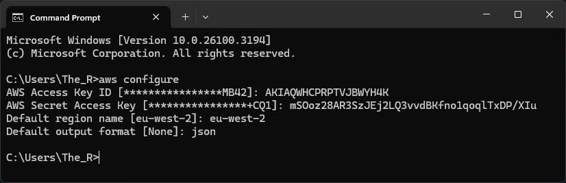

# 🚀 **AWS CLI Configuration Guide**

## 📌 **Introduction**

The AWS Command Line Interface (CLI) allows users to interact with AWS services through the terminal. This guide provides a step-by-step process for configuring the AWS CLI with your AWS account.

## 🔧 **Configuring AWS CLI with Your AWS Account**

To use AWS CLI, you need to configure it with your AWS credentials.

### **Step 1: Obtain Access Keys**

To generate access keys, navigate to the **Identity and Access Management (IAM)** service:

- In the **Access management** dropdown on the left-hand menu, select **Users**.

🖼️ **IAM Users Page:**  


- Select a user to set up an access key for.
- In the user’s page, click the **Security credentials** tab.

🖼️ **Security Credentials Tab:**  


- Scroll down to the **Access keys** section.

🖼️ **Access Keys Section:**  


- Click **Create access key**.

### **Step 2: Generate Access Key**

- On the next screen, start with **Step 1: Access key best practices & alternatives**.
- Select **Command Line Interface (CLI)** and click **Next**.

🖼️ **Step 1 - Best Practices & Alternatives:**  


- In **Step 2: Set description tag**, enter an optional description and click **Next**.

🖼️ **Step 2 - Set Description Tag:**  


- In **Step 3: Retrieve access keys**, your **Access Key ID** and **Secret Access Key** will be displayed.

🖼️ **Step 3 - Retrieve Access Keys:**  


### **Step 3: Configure AWS CLI**

Before pressing **Done**, open your terminal and enter the following command:

```sh
aws configure
```

You will be prompted to enter your **Access Key ID** and **Secret Access Key** in succession.

- **Default region name [region]**: Enter the region exactly as shown in the prompt, e.g., `eu-west-2`.
- **Default output format [None]**: Enter `json`.

🖼️ **Command Prompt Configuration:**  


## ✅ **Conclusion**

Your AWS CLI is now configured and ready to use! You can now interact with AWS services directly from your terminal. 🚀

