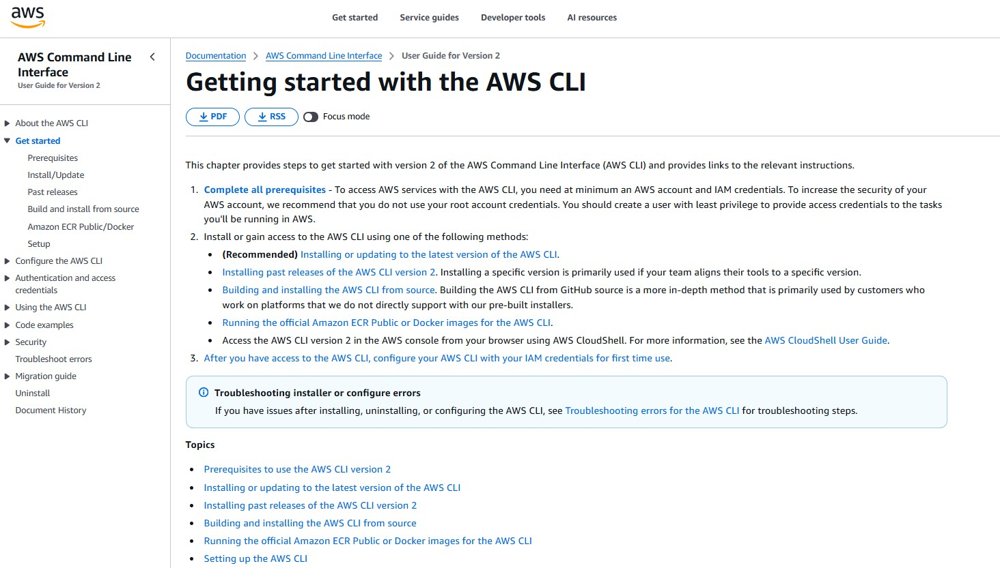
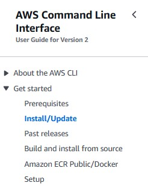
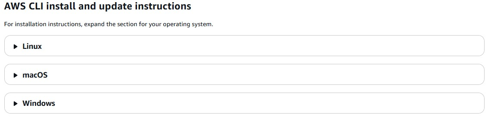
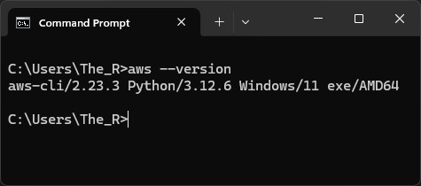

# 🚀 **AWS CLI Setup Guide**

## 📌 **Introduction**  
The AWS Command Line Interface (CLI) allows users to interact with AWS services through the terminal. This guide provides a step-by-step process for installing and verifying the AWS CLI on your system.

## 🔗 **Getting Started**  
To begin, visit the official AWS CLI documentation:  
➡️ [AWS CLI Getting Started Guide](https://docs.aws.amazon.com/cli/latest/userguide/cli-chap-getting-started.html)

🖼️ **Where this link takes you:**  


## 🛠 **Installation**  
### **Step 1: Select Install/Update**  
On the left-hand menu, under the "Get started" section, click on **Install/Update**.

🖼️ **Installation Menu:**  


### **Step 2: Scroll to Installation Instructions**  
Scroll down until you find installation instructions for different operating systems.

🖼️ **Installation Instructions:**  


### **Step 3: Verify Installation**  
After installing the AWS CLI, open your command prompt and run the following command:

```sh
aws --version
```

🖼️ **Command Prompt Verification:**  


If the installation was successful, the terminal will display the AWS CLI version number.

## ✅ **Conclusion**  
You have now installed and verified the AWS CLI! You can begin using it to interact with AWS services directly from your terminal. 🚀

