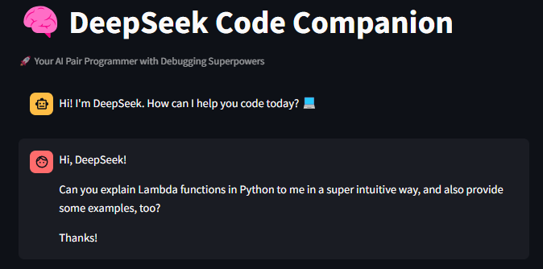
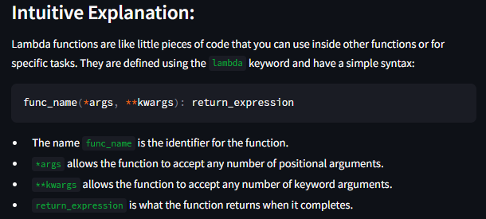
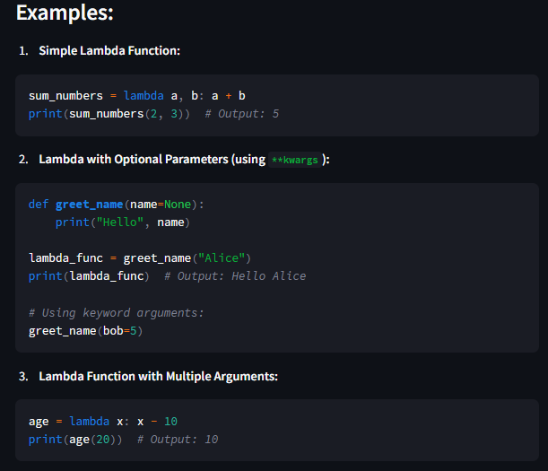
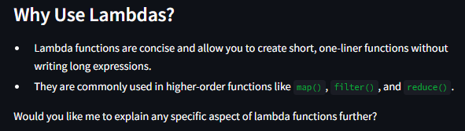

# 🧠 DeepSeek Code Companion

## 🚀 Overview

DeepSeek Code Companion is an AI-powered pair programmer built using **Streamlit**, **LangChain**, and **Ollama**. It assists developers with:

- 🐍 **Python coding queries**
- 🐞 **Debugging support**
- 📝 **Code documentation**
- 💡 **Solution design**

## 📸 Application Preview

### **Landing Page**

When you first launch the app, you will see the chatbot interface ready for interaction.


## 💡 How It Works

1. **Users input coding questions** through the chat interface.
2. **The AI processes the query** using LangChain and Ollama.
3. **A well-structured response** is generated, including explanations and examples.

### **Example Prompt**

A user asks about **Lambda functions in Python**:



### **AI Response - Explanation**

The chatbot provides an intuitive explanation of lambda functions:



### **AI Response - Examples**

The chatbot generates relevant coding examples:



### **Final Summary**

The chatbot wraps up with a summary and additional insights:



## 🛠️ Key Code Components

### **1️⃣ Chat Engine Setup**
```python
from langchain_ollama import ChatOllama

llm_engine = ChatOllama(
    model="deepseek-r1:1.5b",
    base_url="http://localhost:11434",
    temperature=0.3
)
```

### **2️⃣ Prompt Chain Configuration**
```python
from langchain_core.prompts import (
    SystemMessagePromptTemplate,
    HumanMessagePromptTemplate,
    AIMessagePromptTemplate,
    ChatPromptTemplate
)

system_prompt = SystemMessagePromptTemplate.from_template(
    "You are an expert AI coding assistant. Provide concise, correct solutions "
    "with strategic print statements for debugging. Always respond in English."
)
```

### **3️⃣ Handling User Input**
```python
user_query = st.chat_input("Type your coding question here...")
if user_query:
    st.session_state.message_log.append({"role": "user", "content": user_query})
    with st.spinner("🧠 Processing..."):
        prompt_chain = build_prompt_chain()
        ai_response = generate_ai_response(prompt_chain)
    st.session_state.message_log.append({"role": "ai", "content": ai_response})
    st.rerun()
```

## 📦 Installation and Setup

To set up the project, follow these steps:

### **1️⃣ Create a Virtual Environment**
We recommend using **conda**:
```bash
conda create -p venv python==3.12 -y
```

### **2️⃣ Activate the Virtual Environment**
```bash
conda activate venv/
```

### **3️⃣ Install Dependencies**
Ensure you have the required libraries installed. Run:
```bash
pip install -r requirements.txt
```

The `requirements.txt` includes:
```
streamlit
langchain_core
langchain_community
langchain_ollama
```

### **4️⃣ Run the Application**
```bash
streamlit run app.py
```

### **5️⃣ Deactivate the Virtual Environment (When Done)**
```bash
conda deactivate
```

## 🔍 Project Structure

```
DeepSeek-Code-Companion/
├── app.py                 # Main application script
├── README.md              # Project documentation
├── requirements.txt       # Required dependencies
├── images/                # UI demonstration images
│   ├── landing.png        # Initial chatbot screen
│   ├── prompt.png         # User query example
│   ├── explanation.png    # AI explanation example
│   ├── examples.png       # AI-generated code examples
│   ├── end.png            # AI response conclusion
```

## ✨ Features

✅ **Intuitive AI-powered coding assistant**  
✅ **Customisable model selection** (DeepSeek variants)  
✅ **Beautiful, dark-themed UI**  
✅ **Session history to retain previous conversations**  
✅ **Seamless debugging and solution generation**  

## 🤝 Contributions

We welcome contributions! Feel free to:

- Open issues for bug reports or feature requests 🐛
- Submit pull requests for improvements 🔥
- Share feedback to enhance the chatbot experience 💡

## 📬 Contact

For questions or collaboration, reach out via GitHub Issues!

🚀 **Happy Coding!**

