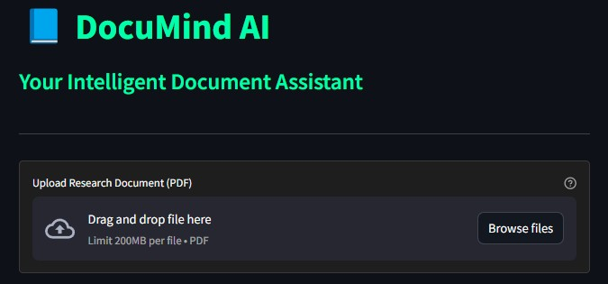
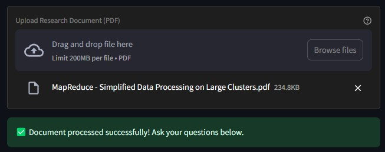
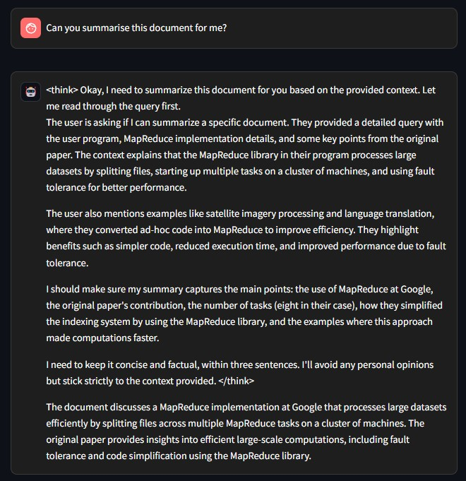

# 📘 DocuMind AI - Your Intelligent Document Assistant

## 🚀 Overview

**DocuMind AI** is an AI-powered research assistant that enables users to upload PDF documents and interact with them using natural language. This tool leverages **Streamlit**, **LangChain**, and **Ollama** to provide intelligent document analysis and summarization.

### 🔍 Key Features

✅ **Upload and Analyze PDF Documents**  
✅ **Extract and Process Text Efficiently**  
✅ **Perform Semantic Search on Documents**  
✅ **Get AI-Generated Summaries and Responses**  
✅ **Beautiful Dark-Themed UI for a Smooth Experience**  

## 📸 Application Preview

### **1️⃣ Launch Screen**  
Upon starting the application, users are welcomed by the home screen.



### **2️⃣ Upload a PDF Document**  
Users can upload a research document for analysis.



### **3️⃣ AI-Generated Summary**  
Once uploaded, users can interact with the document and receive AI-generated summaries and answers.



## 🛠️ How It Works

1️⃣ **Upload a PDF document** – The AI extracts and processes text.  
2️⃣ **Ask questions or request a summary** – The AI searches and analyzes relevant information.  
3️⃣ **Receive AI-powered responses** – The AI provides precise, factual responses based on the document content.  

## 🏗️ Installation & Setup

Follow these steps to set up **DocuMind AI** on your local machine:

### **1️⃣ Create a Virtual Environment**
We recommend using **conda**:
```bash
conda create -p venv python==3.12 -y
```

### **2️⃣ Activate the Virtual Environment**
```bash
conda activate venv/
```

### **3️⃣ Install Dependencies**
Install the required libraries from `requirements.txt`:
```bash
pip install -r requirements.txt
```

The `requirements.txt` includes:
```
streamlit
langchain_core
langchain_community
langchain_ollama
```

### **4️⃣ Run the Application**
```bash
streamlit run rag_deep.py
```

### **5️⃣ Deactivate the Virtual Environment (When Done)**
```bash
conda deactivate
```

## 🔍 Project Structure

```
DeepSeek R1-1.5b RAG Agent/
├── rag_deep.py             # Main application script
├── README.md               # Project documentation
├── requirements.txt        # Required dependencies
├── images/                 # UI demonstration images
│   ├── app.jpg             # Initial launch screen
│   ├── uploaded.jpg        # After uploading a document
│   ├── summary.jpg         # AI-generated summary view
```

## ✨ Features in Detail

✅ **Advanced AI-Powered Document Processing**  
✅ **Real-time Interaction with Uploaded PDFs**  
✅ **User-Friendly Chatbot Interface**  
✅ **Integrated AI Summarization**  
✅ **Optimized for Research and Analysis**  

## 📜 License

This project is open-source and available under the **MIT License**.

## 🤝 Contributions

We welcome contributions! Feel free to:

- Open issues for bug reports or feature requests 🐛
- Submit pull requests for improvements 🔥
- Share feedback to enhance the chatbot experience 💡

## 📬 Contact

For questions or collaboration, reach out via GitHub Issues!

🚀 **Happy Researching!**