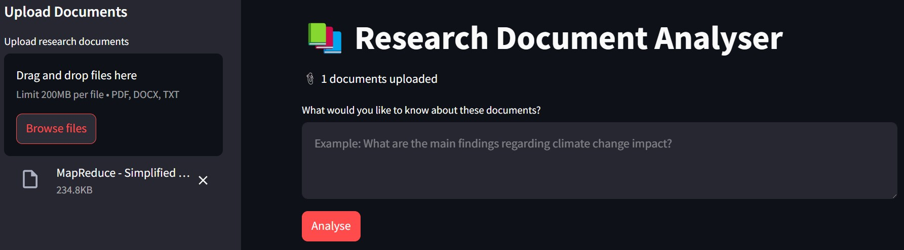
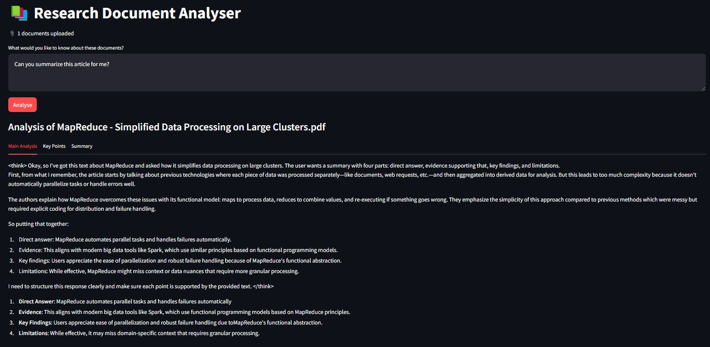
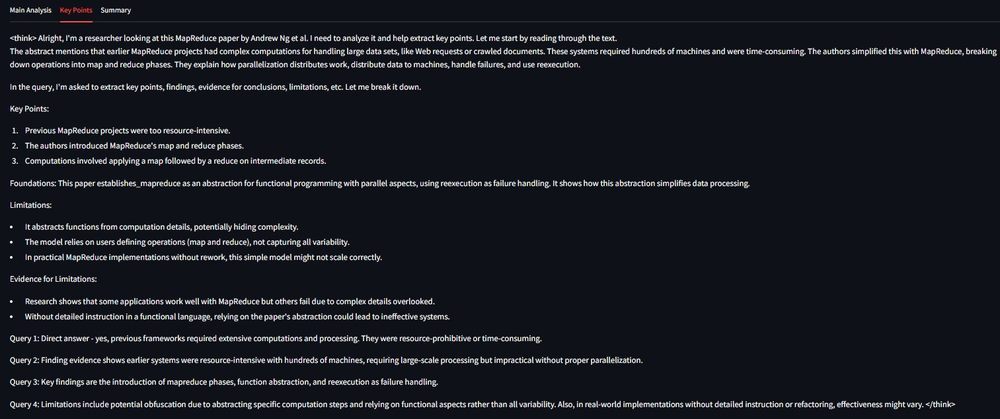
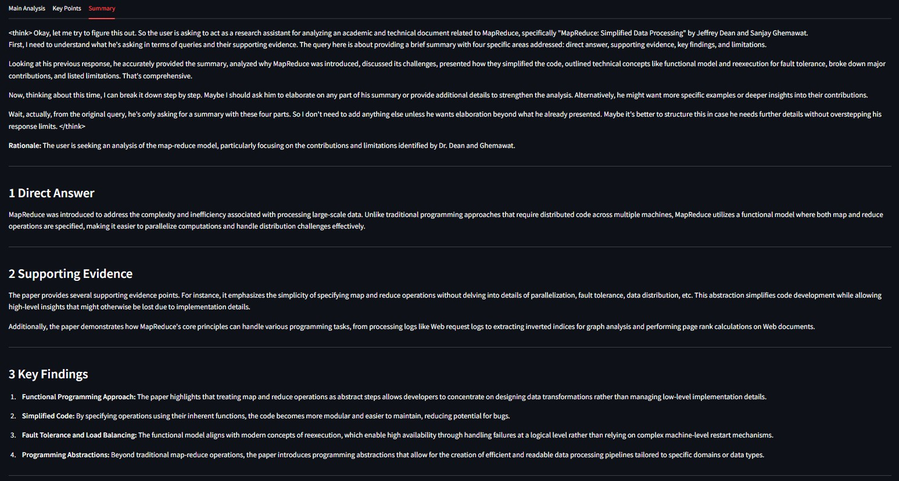

# 📚 Research Assistant - AI-Powered Document Analyser

## 🚀 Overview

**Research Assistant** is an AI-driven research tool that enables users to upload PDF, DOCX, and TXT documents and interact with them using natural language. This tool leverages **Streamlit** and **DeepSeek R1 (1.5B)** running locally via **Ollama** to provide intelligent document analysis and summarisation.

### 🔍 Key Features

✅ **Upload and Analyse PDF, DOCX, and TXT Documents**  
✅ **Extract and Process Text Efficiently**  
✅ **Perform AI-Powered Analysis on Documents**  
✅ **Get AI-Generated Summaries, Key Findings, and Insights**  
✅ **Beautiful Interactive UI for a Seamless Experience**  

## 📸 Application Preview

### **1️⃣ Landing Page**
Upon launching the application, users are welcomed by the main interface.



### **2️⃣ Main Document Analysis**
Users can upload research papers, reports, or text files for AI-driven analysis.



### **3️⃣ Key Findings and Insights**
The AI extracts key points, insights, and supporting evidence.



### **4️⃣ AI-Generated Summary**
Summarised insights provide an overview of the document content.



## 🛠️ How It Works

1️⃣ **Upload a research document** – The AI extracts and processes text.  
2️⃣ **Ask questions or request an analysis** – The AI searches and analyses relevant information.  
3️⃣ **Receive AI-powered insights** – Get precise, structured responses based on the document content.  

## 🏗️ Installation & Setup

Follow these steps to set up **Research Assistant** on your local machine:

### **1️⃣ Create a Virtual Environment**
We recommend using **conda**:
```bash
conda create -p venv python==3.12 -y
```

### **2️⃣ Activate the Virtual Environment**
```bash
conda activate venv/
```

### **3️⃣ Install Dependencies**
Install the required libraries from `requirements.txt`:
```bash
pip install -r requirements.txt
```

The `requirements.txt` includes:
```
streamlit
openai
PyPDF2
docx
```

### **4️⃣ Run the Application**
```bash
streamlit run research_assistant.py
```

### **5️⃣ Deactivate the Virtual Environment (When Done)**
```bash
conda deactivate
```

## 🔍 Project Structure

```
Research Assistant/
├── research_assistant.py   # Main application script
├── README.md               # Project documentation
├── requirements.txt        # Required dependencies
├── images/                 # UI demonstration images
│   ├── landing.jpg         # Initial landing page
│   ├── main.jpg            # Document analysis interface
│   ├── keypoints.jpg       # Extracted key points
│   ├── summary.jpg         # AI-generated summary output
```

## ✨ Features in Detail

✅ **AI-Powered Document Processing** – Extract and analyse text from various document formats.  
✅ **Real-time Interaction with Uploaded Files** – Ask questions and get instant responses.  
✅ **Structured AI Summarisation** – Receive concise and insightful summaries.  
✅ **Streamlit UI for a Seamless Experience** – Easily interact with the assistant in a user-friendly interface.  
✅ **Runs Locally with Full Control** – No external API calls; everything runs on your machine.  

## 📜 License

This project is open-source and available under the **MIT License**.

## 🤝 Contributions

We welcome contributions! Feel free to:

- Open issues for bug reports or feature requests 🐛  
- Submit pull requests for improvements 🔥  
- Share feedback to enhance the assistant 💡  

## 📬 Contact

For questions or collaboration, reach out via GitHub Issues!

🚀 **Happy Researching!**