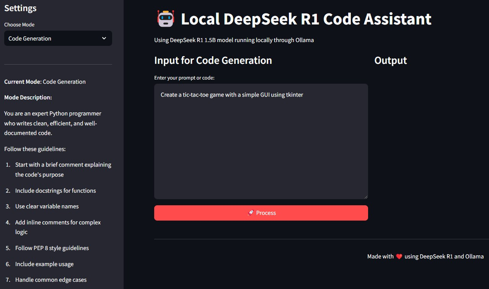
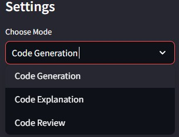
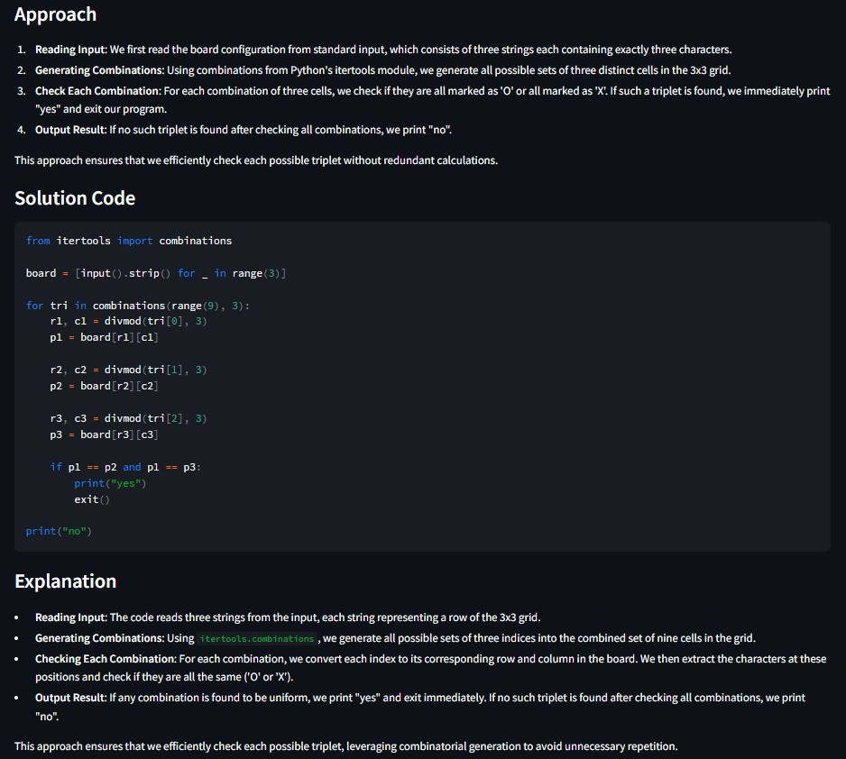

# 🤖 Code Assistant - AI-Powered Coding Companion

## 🚀 Overview

**Code Assistant** is an AI-driven coding assistant that enables users to generate, explain, and review Python code efficiently. This tool leverages **Streamlit** and **DeepSeek R1 (1.5B)** running locally via **Ollama** to provide real-time AI-powered coding support.

### 🔍 Key Features

✅ **Generate Python Code from Natural Language Descriptions**  
✅ **Explain Code with Structured Insights**  
✅ **Review Code for Best Practices, Performance, and Security**  
✅ **Interactive UI for Seamless Experience**  
✅ **Runs Locally Using Ollama for Full Control**  

## 📸 Application Preview

### **1️⃣ Landing Page**
Upon launching the application, users are welcomed by the main interface.



### **2️⃣ Mode Selection**
Users can choose between **Code Generation**, **Code Explanation**, and **Code Review** modes.



### **3️⃣ AI-Generated Solution**
The AI provides structured responses based on the selected mode.



## 🛠️ How It Works

1️⃣ **Select a mode** – Choose **Code Generation**, **Code Explanation**, or **Code Review**.  
2️⃣ **Enter your request or paste your code** – The AI processes the input and provides structured responses.  
3️⃣ **Receive AI-powered insights** – Get precise code suggestions, detailed explanations, or expert-level reviews.  

## 🏗️ Installation & Setup

Follow these steps to set up **Code Assistant** on your local machine:

### **1️⃣ Create a Virtual Environment**
We recommend using **conda**:
```bash
conda create -p venv python==3.12 -y
```

### **2️⃣ Activate the Virtual Environment**
```bash
conda activate venv/
```

### **3️⃣ Install Dependencies**
Install the required libraries from `requirements.txt`:
```bash
pip install -r requirements.txt
```

The `requirements.txt` includes:
```
streamlit
openai
```

### **4️⃣ Run the Application**
```bash
streamlit run code_assistant.py
```

### **5️⃣ Deactivate the Virtual Environment (When Done)**
```bash
conda deactivate
```

## 🔍 Project Structure

```
Code Assistant/
├── code_assistant.py       # Main application script
├── README.md               # Project documentation
├── requirements.txt        # Required dependencies
├── images/                 # UI demonstration images
│   ├── landing.jpg         # Initial landing page
│   ├── mode.jpg            # Mode selection screen
│   ├── solution.jpg        # AI-generated solution output
```

## ✨ Features in Detail

✅ **AI-Powered Code Generation** – Convert natural language descriptions into fully functional Python code.  
✅ **Code Explanation and Insights** – Understand how code works with step-by-step breakdowns.  
✅ **Expert Code Review** – Identify bugs, inefficiencies, and security risks.  
✅ **Streamlit UI for a Seamless Experience** – Easily interact with the assistant in a user-friendly interface.  
✅ **Runs Locally with Full Control** – No external API calls; everything runs on your machine.  

## 📜 License

This project is open-source and available under the **MIT License**.

## 🤝 Contributions

We welcome contributions! Feel free to:

- Open issues for bug reports or feature requests 🐛  
- Submit pull requests for improvements 🔥  
- Share feedback to enhance the assistant 💡  

## 📬 Contact

For questions or collaboration, reach out via GitHub Issues!

🚀 **Happy Coding!**