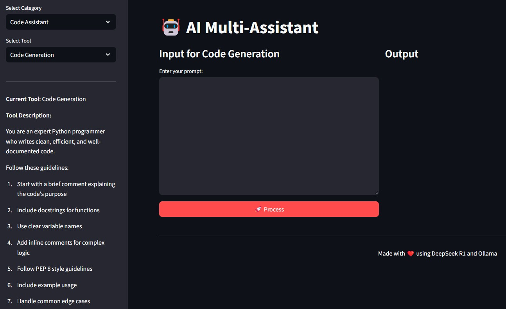
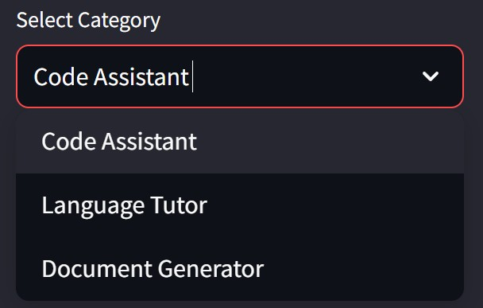
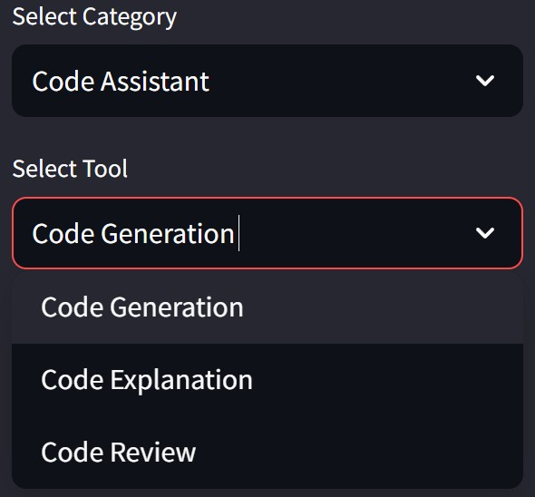
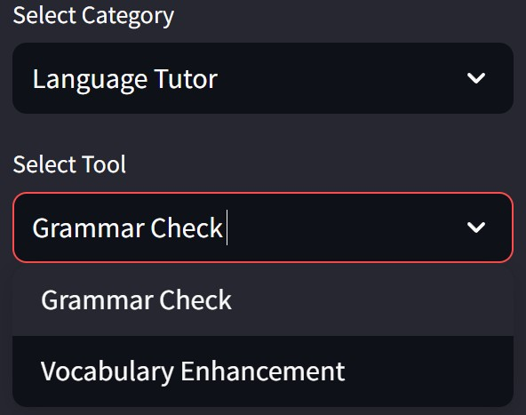
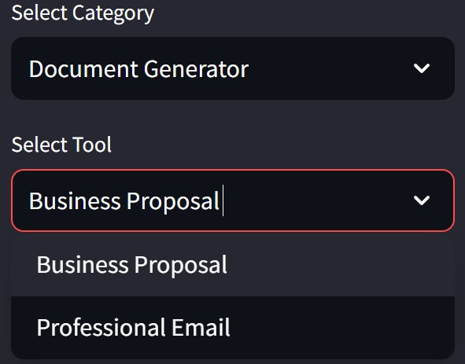

# 🤖 AI Multi-Assistant - Your Versatile AI-Powered Helper

## 🚀 Overview

**AI Multi-Assistant** is an AI-driven tool that enables users to generate, explain, and review code, perform language tutoring, and generate structured documents. This tool leverages **Streamlit** and **DeepSeek R1 (1.5B)** running locally via **Ollama** to provide multi-functional AI assistance.

### 🔍 Key Features

✅ **Code Assistant** – Generate, explain, and review Python code.  
✅ **Language Tutor** – Perform grammar checks and enhance vocabulary.  
✅ **Document Generator** – Create business proposals, emails, and structured documents.  
✅ **Intuitive UI for Effortless Navigation**  
✅ **Runs Locally for Full Control and Privacy**  

## 📸 Application Preview

### **1️⃣ Landing Page**
Upon launching the application, users are greeted with a clean and structured interface.



### **2️⃣ Category Selection**
Users can select an assistant category: **Code Assistant**, **Language Tutor**, or **Document Generator**.



### **3️⃣ Code Assistant Tools**
Options for **Code Generation**, **Code Explanation**, and **Code Review**.



### **4️⃣ Language Tutor Tools**
Perform **Grammar Checks** and **Vocabulary Enhancements**.



### **5️⃣ Document Generator Tools**
Create **Business Proposals** and **Professional Emails** with AI assistance.



## 🛠️ How It Works

1️⃣ **Choose an assistant category** – Select **Code Assistant**, **Language Tutor**, or **Document Generator**.  
2️⃣ **Select a specific tool** – Depending on the category, choose options such as **Code Review**, **Grammar Check**, or **Business Proposal**.  
3️⃣ **Enter your prompt** – The AI processes the input and provides structured responses.  
4️⃣ **Receive AI-powered insights** – Get precise coding suggestions, language improvements, or well-structured documents.  

## 🏗️ Installation & Setup

Follow these steps to set up **AI Multi-Assistant** on your local machine:

### **1️⃣ Create a Virtual Environment**
We recommend using **conda**:
```bash
conda create -p venv python==3.12 -y
```

### **2️⃣ Activate the Virtual Environment**
```bash
conda activate venv/
```

### **3️⃣ Install Dependencies**
Install the required libraries from `requirements.txt`:
```bash
pip install -r requirements.txt
```

The `requirements.txt` includes:
```
streamlit
openai
```

### **4️⃣ Run the Application**
```bash
streamlit run ai_multi_assistant.py
```

### **5️⃣ Deactivate the Virtual Environment (When Done)**
```bash
conda deactivate
```

## 🔍 Project Structure

```
AI Multi-Assistant/
├── ai_multi_assistant.py   # Main application script
├── README.md               # Project documentation
├── requirements.txt        # Required dependencies
├── images/                 # UI demonstration images
│   ├── landing.jpg         # Initial landing page
│   ├── category.jpg        # Category selection screen
│   ├── codetool.jpg        # Code assistant tools
│   ├── langtool.jpg        # Language tutor tools
│   ├── doctool.jpg         # Document generator tools
```

## ✨ Features in Detail

✅ **AI-Powered Code Assistance** – Generate, explain, and review Python code.  
✅ **Advanced Language Tutoring** – Perform grammar checks and enhance vocabulary.  
✅ **Smart Document Generation** – Create structured business and professional documents.  
✅ **Streamlit UI for a Seamless Experience** – Intuitive, interactive user interface.  
✅ **Runs Locally with Full Control** – No external API calls; everything runs on your machine.  

## 📜 License

This project is open-source and available under the **MIT License**.

## 🤝 Contributions

We welcome contributions! Feel free to:

- Open issues for bug reports or feature requests 🐛  
- Submit pull requests for improvements 🔥  
- Share feedback to enhance the assistant 💡  

## 📬 Contact

For questions or collaboration, reach out via GitHub Issues!

🚀 **Enhance Your Productivity with AI Multi-Assistant!**

