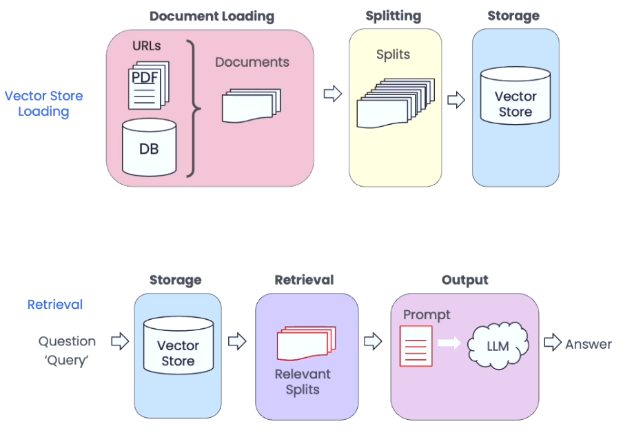

# 🦜🔗 **LangChain Document Splitting**

## 📖 **Overview**

This section of the project focuses on **document splitting**, a critical step in the Retrieval-Augmented Generation (RAG) pipeline using LangChain. Document splitting allows large documents to be broken down into manageable chunks, optimising retrieval and processing by Language Models (LLMs).

The image below provides an **overview of the process**, showing how documents are split into smaller chunks after being loaded, facilitating efficient storage and retrieval.



In this section, we explore various **document splitting techniques**, including:

- **Basic character splitting** using `RecursiveCharacterTextSplitter` and `CharacterTextSplitter`
- **Recursive splitting with multiple delimiters**
- **Token-based splitting using `TokenTextSplitter`**
- **Context-aware splitting for structured documents**

These techniques ensure that text is split effectively while maintaining contextual integrity, which is crucial for downstream NLP applications.

## 📂 **Files**

1. **`1_basic_splitting.py`**  
   Demonstrates fundamental splitting methods using character-based approaches.
2. **`2_recursive_splitting.py`**  
   Implements recursive text splitting with multiple delimiters.
3. **`3_token_splitting.py`**  
   Uses token-based splitting for more flexible chunking.
4. **`4_context_aware_splitting.py`**  
   Shows how to preserve context when splitting markdown-based documents.

## 🛠 **Functionality**

### **Key Features**

- **Suppresses deprecation warnings** for a cleaner console output.
- **Sets up the OpenAI API** by loading environment variables.
- **Demonstrates different text splitting strategies**, highlighting their advantages and limitations.
- **Processes markdown documents** while preserving structured information.

### **High-Level Flow**

1. **Text Splitting Techniques**  
   - Splitting using simple character-based methods.
   - Recursive splitting with multiple delimiters.
   - Token-based splitting to optimise for LLMs.
   - Context-aware splitting using markdown headers.

2. **Practical Implementation**  
   - Each script demonstrates a different splitting technique.
   - Outputs show how text is divided based on defined chunking rules.

## 📝 **Example Outputs**

Below are **sample console outputs**, formatted to resemble terminal execution:

<details>
<summary>📄 Basic Character Splitting</summary>

```python
from langchain.text_splitter import RecursiveCharacterTextSplitter, CharacterTextSplitter

text1 = "abcdefghijklmnopqrstuvwxyz"
r_splitter = RecursiveCharacterTextSplitter(chunk_size=26, chunk_overlap=4)
print(r_splitter.split_text(text1))
```

```plaintext
['abcdefghijklmnopqrstuvwxyz']
```
</details>

<details>
<summary>🔄 Recursive Character Splitting</summary>

```python
text2 = "abcdefghijklmnopqrstuvwxyzabcdefg"
print(r_splitter.split_text(text2))
```

```plaintext
['abcdefghijklmnopqrstuvwxyz', 'wxyzabcdefg']
```
</details>

<details>
<summary>🔢 Token-Based Splitting</summary>

```python
from langchain.text_splitter import TokenTextSplitter

text_splitter = TokenTextSplitter(chunk_size=1, chunk_overlap=0)
text1 = "foo bar bazzyfoo"
print(text_splitter.split_text(text1))
```

```plaintext
['foo', 'bar', 'bazzyfoo']
```
</details>

<details>
<summary>📑 Context-Aware Markdown Splitting</summary>

```python
from langchain.text_splitter import MarkdownHeaderTextSplitter

markdown_document = """# Title\n\n## Chapter 1\n\nHi this is Jim\n\nHi this is Joe\n\n### Section\n\nHi this is Lance\n\n## Chapter 2\n\nHi this is Molly"""
headers_to_split_on = [("#", "Header 1"), ("##", "Header 2"), ("###", "Header 3")]

markdown_splitter = MarkdownHeaderTextSplitter(headers_to_split_on=headers_to_split_on)
md_header_splits = markdown_splitter.split_text(markdown_document)
print(md_header_splits[0])
```

```plaintext
Document(page_content='Hi this is Jim \nHi this is Joe', metadata={'Header 1': 'Title', 'Header 2': 'Chapter 1'})
```
</details>

## 🚀 **Conclusion**

This section highlights different techniques for **text splitting**, an essential preprocessing step in RAG pipelines. By splitting documents efficiently, we enable improved performance for **retrieval-based models**.

The next steps will explore **embedding and vector storage** to facilitate information retrieval for AI-powered applications!

