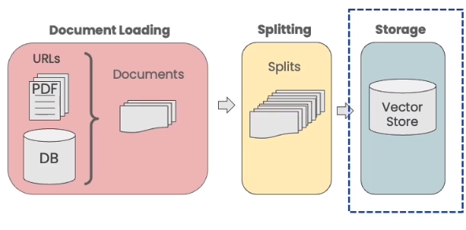

# 🦜🔗 **LangChain Vector Stores & Embeddings**

## 📖 **Overview**

This section of the project focuses on **vector stores and embeddings**, a crucial step in enabling **semantic search and retrieval-augmented generation (RAG)** using LangChain. By leveraging **text embeddings and vector databases**, we can efficiently store and retrieve documents based on their semantic meaning rather than exact keyword matches.

The image below provides an **overview of the process**, demonstrating how documents are **split, embedded, stored in a vector database, and queried** to retrieve relevant information.



In this section, we cover:

- **Text splitting** using `RecursiveCharacterTextSplitter`.
- **Generating OpenAI embeddings** for text chunks.
- **Storing embeddings** in a **Chroma** vector database.
- **Performing similarity searches** to find relevant documents.
- **Identifying and addressing failure modes** in semantic retrieval.

## 📂 **Files**

1. **`1_embeddings.py`**  
   Demonstrates how to generate embeddings for text snippets and compute similarity between them.

2. **`2_vector_stores.py`**  
   Loads documents, processes them into embeddings, and stores them in a **Chroma vector database**.

3. **`3_failure_modes.py`**  
   Highlights potential failure modes in retrieval, such as duplicate documents and misleading search results.

## 🛠 **Functionality**

### **Key Features**

- **Suppresses deprecation warnings** for cleaner console output.
- **Sets up the OpenAI API** by loading environment variables.
- **Implements text splitting** to handle large documents.
- **Generates vector embeddings** to represent text meaningfully.
- **Stores and retrieves embeddings** in a vector database.
- **Analyses failure cases** and suggests improvements for retrieval accuracy.

### **High-Level Flow**

1. **Document Loading & Splitting**  
   - PDFs are loaded and processed.
   - Text is split into chunks of **1500 characters** with an **overlap of 150**.

2. **Generating Embeddings**  
   - Each chunk is transformed into an embedding vector.
   - Similarity between text snippets is computed.

3. **Storing in a Vector Database**  
   - Embeddings are stored in a **Chroma vector database**.
   - Queries are performed to find the most similar chunks.

4. **Failure Modes in Retrieval**  
   - Duplicate documents create redundant search results.
   - Queries can return unrelated results due to lack of context diversity.

## 📝 **Example Outputs**

### 📄 **Loading and Splitting Documents**
```python
from langchain.document_loaders import PyPDFLoader
from langchain.text_splitter import RecursiveCharacterTextSplitter

# Load PDFs
loaders = [
    PyPDFLoader("documents/MachineLearning-Lecture01.pdf"),
    PyPDFLoader("documents/MachineLearning-Lecture02.pdf"),
    PyPDFLoader("documents/MachineLearning-Lecture03.pdf")
]

docs = []
for loader in loaders:
    docs.extend(loader.load())

# Split text
text_splitter = RecursiveCharacterTextSplitter(
    chunk_size=1500,
    chunk_overlap=150
)
splits = text_splitter.split_documents(docs)
print(len(splits))
```
```plaintext
209
```

### 🔢 **Generating Embeddings**
```python
from langchain.embeddings.openai import OpenAIEmbeddings
import numpy as np

embedding = OpenAIEmbeddings()

sentence1 = "i like dogs"
sentence2 = "i like canines"
sentence3 = "the weather is ugly outside"

embedding1 = embedding.embed_query(sentence1)
embedding2 = embedding.embed_query(sentence2)
embedding3 = embedding.embed_query(sentence3)

print(np.dot(embedding1, embedding2))
print(np.dot(embedding1, embedding3))
print(np.dot(embedding2, embedding3))
```
```plaintext
0.9631511380693046
0.7720831371983216
0.7595486297911649
```

### 🔍 **Performing Similarity Search**
```python
question = "is there an email i can ask for help"
docs = vectordb.similarity_search(question, k=3)
print(len(docs))
print(docs[0].page_content)
```
```plaintext
3
"cs229-q@cs.stanford.edu. This goes to an acc that’s read by all the TAs and me. ..."
```

### ⚠️ **Failure Modes in Semantic Search**
```python
question = "what did they say about matlab?"
docs = vectordb.similarity_search(question, k=5)

print(docs[0].page_content)
print(docs[1].page_content)
```
```plaintext
"Those homeworks will be done in either MATLAB B or in Octave ..."
"Those homeworks will be done in either MATLAB B or in Octave ..."  (Duplicate result)
```

```python
# Another failure mode: Question about Lecture 3 returns results from multiple lectures
question = "what did they say about regression in the third lecture?"
docs = vectordb.similarity_search(question, k=5)
for doc in docs:
    print(doc.metadata)
```
```plaintext
{'source': 'docs/cs229_lectures/MachineLearning-Lecture03.pdf', 'page': 0}
{'source': 'docs/cs229_lectures/MachineLearning-Lecture02.pdf', 'page': 8}
{'source': 'docs/cs229_lectures/MachineLearning-Lecture01.pdf', 'page': 8}
```

## 🚀 **Conclusion**

This section explores **embeddings and vector stores**, essential tools for **retrieval-based AI applications**. We examined:

- How to **split and embed documents** for efficient retrieval.
- How to **store embeddings in a vector database** and perform similarity searches.
- **Potential failure modes** in semantic search and how they impact retrieval accuracy.

The next steps will involve **refining retrieval strategies** to mitigate failure cases and improve search relevance!
