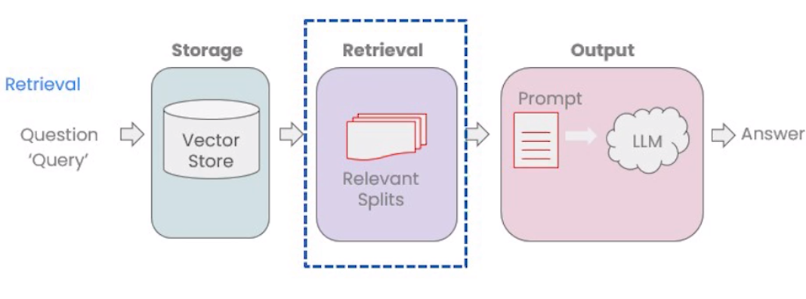

# 🦜🫀 **LangChain Retrieval Techniques**

## 📖 **Overview**

This section of the project focuses on **retrieval techniques** in LangChain, specifically addressing limitations of basic similarity search and exploring alternative retrieval methods. The retrieval step is crucial in **retrieval-augmented generation (RAG)**, as it determines the quality and relevance of the information retrieved from a **vector database**.

The diagram below illustrates the **retrieval process**, showing how a query passes through a vector store, retrieves relevant splits, and constructs a final prompt for the LLM:



This section covers:

- **Basic similarity search** and its limitations.
- **Maximal Marginal Relevance (MMR)** to improve retrieval diversity.
- **Metadata filtering** for contextual search.
- **Compression techniques** to refine document retrieval.
- **SVM-based and TF-IDF-based retrieval** as alternative approaches.

## 📂 **Files**

1. **`1_addressing_problems.py`**  
   Covers challenges in **basic similarity search** and solutions such as **MMR** and **metadata filtering**.

2. **`2_other_techniques.py`**  
   Explores **SVM and TF-IDF retrieval** as alternatives to standard vector-based retrieval.

## 🛠 **Functionality**

### **Key Features**

- **Suppresses deprecation warnings** for cleaner console output.
- **Sets up OpenAI API** for embedding generation.
- **Implements different retrieval strategies** for improved search performance.
- **Demonstrates retrieval limitations** and mitigation techniques.

### **High-Level Flow**

1. **Query Processing & Similarity Search**  
   - Queries are transformed into vector embeddings.
   - Documents are retrieved based on similarity.

2. **Addressing Diversity with MMR**  
   - Reduces redundancy in retrieved documents.
   - Ensures a diverse set of relevant results.

3. **Metadata Filtering for Contextual Search**  
   - Enables retrieval from specific sources (e.g., a particular lecture note).

4. **Applying Compression for Efficient Retrieval**  
   - Uses LLM-based compression to refine document retrieval.

5. **Exploring Alternative Retrieval Methods**  
   - Implements **SVM and TF-IDF** retrieval as non-vector-based approaches.

## 📝 **Example Outputs**

### 📄 **Performing Similarity Search**
```python
question = "What did they say about MATLAB?"
docs_ss = vectordb.similarity_search(question, k=3)
print(docs_ss[0].page_content[:200])
```
```plaintext
"Those homeworks will be done in either MATLAB B or in Octave ..."
```

### 📊 **Applying Maximal Marginal Relevance (MMR)**
```python
question = "What did they say about MATLAB?"
docs_mmr = vectordb.max_marginal_relevance_search(question, k=3)
print(docs_mmr[1].page_content[:200])
```
```plaintext
"Algorithm then? So what's different? How come I was making all that noise earlier about \nlea st squa..."
```

### 📚 **Filtering by Metadata for Contextual Search**
```python
question = "What did they say about regression in the third lecture?"
docs = vectordb.similarity_search(
    question,
    k=3,
    filter={"source": "docs/cs229_lectures/MachineLearning-Lecture03.pdf"}
)
for d in docs:
    print(d.metadata)
```
```plaintext
{'source': 'docs/cs229_lectures/MachineLearning-Lecture03.pdf', 'page': 0}
{'source': 'docs/cs229_lectures/MachineLearning-Lecture03.pdf', 'page': 13}
{'source': 'docs/cs229_lectures/MachineLearning-Lecture03.pdf', 'page': 4}
```

### 🧪 **Compression-Based Retrieval**
To reduce redundancy and improve retrieval efficiency, we apply **LLM-based compression**. The diagram below shows how relevant splits are compressed before being passed to the LLM:


```python
compressed_docs = compression_retriever.get_relevant_documents(question)
pretty_print_docs(compressed_docs)
```
```plaintext
Document 1:
"Those homeworks will be done in either MATLAB B or in Octave..."
Document 2:
"Oh, it was the MATLAB."
```

### 🧬 **Using SVM & TF-IDF Retrievers**
```python
question = "What are major topics for this class?"
docs_svm = svm_retriever.get_relevant_documents(question)
print(docs_svm[0].page_content[:200])
```
```plaintext
"Let me just check what questions you have right now. So if there are no questions, I'll just close ..."
```
```python
question = "What did they say about MATLAB?"
docs_tfidf = tfidf_retriever.get_relevant_documents(question)
print(docs_tfidf[0].page_content[:200])
```
```plaintext
"Saxena and Min Sun here did, which is given an image like this, right? This is actually a v\npicture..."
```

## 🚀 **Conclusion**

This section explores **advanced retrieval strategies**, showcasing their advantages and limitations. We examined:

- **Basic similarity search** and its drawbacks.
- **MMR for more diverse retrieval results**.
- **Metadata filtering for precise contextual search**.
- **Compression-based retrieval** to refine document outputs.
- **SVM and TF-IDF retrieval** as alternative approaches.

By implementing these techniques, we **enhance retrieval performance** and improve the quality of answers returned by the LLM.