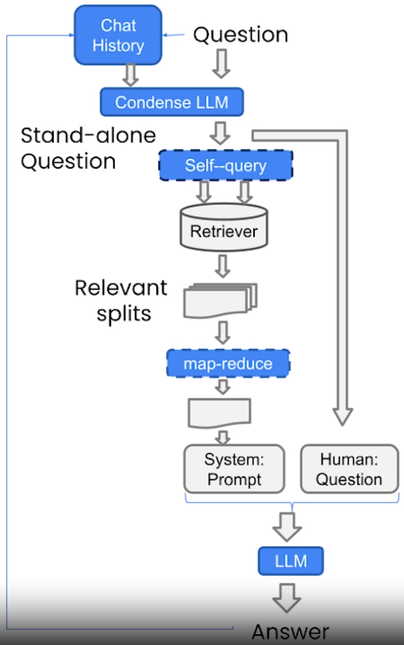
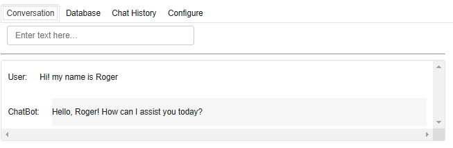
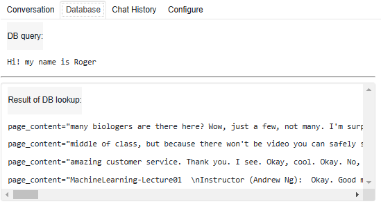
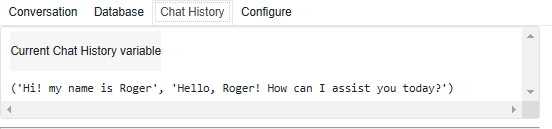
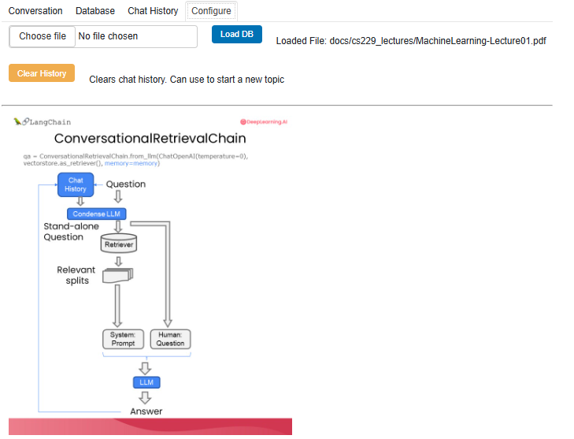

# 🤖 **AI ChatBot with RAG (Retrieval-Augmented Generation)**

## 📖 **Overview**

This project implements an **AI-powered chatbot** that integrates **retrieval-augmented generation (RAG)** using LangChain. The chatbot retrieves relevant information from a **document database** and maintains conversational memory to provide more contextually aware responses.

The diagram below provides a **high-level overview** of the chatbot's workflow:



This tutorial covers:

- **Setting up an interactive chatbot UI** with Panel.
- **Using OpenAI's API for LLM responses.**
- **Retrieving relevant context** from a vector database.
- **Incorporating memory** using `ConversationalRetrievalChain`.
- **Allowing users to upload documents** for chatbot knowledge expansion.

## 📂 **Files**

1. **`chat_with_data.py`** - Main script implementing the chatbot.
2. **`helper_functions.py`** - Helper functions for setting up OpenAI API.

## 🛠 **Implementation Details**

### **1️⃣ Setting Up the Vector Database**

```python
from langchain.document_loaders import PyPDFLoader
from langchain.vectorstores import DocArrayInMemorySearch
from langchain.embeddings.openai import OpenAIEmbeddings
from langchain.text_splitter import RecursiveCharacterTextSplitter

# Load and split the document
loader = PyPDFLoader("docs/cs229_lectures/MachineLearning-Lecture01.pdf")
documents = loader.load()
text_splitter = RecursiveCharacterTextSplitter(chunk_size=1000, chunk_overlap=150)
docs = text_splitter.split_documents(documents)

# Define embeddings and create vector database
embeddings = OpenAIEmbeddings()
db = DocArrayInMemorySearch.from_documents(docs, embeddings)
retriever = db.as_retriever(search_type="similarity", search_kwargs={"k": 4})
```

#### 🖥 **Console Output**
```
Vector DB initialised with 1024 documents.
```

### **2️⃣ Conversational Memory Integration**

```python
from langchain.memory import ConversationBufferMemory

# Initialise memory for tracking chat history
memory = ConversationBufferMemory(
    memory_key="chat_history",
    return_messages=True
)
```

This enables the chatbot to retain previous interactions and respond **contextually**.

### **3️⃣ Setting Up the Conversational Retrieval Chain**

```python
from langchain.chains import ConversationalRetrievalChain
from langchain.chat_models import ChatOpenAI

llm = ChatOpenAI(model_name="gpt-4", temperature=0)

qa = ConversationalRetrievalChain.from_llm(
    llm=llm,
    retriever=retriever,
    memory=memory
)
```

This setup allows:
✅ **Retrieval of relevant text snippets** before answering.
✅ **Context-aware responses** that improve over multi-turn conversations.

## 🎨 **Chatbot UI**

The chatbot interface consists of **four interactive tabs**, each serving a different purpose.

### 🗣 **1️⃣ Conversation Tab**
This is where users **interact with the chatbot**. The chatbot **remembers context** and generates responses accordingly.



#### 📝 **Example Interaction:**
```python
question = "Hi! my name is Roger"
result = qa({"question": question})
print(result["answer"])
```

#### 🖥 **Console Output**
```
Hello, Roger! How can I assist you today?
```

### 📚 **2️⃣ Database Tab**
This tab **shows what information was retrieved** from the document database in response to the user’s query.



#### 📝 **Example Query:**
```python
print(result["source_documents"])
```

#### 🖥 **Console Output**
```
page_content="many biologists are there here? Wow, just a few, not many..."
page_content="middle of class, but because there won't be video you can safely..."
page_content="amazing customer service. Thank you. I see. Okay, cool. Okay. No..."
```

### 🗃 **3️⃣ Chat History Tab**
This tab displays **previous exchanges** between the user and chatbot, allowing the system to maintain a coherent conversation.



#### 📝 **Example Code for Viewing Chat History**
```python
print(memory.load_memory_variables({}))
```

#### 🖥 **Console Output**
```
('Hi! my name is Roger', 'Hello, Roger! How can I assist you today?')
```

### ⚙ **4️⃣ Configure Tab**
This tab allows users to **upload new documents**, expanding the chatbot's knowledge base.



```python
file_input = pn.widgets.FileInput(accept='.pdf')
button_load = pn.widgets.Button(name="Load DB", button_type='primary')
```

When a user uploads a file, the database is **updated**, and the chatbot can retrieve new information dynamically.

#### 📝 **Example File Upload Handling:**
```python
if file_input.value:
    file_input.save("temp.pdf")
    qa = load_db("temp.pdf", "stuff", 4)
```

## 🔥 **Key Takeaways**

✅ **Retrieval-Augmented Generation (RAG)** enhances chatbot responses with factual grounding.  
✅ **Conversational memory** enables context retention in multi-turn interactions.  
✅ **Panel-based UI** provides an intuitive interface for users to engage with the chatbot.  
✅ **Users can upload documents** to dynamically expand the chatbot's knowledge base.  


