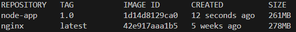
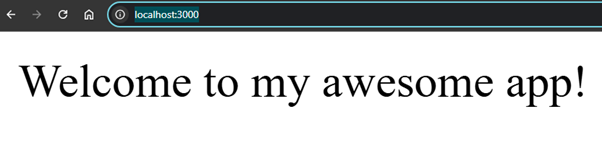

# **Simple Dockerized Node.js Application**

## **Overview**
This project demonstrates how to build a Docker image for a basic Node.js application, run it as a container, and access it via a web browser. The application is a simple web server created using **Express.js**, which listens on port `3000` and responds with "Welcome to my awesome app!".

This guide walks through:
1. Writing the application code (`server.js`).
2. Creating a `Dockerfile` to containerize the application.
3. Running the application in a Docker container.
4. Testing the application in your browser.

## **Project Files**

### 1. **`server.js`**
This is the main application file, written in Node.js using the `Express` library.

```javascript
const express = require('express');
const app = express();

app.get('/', (req, res) => {
    res.send("Welcome to my awesome app!");
});

app.listen(3000, function () {
    console.log("App listening on port 3000");
});
```

#### **Explanation**:
- **Line 1**: Imports the `Express` library, which simplifies building web applications in Node.js.
- **Line 2**: Initializes an Express application instance.
- **Line 4-6**: Sets up a route (`/`) that responds with "Welcome to my awesome app!" when accessed.
- **Line 8-10**: Starts the application and listens for HTTP requests on port `3000`.

### 2. **`package.json`**
This file defines the project metadata and dependencies.

```json
{
    "name": "my-app",
    "version": "1.0",
    "dependencies": {
        "express": "4.18.2"
    }
}
```

#### **Explanation**:
- **`name`**: The name of the project.
- **`version`**: The version of the application.
- **`dependencies`**: Lists the required libraries (`express` in this case) and their versions.

### 3. **`Dockerfile`**
This file defines the instructions for building the Docker image.

```dockerfile
FROM node:19-alpine

COPY package.json /app/
COPY src /app/

WORKDIR /app

RUN npm install

CMD ["node", "server.js"]
```

#### **Explanation**:
- **`FROM node:19-alpine`**: Uses a lightweight Node.js image as the base.
- **`COPY package.json /app/`**: Copies the `package.json` file into the container's `/app` directory.
- **`COPY src /app/`**: Copies the source code (e.g., `server.js`) into the container.
- **`WORKDIR /app`**: Sets the working directory inside the container to `/app`.
- **`RUN npm install`**: Installs the dependencies listed in `package.json` (e.g., `express`).
- **`CMD ["node", "server.js"]`**: Specifies the command to start the application when the container runs.

## **Setup Instructions**

### **Step 1: Build the Docker Image**
Run the following command to build the Docker image:
```bash
docker build -t node-app:1.0 .
```
This creates an image tagged `node-app:1.0`.

**Example Output:**




### **Step 2: Run the Docker Container**
Run the following command to start a container from the image:
```bash
docker run -d -p 3000:3000 node-app:1.0
```

- **`-d`**: Runs the container in detached mode.
- **`-p 3000:3000`**: Maps port `3000` on your local machine to port `3000` inside the container.


### **Step 3: Verify the Application**
1. Open your browser and navigate to [http://localhost:3000](http://localhost:3000).
2. You should see the message:  
   **"Welcome to my awesome app!"**

**Example:**



## **Project Features**

### 1. **Modular Application Code**
The application code (`server.js`) is simple and modular, using `Express.js` to handle routes and responses.

### 2. **Lightweight Docker Image**
Using the `node:19-alpine` base image ensures the Docker image is small, making it efficient for deployment.

### 3. **Port Mapping**
The project demonstrates how to map container ports to local ports, making the application accessible on your host machine.

## **Key Commands Recap**

### Build the Image
```bash
docker build -t node-app:1.0 .
```

### Run the Container
```bash
docker run -d -p 3000:3000 node-app:1.0
```

### Check Running Containers
```bash
docker ps
```

### Stop a Container
```bash
docker stop <CONTAINER_ID>
```

## **Additional Notes**
- Ensure Docker is installed and running on your system.
- The images folder (`images/dockerimage.png` and `images/local3000.png`) should be in the same directory as the `README.md` file.
- To modify the application, update `server.js`, rebuild the image, and restart the container.
