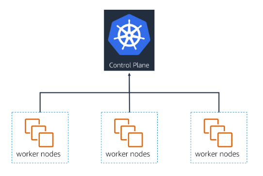

# 📌 Cluster

A **Cluster** is the complete Kubernetes environment that manages and runs your containerised applications.

> **"A cluster is a set of worker machines (called nodes) and a control plane that manages them."**

Every cluster consists of:

* **Worker Nodes** → Where your application workloads (pods) actually run.
* **Control Plane** → Manages the cluster, schedules workloads, and maintains the desired state.

## 📊 Cluster Overview

The diagram above shows the relationship within a Kubernetes cluster:
- The **Control Plane** sits at the top and manages everything.
- Below it are multiple **worker nodes** that run the actual application pods.
- Every cluster must have at least **one worker node**, but usually there are many to handle workloads and ensure high availability.

## 🎯 **Summary:**

* A **cluster** combines the control plane and worker nodes to run applications.
* **Control Plane** → makes decisions and manages the state.
* **Worker Nodes** → run the pods that host application containers.
* Kubernetes uses this structure to scale and manage workloads automatically.
