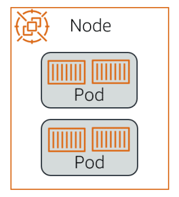

# 📌 Node

A **Node** is a machine (physical or virtual) that runs your workloads in Kubernetes.

> **"Kubernetes runs your workload by grouping containers into pods and assigning those pods to run on nodes."**

Each node has:

* **Services and agents needed to run pods** (like kubelet, container runtime, and kube-proxy).
* The ability to host one or more **pods**, which contain your application containers.
* Management from the **control plane**, which schedules pods onto the node.

A node can be:

* A **virtual machine (VM)** (in cloud environments like AWS, GCP).
* A **physical machine (bare metal)** (in on-premise setups).

## 📊 Node Overview

The diagram above shows a node running two pods. Each pod contains one or more containers, and the node provides the computing resources (CPU, memory, networking) they need.

## 🎯 **Summary:**

* A **node** is where Kubernetes actually runs your app (pods and containers).
* **Pods are scheduled by the control plane to run on available nodes.**
* **Nodes provide CPU, memory, networking, and storage needed for the pods.**
* Nodes can be **virtual or physical**, depending on your Kubernetes setup.

