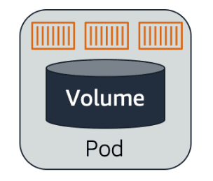

# 📌 Pod

A **Pod** is the smallest and simplest unit in the Kubernetes object model.

> **"A pod is a wrapper for one or more containers that should be managed as a single unit."**

Each pod:

* Can contain **one or more containers** (though usually just one).
* Shares the same:
  * **Network namespace** → containers can communicate via `localhost`.
  * **Storage volumes** → shared data between containers.
* Is scheduled onto a **worker node**, where it runs and provides application functionality.
* Is managed by higher-level Kubernetes objects, like ReplicaSets and Deployments.

## 📊 Pod Overview

The diagram above shows a pod running two containers. These containers:
- Share the same pod environment (IP, storage, lifecycle).
- Work together closely (for example, a web app and its helper or sidecar).

---

## 📦 Volumes in Pods

Containers inside a pod may need to **share data** or **store data across restarts**.  
Kubernetes provides **volumes** for this purpose.

The diagram above shows a pod with a shared volume. All containers in the pod can access this volume.

### 📌 Types of Volumes

#### 📍 Ephemeral Volume

> **"Destroyed when the pod is destroyed."**

* Good for temporary data and sharing between containers in the pod.
* Automatically created and deleted with the pod.
* Example: scratch data, temporary caches.

#### 📍 Persistent Volume

> **"Lives beyond the pod."**

* Managed independently of pods → can be reused by new pods.
* Backed by external storage (cloud disks, network storage, etc).
* Ideal for important data → databases, files that must survive pod restarts/deletion.

---

## 🎯 **Summary:**

* A **pod** is the basic unit that Kubernetes schedules onto nodes.
* Each pod can contain **one or more containers**, typically closely related.
* **Containers in a pod share the same IP and storage volumes**, but are isolated from other pods.
* Pods are **temporary by design**, but volumes can help persist data.
* **Ephemeral volumes** are deleted with the pod, while **persistent volumes** survive and can be reused.

