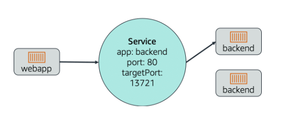

# 📌 Service

A **Service** in Kubernetes provides a stable network endpoint to access a group of pods.

> **"Pods are temporary and can change — a Service gives clients a consistent way to access them."**

Each Service:

* **Selects a group of pods** based on labels (e.g. `app: backend`).
* **Provides a stable IP and DNS name**, so clients do not need to track pod changes.
* **Load balances traffic** between the selected pods automatically.

---

## 📊 Service Overview

The diagram above shows a common pattern:
1. A **webapp pod** needs to talk to the backend pods.
2. Instead of talking directly (which would break if pods changed), the webapp sends traffic to a **Service**.
3. The **Service** listens on `port: 80` and forwards the traffic to the backend pods on their `targetPort: 13721`.
4. The Service forwards requests to **any backend pod that matches the selector (`app: backend`)**, spreading traffic automatically (load balancing).

✅ Even if backend pods are destroyed and replaced, the Service **always routes traffic to available backend pods.**

---

## 📦 Types of Services (briefly)

* **ClusterIP (default)** → Only accessible from within the cluster.
* **NodePort** → Exposes the Service on a static port on each node.
* **LoadBalancer** → Integrates with cloud providers to expose the Service externally.
* **ExternalName** → Maps the Service to an external DNS name.

---

## 🎯 **Summary:**

* A **Service** allows other pods and clients to access backend pods reliably.
* Services **select pods by label**, and route traffic to them.
* Services **load balance traffic** across pods, providing stability and scaling.
* The example shown routes traffic from a **webapp → Service → backend pods**, even as backend pods are created and destroyed dynamically.

