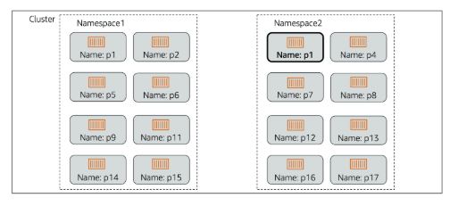

# 📌 Namespace

A **Namespace** in Kubernetes is a way to **logically divide cluster resources**.

> **"Namespaces allow multiple teams, projects, or environments to share the same physical cluster while keeping their resources separate."**

Key points about namespaces:

* Provide **isolation** between different groups of resources.
* Resources in different namespaces can have the **same names** (e.g. two `web-app` pods in `dev` and `prod` namespaces).
* Useful for:
  * Multi-team environments.
  * Separating development, testing, and production workloads.
  * Applying security and access controls.

## 📊 Namespace Overview

The diagram above shows how namespaces logically organise resources:

- The **cluster** contains multiple namespaces (e.g. `team-a`, `team-b`).
- Each namespace contains its own pods and other Kubernetes objects.
- Kubernetes schedules pods from **any namespace** onto **any available worker node**.
- Namespaces do **not physically isolate resources** → they logically group them.

---

## 🎯 **Summary:**

* A **namespace** groups Kubernetes resources for logical separation.
* Resources (like pods and services) in different namespaces are **isolated but can coexist in the same cluster**.
* Namespaces are useful for **multi-team environments**, **projects**, and **access control**.
* Pods from different namespaces may run side by side on the same **worker nodes**, but are logically separated.