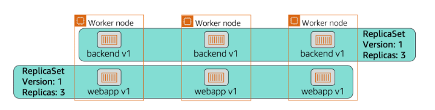
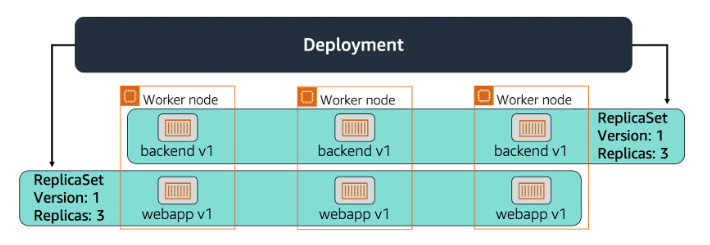

# 📌 ReplicaSets and Deployments

Kubernetes uses **ReplicaSets** and **Deployments** to ensure the right number of pod instances are running and to manage their lifecycle easily and safely.

---

## 📦 ReplicaSet

A **ReplicaSet** ensures that a specific number of **identical pod replicas** are running at all times.

> **"If pods fail or are deleted, the ReplicaSet creates new ones automatically to maintain the desired count."**

ReplicaSets:

* Guarantee **high availability** by maintaining pod replicas.
* Automatically **replace failed or deleted pods**.
* Are usually **managed by Deployments**, though they can be used directly (rare in practice).

## 📊 ReplicaSet Overview

In the example above:
- A **ReplicaSet** is defined with `replicas: 3` for the `backend` and `webapp` pods.
- Kubernetes schedules these pods onto available **worker nodes**.
- If a pod crashes or is removed, the ReplicaSet automatically **replaces it to maintain 3 running pods.**

✅ **ReplicaSets keep the desired number of pods running at all times.**

---

## 🚀 Deployment

A **Deployment** is a higher-level object that manages ReplicaSets and provides more powerful features like versioning and controlled updates.

> **"You describe the desired state in the Deployment, and Kubernetes makes it happen safely and incrementally."**

Deployments:

* Automatically create and manage **ReplicaSets**.
* Allow easy **rolling updates** to update pod versions without downtime.
* Enable **rollback** to previous versions if something goes wrong.
* Make it simple to scale the number of replicas up or down.

## 📊 Deployment Overview

In the diagram above:
- The **Deployment** defines that there should be `3 replicas` of `backend v1` and `webapp v1`.
- The Deployment creates a **ReplicaSet** to maintain these pods.
- The ReplicaSet then manages pod creation across **worker nodes**.
- If you update the Deployment (for example, new image version `backend v2`), Kubernetes will:
  - Gradually scale down `backend v1` pods.
  - Gradually scale up `backend v2` pods.
  - This ensures **zero downtime rolling updates**.

✅ **Deployments make managing ReplicaSets and rolling out updates simple and safe.**

---

## 🎯 **Summary:**

* **ReplicaSet → maintains the desired number of pod replicas.**
* **Deployment → manages ReplicaSets and provides advanced features** like updates, rollback, and scaling.
* Use **Deployments** for nearly all practical Kubernetes app deployments → they make management safer and easier.

