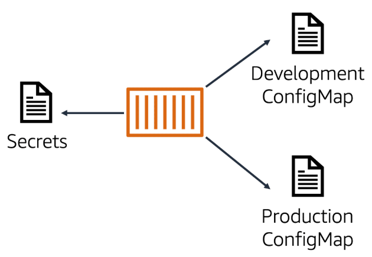

# 📌 ConfigMap and Secrets

Kubernetes uses **ConfigMaps** and **Secrets** to provide configuration and sensitive data to pods in a clean and secure way.

> **"Keep your application configuration and secrets separate from your container images."**

---

## 📦 ConfigMap

A **ConfigMap** is used to store **non-sensitive configuration data** as key-value pairs.

> **"ConfigMaps let you provide configuration to pods without hardcoding it in your container images."**

ConfigMaps:

* Store configuration such as:
  * Application settings (e.g. `LOG_LEVEL=DEBUG`)
  * Database connection strings (if non-sensitive)
  * Feature flags
* Can be provided to pods as:
  * **Environment variables**
  * **Command-line arguments**
  * **Mounted configuration files**

✅ **ConfigMaps make applications more portable and flexible.**

---

## 🔐 Secrets

A **Secret** is used to store **sensitive information** securely.

> **"Secrets store sensitive data like passwords and API keys, and restrict access to it."**

Secrets:

* Store sensitive data such as:
  * API keys
  * Passwords
  * TLS certificates
* Are encoded (base64) and can be **encrypted at rest**.
* Access is controlled using **RBAC policies**.
* Can be injected into pods:
  * As **environment variables**
  * Mounted as **volumes (files)**

✅ **Secrets improve security by restricting and encrypting sensitive data.**

---

## 📊 ConfigMap and Secrets Overview

The diagram above shows how ConfigMaps and Secrets are used:

- A pod may use:
  - **Development ConfigMap** → non-sensitive settings.
  - **Production ConfigMap** → production settings.
  - **Secrets** → sensitive credentials like database passwords.
  
✅ Kubernetes cleanly separates configuration and secrets → allowing secure and environment-specific settings for pods.

---

## 🎯 **Summary:**

* **ConfigMaps** → store non-sensitive configuration data → injected into pods as env vars, files, or args.
* **Secrets** → store sensitive data securely → encrypted, access-controlled → injected into pods safely.
* Using ConfigMaps and Secrets keeps configuration separate from container images → improving **security**, **portability**, and **flexibility**.

