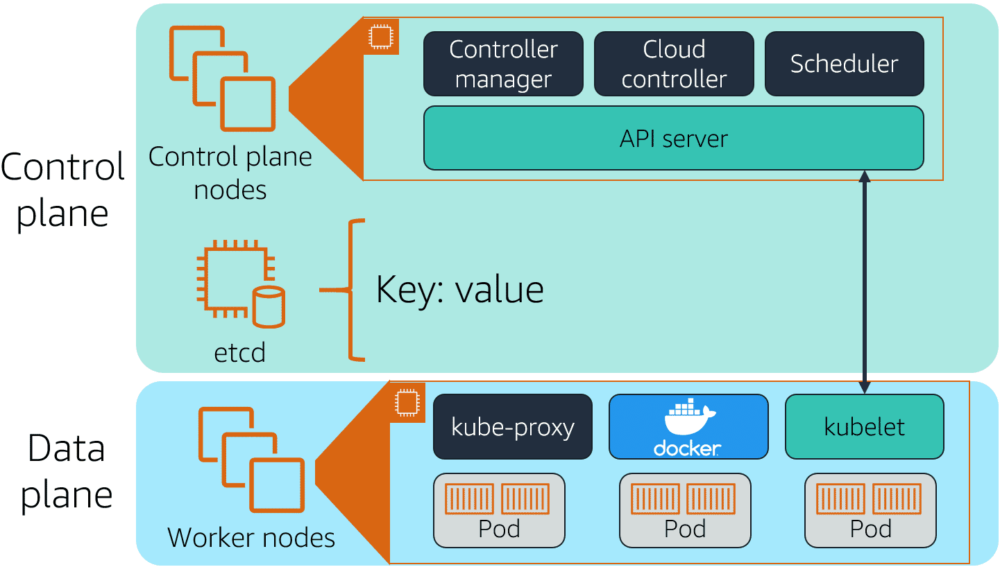

# 📌 Control Plane and Data Plane

## 🚀 What is the Control Plane?

> **"Manages everything — where, when, and how pods run."**

Components:

* **API Server** → Central access point. Everything (kubectl, controllers) talk to Kubernetes through this.
* **Scheduler** → Decides **where pods should be placed** → (as above).
* **Controller Manager** → Makes sure desired state is met (e.g. if pod dies, creates a new one).
* **Cloud Controller Manager** → Talks to cloud provider (e.g. AWS, GCP) if necessary.
* **etcd** → **Key-value store** → saves all cluster state data (pods, namespaces, deployments, etc.).

### 🎯 **Summary:**

> The control plane is the brain — it manages decisions and stores the desired state.

## 📊 Control Plane and Data Plane Overview



The diagram above shows how the control plane and data plane work together:
- The control plane makes scheduling and management decisions.
- The data plane executes those decisions by running the application pods on worker nodes.

## 🏗️ What is the Data Plane?

> **"Where your app actually runs."**

Components:

* **Worker Nodes** → The computers that run your pods.
* **kubelet** → The **agent on each worker node** → talks to control plane → manages pods locally.
* **Container Runtime (e.g. Docker)** → Actually runs the containers inside pods.
* **kube-proxy** → Handles networking → makes sure pods can talk to each other and to the outside world.

### 🎯 **Summary:**

> The data plane runs your workloads → pods → containers → your apps.

## 🚦 Big picture view:

```
[ Control Plane (brain) ]
   - API Server
   - Scheduler
   - Controller Manager
   - etcd

   |
   v

[ Data Plane (muscle) ]
   - Worker Node 1 --> kubelet --> Pod(s) --> Container(s)
   - Worker Node 2 --> kubelet --> Pod(s) --> Container(s)
```

✅ **Control Plane decides WHAT and WHERE.**
✅ **Data Plane does the actual running of the containers (the apps).**

### 🎯 **Summary:**

* **Control Plane = Decides what to run and where → Scheduler and Controllers.**
* **Data Plane = Actually runs your app → Worker Nodes → Pods → Containers.**
* **Scheduling → Filters worker nodes → picks the best one → runs the pod.**