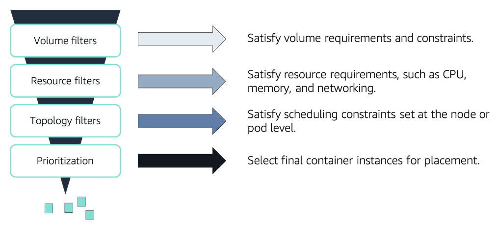

# 📌 Pod Scheduling

When you request a pod (via a Deployment, for example), Kubernetes needs to decide:

> **"Which worker node should this pod run on?"**

This is called **scheduling**, and the **Kubernetes Scheduler** handles this.

## 📊 Pod Scheduling Process

The diagram above shows the scheduling process where a pod goes through various filters and prioritization to decide the best node to run on.

## 🚦 How Scheduling Works (Filters and Prioritization):

### 1️⃣ **Volume filters**

* Checks if the node can provide the necessary **storage/volumes**.
* E.g. does this node have access to the disk or persistent volume the pod needs?

### 2️⃣ **Resource filters**

* Checks if the node has enough resources:

  * CPU
  * Memory (RAM)
  * Network capacity
* If not enough resources → node is skipped.

### 3️⃣ **Topology filters**

* Checks for placement rules:

  * Should pods be spread across availability zones?
  * Should they avoid running together for high availability?

### 4️⃣ **Prioritization**

* After eliminating unsuitable nodes → ranks the remaining ones:

  * Which has the most free resources?
  * Which will balance the load best?

The **best candidate node** is selected → **pod is scheduled and launched there.**

## 🎯 **Summary:**

> Scheduling = Kubernetes choosing the best worker node using filters (requirements → constraints → prioritization).