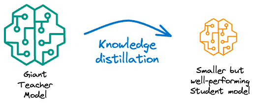
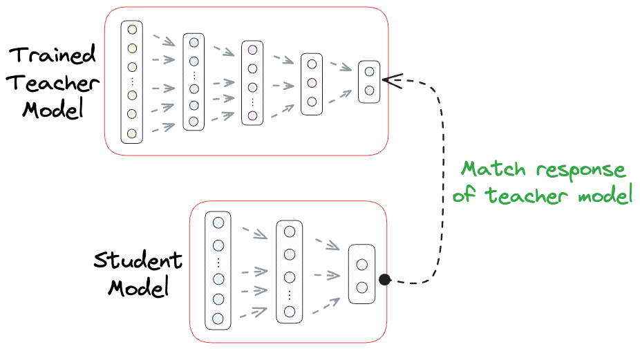

# 📚 Knowledge Distillation for Model Compression

## 🔍 Overview

This project demonstrates **Knowledge Distillation**, a technique used for model compression in deep learning. A large, pre-trained **Teacher Model** transfers its knowledge to a smaller **Student Model**, which mimics its behavior while maintaining competitive performance.

### 📌 Why Knowledge Distillation?
- Reduces computational complexity.
- Makes deployment feasible on resource-limited devices.
- Achieves high accuracy while being more efficient.

### 📷 Knowledge Distillation Process
Below is a visual representation of Knowledge Distillation:



In this implementation, we specifically use **Response-Based Knowledge Distillation**, where the Student Model learns by mimicking the probability distribution of the Teacher Model's predictions.



(Images from [Daily Dose of Data Science](https://www.dailydoseofds.com/model-compression-a-critical-step-towards-efficient-machine-learning/))

## ✏️ KL Divergence: The Loss Function

In response-based knowledge distillation, the Student Model is trained using **KL Divergence** as the loss function. This measures the difference between two probability distributions:

$$
D_{KL}(P \parallel Q) = \sum_x P(x) \cdot \log \left( \frac{P(x)}{Q(x)} \right)
$$

where:
- $$P(x)$$ represents the probability distribution from the **Teacher Model**.
- $$Q(x)$$ represents the probability distribution from the **Student Model**.

If $$P(x)$$ and $$Q(x)$$ are identical, KL divergence equals **0**, meaning **no information is lost**.

## 🏗 Implementation Steps

1️⃣ **Load and preprocess the MNIST dataset** 📊
2️⃣ **Define and train a Teacher Model** 🏫
3️⃣ **Define a smaller Student Model** 🎓
4️⃣ **Train the Student Model using knowledge distillation** 🔥
5️⃣ **Compare performance in terms of accuracy and inference time** ⚡

## 📈 Training Performance

### **Teacher Model Training Performance**
| Epoch | Loss | Accuracy |
|--------|--------|------------|
| 1 | 0.2337 | 97.60% |
| 2 | 0.0770 | 98.00% |
| 3 | 0.0581 | 98.44% |
| 4 | 0.0494 | 98.24% |
| 5 | 0.0416 | 98.53% |

### **Student Model Training Performance**
| Epoch | Loss | Accuracy |
|--------|--------|------------|
| 1 | 1.9762 | 93.53% |
| 2 | 0.9072 | 94.67% |
| 3 | 0.6212 | 96.30% |
| 4 | 0.4836 | 96.29% |
| 5 | 0.4033 | 96.34% |

Despite a **modest accuracy drop** (from **98.53%** to **96.34%**), the Student Model is **significantly more efficient**.

## 🚀 Inference Speed Comparison

The Student Model not only maintains high accuracy but also achieves **faster inference speeds**.

| Model | Inference Time |
|--------|----------------|
| Teacher Model | 1.61 s ± 21.7 ms |
| Student Model | 1.09 s ± 63 ms |

This **33% speed improvement** makes the Student Model more practical for real-world deployment. 🚀

## 🛠 Running the Code

To train and evaluate the models, run:
```bash
python knowledge_distillation.py
```

## 🔥 Key Takeaways
✅ Knowledge Distillation reduces model size while maintaining accuracy.
✅ KL Divergence is used as the loss function for training the Student Model.
✅ The Student Model achieves a **33% faster inference time** with only a **2% accuracy drop**.

This technique is widely used in **mobile AI, edge computing, and model compression** for efficient deep learning deployment. 🚀