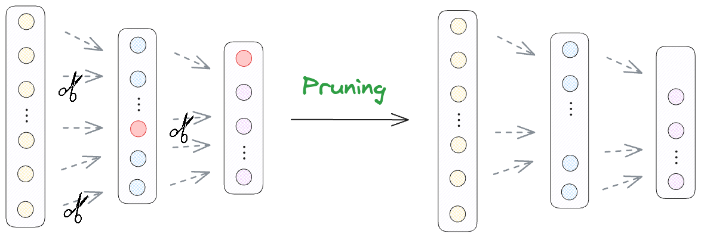

# ✂️ Neural Network Pruning for Model Compression

## 🔍 Overview

Pruning is a technique used to reduce the size of neural networks by removing less significant parameters, making models **smaller, faster, and more efficient** while maintaining competitive accuracy.

This project explores two pruning techniques:
- **Zero Pruning**: Eliminates weights that are below a threshold.
- **Activation Pruning**: Removes neurons with low activation values.

### 📷 Pruning in Machine Learning
Below are two conceptual illustrations of pruning:

1. **Decision Tree Pruning (for context)**

   

2. **Neural Network Pruning (our focus)**

   

(Images from [Daily Dose of Data Science](https://www.dailydoseofds.com/model-compression-a-critical-step-towards-efficient-machine-learning/))

## 🧹 Zero Pruning

Zero pruning sets model parameters to **zero** if they are below a certain threshold, reducing memory consumption without significantly affecting accuracy.

### 🔬 How It Works
- During training, many weights become small but **aren't necessarily important**.
- We set these near-zero weights to **exactly zero**, reducing the model’s size.
- This method keeps the network structure **unchanged**, making implementation simple.

### 📷 Zero Pruning Illustration


### 📊 Zero Pruning Results

| Threshold | Accuracy | Original Params | Zeroed Params | Zero Percentage |
|------------|------------|----------------|----------------|----------------|
| 0.00 | 97.07% | 566,528 | 0 | 0.00% |
| 0.01 | 97.05% | 566,528 | 120,825 | 21.33% |
| 0.02 | 97.03% | 566,528 | 238,169 | 42.04% |
| 0.03 | 96.58% | 566,528 | 345,597 | 61.00% |
| 0.04 | 93.75% | 566,528 | 422,488 | 74.57% |
| 0.06 | 82.20% | 566,528 | 488,538 | 86.23% |
| 0.08 | 74.05% | 566,528 | 517,510 | 91.35% |
| 0.10 | 53.83% | 566,528 | 535,227 | 94.47% |

### 🏗 Memory Impact
With a **0.02 pruning threshold**, the memory usage drops from **2.16MB** to **0.84MB**, a **61% reduction** with only a **0.04% accuracy drop**. 🚀

## 🧠 Activation Pruning

Activation pruning removes neurons that **activate infrequently**, reducing model size without major accuracy loss.

### 🔬 How It Works
- During training, neurons with low activation contribute **less to the output**.
- These weakly activated neurons are **removed entirely**, leading to a smaller, more efficient model.
- Unlike zero pruning, **activation pruning changes the network structure**.

### 📷 Activation Pruning Illustration


### 📊 Activation Pruning Results

| Threshold | Accuracy | Original Params | New Params | Inference Time (s) | Size Reduction |
|------------|------------|----------------|----------------|----------------|----------------|
| 0.0 | 96.63% | 567,434 | 567,434 | 1.406 | 0.00% |
| 0.1 | 96.44% | 567,434 | 215,901 | 1.196 | 61.95% |
| 0.2 | 96.37% | 567,434 | 199,489 | 1.361 | 64.84% |
| 0.3 | 96.11% | 567,434 | 182,201 | 1.425 | 67.89% |
| 0.4 | 94.24% | 567,434 | 165,041 | 1.300 | 70.91% |
| 0.6 | 87.49% | 567,434 | 136,019 | 1.326 | 76.03% |
| 0.8 | 82.55% | 567,434 | 106,310 | 1.495 | 81.26% |
| 1.0 | 64.49% | 567,434 | 76,409 | 1.262 | 86.53% |

## 🎯 Key Takeaways
✅ **Zero Pruning** eliminates unnecessary parameters, reducing memory usage **by 61%** with almost no accuracy loss.  
✅ **Activation Pruning** removes entire neurons, achieving up to **86% size reduction** while maintaining **reasonable accuracy**.  
✅ Both techniques offer **lightweight models with lower inference time**, making deep learning feasible for edge devices.  

## 🛠 Running the Code

To train and evaluate the pruned models, run:
```bash
python zero_pruning.py
python activation_pruning.py
```

🚀 **Pruning is a powerful tool to make deep learning models faster and more efficient without major accuracy loss!**

