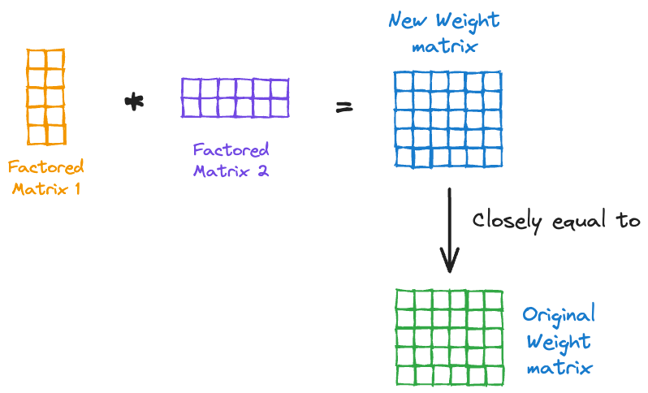
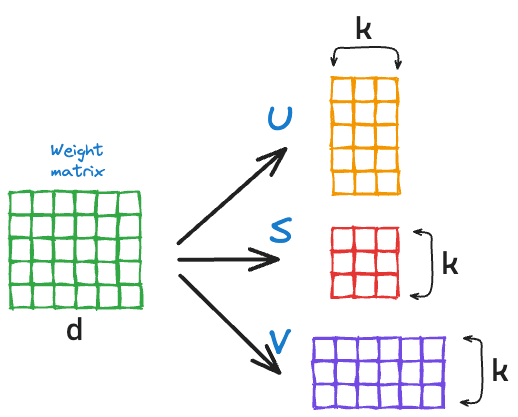

# 🔢 Low-Rank Factorization for Model Compression

## 🔍 Overview

Low-Rank Factorization (LRF) is a technique used to **compress large neural network layers** by decomposing weight matrices into lower-rank approximations. This significantly reduces computational cost and memory usage, enabling **faster inference** while maintaining high accuracy.

### 📷 Concept of Low-Rank Factorization
Below is an overview of how Low-Rank Factorization works:



We specifically use **Singular Value Decomposition (SVD)** to achieve this factorization:



(Images from [Daily Dose of Data Science](https://www.dailydoseofds.com/model-compression-a-critical-step-towards-efficient-machine-learning/))

## 🔬 How Low-Rank Factorization Works

- **Matrix Decomposition**: We apply **Singular Value Decomposition (SVD)** on weight matrices to break them into three components: \( U, S, V \).
- **Truncation**: Only the top \( k \) singular values are retained, where \( k \) is the **rank threshold**.
- **Reconstruction**: The original weight matrix is approximated using the retained components, resulting in a **compressed model**.

## 📊 Performance Results

The table below shows how reducing the rank affects accuracy, number of parameters, operations, and inference time:

| Rank Threshold | Accuracy | Original Params | New Params | Operations | Inference Time (s) |
|---------------|------------|----------------|----------------|----------------|----------------|
| 128 | 97.24% | 32,768 | 65,536 | 1,048,576 | 1.5758 |
| 100 | 97.24% | 32,768 | 48,400 | 1,548,800 | 1.5896 |
| 90 | 97.26% | 32,768 | 42,660 | 1,365,120 | 1.8174 |
| 80 | 97.26% | 32,768 | 37,120 | 1,187,840 | 1.5243 |
| 60 | 97.26% | 32,768 | 26,640 | 852,480 | 1.5719 |
| 20 | 97.16% | 32,768 | 8,080 | 258,560 | 1.4113 |
| 10 | 97.24% | 32,768 | 3,940 | 126,080 | 1.4396 |
| 5 | 80.23% | 32,768 | 1,945 | 62,240 | 1.4144 |
| 2 | 34.73% | 32,768 | 772 | 24,704 | 1.3504 |
| 1 | 19.08% | 32,768 | 385 | 12,320 | 1.2726 |

## 📌 Key Takeaways
✅ **Higher ranks (e.g., 100, 80, 60)** retain almost **identical accuracy** while reducing the number of parameters.  
✅ **Inference time decreases significantly** with lower ranks.  
✅ **Lower ranks (e.g., 5, 2, 1)** show extreme compression but with significant accuracy loss.  


## 🛠 Running the Code

To train and apply low-rank factorization, run:
```bash
python low-rank_factorisation.py
```

🚀 **Low-Rank Factorization is a powerful method for reducing neural network complexity while keeping performance high!**

