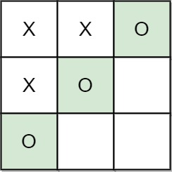

# 🎯 **LeetCode 1275: Find Winner on a Tic Tac Toe Game**

## 📌 **Problem Overview**
Tic-Tac-Toe is a game played on a **3 × 3 grid** by two players:  
- **Player A** always places **'X'**.  
- **Player B** always places **'O'**.  

The game follows these rules:
1. Players take turns placing their respective marks (`X` or `O`) in **empty** squares.
2. The game ends when **three** of the same non-empty character fill any **row, column, or diagonal**.
3. If all squares are filled and no player has won, the game is a **Draw**.
4. If the game has not ended but there are still moves left, the game is **Pending**.

**Goal:** Given a sequence of `moves`, determine the winner, return `"A"`, `"B"`, `"Draw"`, or `"Pending"`.

## 🎲 **Winning Conditions**
A player wins if they complete **any of the following conditions**:


## 🛠 **Approach**
The problem can be efficiently solved using a **3x3 board simulation**:

1. **Initialise a 3×3 Grid:** Represent the board as a **3×3 matrix**, starting empty.
2. **Simulate Moves:** Iterate through `moves`:
   - If it's Player A's turn, place `1` in the board (`X`).
   - If it's Player B's turn, place `-1` (`O`).
3. **Check Winning Conditions:**  
   - A player wins if any **row, column, diagonal, or anti-diagonal** is completely filled with their marker.
4. **Determine Final Result:**  
   - If a player wins, return their name (`"A"` or `"B"`).  
   - If all cells are filled, return `"Draw"`.  
   - If moves are still left, return `"Pending"`.

This approach ensures an **O(1) space complexity** and **O(N) time complexity**, where `N ≤ 9`.

## 🚀 **Python Solution**
```python
from typing import List

class Solution:
    def tictactoe(self, moves: List[List[int]]) -> str:
        """
        Determines the winner of a Tic-Tac-Toe game based on the given moves.

        Args:
            moves (List[List[int]]): A list of moves where each move is represented as [row, col].

        Returns:
            str: "A" if Player A wins, "B" if Player B wins, "Draw" if the board is full with no winner, 
                 or "Pending" if the game has not yet been completed.
        """

        # Define the size of the Tic-Tac-Toe board (3x3 grid).
        n = 3
        board = [[0] * n for _ in range(n)]
        
        def check_row(row: int, player_id: int) -> bool:
            """Checks if a player has filled an entire row."""
            return all(board[row][col] == player_id for col in range(n))

        def check_col(col: int, player_id: int) -> bool:
            """Checks if a player has filled an entire column."""
            return all(board[row][col] == player_id for row in range(n))

        def check_diagonal(player_id: int) -> bool:
            """Checks if a player has filled the main diagonal."""
            return all(board[row][row] == player_id for row in range(n))

        def check_anti_diagonal(player_id: int) -> bool:
            """Checks if a player has filled the anti-diagonal."""
            return all(board[row][n - 1 - row] == player_id for row in range(n))
        
        # Player A starts first and is represented as 1, Player B as -1.
        player = 1

        for row, col in moves:
            board[row][col] = player

            # Check if the current move results in a win.
            if (
                check_row(row, player) or
                check_col(col, player) or
                (row == col and check_diagonal(player)) or
                (row + col == n - 1 and check_anti_diagonal(player))
            ):
                return 'A' if player == 1 else 'B'
            
            # Switch player for the next move (1 -> -1, -1 -> 1).
            player *= -1
        
        # If all moves are made but no winner, determine if it's a draw or pending.
        return "Draw" if len(moves) == n * n else "Pending"
```

## 📌 **Example Walkthrough**

### **Example 1**
#### **Input:**
```python
moves = [[0,0],[2,0],[1,1],[2,1],[2,2]]
```
#### **Output:**
```python
"A"
```
#### **Explanation:**
- Player A wins by forming a diagonal.


### **Example 2**
#### **Input:**
```python
moves = [[0,0],[1,1],[0,1],[0,2],[1,0],[2,0]]
```
#### **Output:**
```python
"B"
```
#### **Explanation:**
- Player B wins by completing the **anti-diagonal**.



### **Example 3**
#### **Input:**
```python
moves = [[0,0],[1,1],[2,2],[1,0],[1,2],[2,1],[0,2],[2,0],[0,1]]
```
#### **Output:**
```python
"Draw"
```
#### **Explanation:**
- The board is full, but no player has won.


## ⏳ **Complexity Analysis**
| Step | Operation | Time Complexity |
|------|------------|----------------|
| Initialise board | `board = [[0] * 3 for _ in range(3)]` | **O(1)** |
| Iterate through moves | `for row, col in moves` | **O(N)** (N ≤ 9) |
| Check winning conditions | `checkRow()`, `checkCol()`, `checkDiagonal()` | **O(1)** |
| **Total Complexity** | **O(N), Space: O(1)** | ✅ Efficient |

## 🎯 **Why This Approach?**
✔ **Uses constant space** (3x3 board).  
✔ **Efficient checks** for winning conditions.  
✔ **O(N) time complexity** ensures optimal performance for a 3x3 grid.  

🚀 **With this approach, you can quickly determine the Tic-Tac-Toe winner or game status!** 🎯