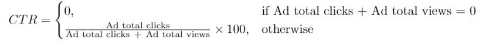

# 📊 **LeetCode 1322: Ads Performance**

## 📌 **Overview**
This project solves **LeetCode Problem 1322: Ads Performance**.  
The goal is to **calculate the Click-Through Rate (CTR) for each ad** based on user interactions.

### **Problem Statement**
Each row in the dataset represents a **user's interaction** with an ad.  
The possible actions are:
- `"Clicked"`
- `"Viewed"`
- `"Ignored"`

CTR is calculated as:

<p align="center">
  
</p>

- If an ad has **no clicks and no views**, then CTR = `0.00`.

### **Constraints**
- Each ad has a **unique ID (`ad_id`)**.
- A user **can interact with multiple ads**.
- The dataset consists of **(ad_id, user_id, action)** tuples.

## 🎯 **Example Walkthrough**
### **Example Input**
```python
Input:
ad_id  user_id  action
1      101      Clicked
1      102      Viewed
1      103      Clicked
2      201      Viewed
2      202      Viewed
3      301      Clicked
3      302      Viewed
3      303      Viewed
3      304      Clicked
```

### **Step-by-Step Breakdown**
1️⃣ **Calculate total clicks and views per `ad_id`**  
   - `ad_id = 1`: Clicks = `2`, Views = `1` → CTR = `(2 / (2+1)) * 100 = 66.67`
   - `ad_id = 2`: Clicks = `0`, Views = `2` → CTR = `0.00`
   - `ad_id = 3`: Clicks = `2`, Views = `2` → CTR = `(2 / (2+2)) * 100 = 50.00`

2️⃣ **Sort the results**  
   - First **by `CTR` in descending order**.
   - Then **by `ad_id` in ascending order in case of a tie**.

### **Expected Output**
```python
Output:
ad_id  ctr
1      66.67
3      50.00
2       0.00
```

## 🧠 **Intuition Behind the Approach**
### **Key Observations**
✔ **CTR measures ad effectiveness**, so it must be **calculated and ranked properly**.  
✔ The **CTR formula requires counting clicks and views separately** for each `ad_id`.  
✔ **Sorting ensures the most effective ads appear first**.  

## 📝 **Step-by-Step Approach**
### **1️⃣ Group the Data by `ad_id`**
- Compute:
  - **Total clicks** → Sum of occurrences where `action == "Clicked"`.
  - **Total views** → Sum of occurrences where `action == "Viewed"`.

### **2️⃣ Calculate CTR**
- Apply the formula:
  ```python
  CTR = (Total Clicks / (Total Clicks + Total Views)) * 100
  ```
- If an ad has **zero clicks and zero views**, CTR is `0.00`.

### **3️⃣ Sort the Data**
- Sort **by `CTR` in descending order**.
- If `CTR` values are the same, **sort by `ad_id` in ascending order**.

## **💡 Implementation**
```python
import pandas as pd

def ads_performance(ads: pd.DataFrame) -> pd.DataFrame:
    """
    Computes the Click-Through Rate (CTR) for each ad.

    CTR is calculated as:
        CTR = (Total Clicks / (Total Clicks + Total Views)) * 100
    If there are no clicks and views, CTR is set to 0.00.

    The results are:
    - Rounded to two decimal places.
    - Sorted by `ctr` in descending order.
    - Sorted by `ad_id` in ascending order in case of a tie.

    :param ads: DataFrame containing ad_id, user_id, and action columns.
    :return: DataFrame with ad_id and corresponding CTR.
    """

    # Group by 'ad_id' and calculate the CTR for each group
    ctr = ads.groupby('ad_id')['action'].apply(
        lambda x: round(
            (sum(x == 'Clicked') / (sum(x == 'Clicked') + sum(x == 'Viewed')) * 100)
            if (sum(x == 'Clicked') + sum(x == 'Viewed')) > 0 else 0.00, 
            2
        )
    ).reset_index()

    # Rename the column to 'ctr'
    ctr.columns = ['ad_id', 'ctr']
    
    # Sort the results by 'ctr' in descending order and by 'ad_id' in ascending order
    result = ctr.sort_values(by=['ctr', 'ad_id'], ascending=[False, True])

    return result

```

## ⏳ **Time Complexity Analysis**
| Approach | Time Complexity | Space Complexity |
|----------|----------------|------------------|
| **Grouping & Aggregation (`O(n)`)** | **O(n)** ✅ | **O(n)** ✅ |

- **Each record is processed once** (`O(n)` time complexity).
- **Stores results in a new DataFrame** (`O(n)` space complexity).

## 🏗 **Project Structure**
```
1322. Ads Performance/
├── ads_performance.py    # Python implementation of the solution
├── README.md             # Detailed explanation & walkthrough
├── images/
│   ├── formula.png       # CTR formula for better intuition
```

✨ **Master click-through rate (CTR) calculations and data aggregation with this efficient `O(n)` approach!** 🚀  
