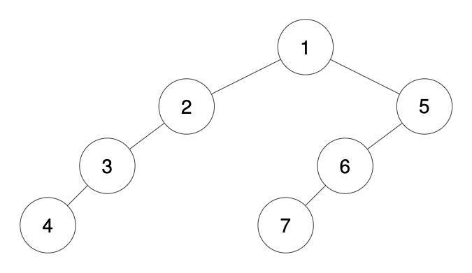

# 🌲 **LeetCode 1028: Recover a Tree From Preorder Traversal**  

## 📌 **Problem Overview**  
We are given a **preorder depth-first traversal** string of a binary tree.  
- **Each node's value** is represented as a sequence of digits.
- The **depth of a node** is represented by the **number of dashes ('-')** before its value.  
- The **root node** has a depth of **0** (i.e., it has no preceding dashes).  
- **If a node has only one child, it is always the left child.**  

### **Task:**  
Reconstruct the binary tree from the traversal string and return the **root node**.  

## 🖼 **Example 1**  
**Input:**  
```python
traversal = "1-2--3--4-5--6--7"
```
**Output:**  
```
[1, 2, 5, 3, 4, 6, 7]
```

**Tree Representation:** 


✅ **Explanation:**  
- The root is `1`, which has depth `0` (no dashes).
- `2` is at depth `1` (one dash) → it is a left child of `1`.  
- `3` and `4` are at depth `2` (two dashes) → they are children of `2`.  
- `5` is at depth `1` (one dash) → it is a right child of `1`.  
- `6` and `7` are at depth `2` (two dashes) → they are children of `5`.  

## 🖼 **Example 2**  
**Input:**  
```python
traversal = "1-2--3---4-5--6---7"
```
**Output:**  
```
[1, 2, 5, 3, null, 6, null, 4, null, 7]
```

**Tree Representation:** 



✅ **Explanation:**  
- The structure is similar to **Example 1**, but `4` and `7` have **an extra level of depth**.
- `4` is a **left child** of `3`, and `7` is a **left child** of `6`.  

## 🖼 **Example 3**  
**Input:**  
```python
traversal = "1-401--349---90--88"
```
**Output:**  
```
[1, 401, null, 349, 88, 90]
```

**Tree Representation:**


✅ **Explanation:**  
- The root is `1`.  
- `401` is a left child of `1`.  
- `349` is a left child of `401`.  
- `90` is a left child of `349`.  
- `88` is a right child of `401`.  

## 🚀 **Approach & Intuition**  

### 🔹 **Key Idea: Stack-Based Depth Management**
1. **Use a stack to maintain nodes at different depths**:
   - The **stack keeps track of parent-child relationships**.  
2. **Traverse the string and extract values**:
   - Count **dashes** (`-`) to determine **depth**.
   - Extract the **node value**.
3. **Adjust the stack to maintain the correct tree structure**:
   - If the stack length **exceeds the current depth**, pop from the stack.
   - The **new node is attached to the correct parent**:
     - If the parent **has no left child**, attach it as **left child**.
     - Otherwise, attach it as **right child**.
4. **The first node in the stack is always the root**.

## 📝 **Implementation**  

```python
# recover_tree.py

from typing import Optional

class TreeNode:
    """
    Definition for a binary tree node.
    """

    def __init__(self, val=0, left=None, right=None):
        self.val = val
        self.left = left
        self.right = right


class Solution:
    def recoverFromPreorder(self, traversal: str) -> Optional[TreeNode]:
        """
        Recovers a binary tree from its preorder traversal string.

        The traversal string consists of integer values separated by dashes ('-'),
        where the number of dashes indicates the depth of the node in the tree.

        Args:
            traversal (str): The preorder traversal string.

        Returns:
            Optional[TreeNode]: The root node of the reconstructed binary tree.
        """

        dashes = 0          # Tracks the depth of the current node
        stack = []          # Maintains nodes at different depths
        i = 0               # Pointer to iterate through traversal string

        while i < len(traversal):
            if traversal[i] == "-":
                # Count the number of consecutive dashes to determine depth
                dashes += 1
                i += 1
            else:
                j = i       # Start of the node value

                # Extract the numeric value of the node
                while j < len(traversal) and traversal[j] != "-":
                    j += 1
                val = int(traversal[i:j])
                node = TreeNode(val)

                # Adjust stack size to match the current depth
                while len(stack) > dashes:
                    stack.pop()

                # Attach the new node as a left or right child
                if stack and not stack[-1].left:
                    stack[-1].left = node
                elif stack:
                    stack[-1].right = node

                # Push the current node onto the stack
                stack.append(node)

                # Move pointer and reset dashes counter
                i = j
                dashes = 0

        return stack[0]         # The first node in the stack is the root of the tree
```

## ⏳ **Time Complexity Analysis**  

| Operation                             | Complexity |
|--------------------------------------|------------|
| Iterating through the traversal string | **O(N)** |
| Extracting node values from the string | **O(N)** |
| Stack operations (push/pop)            | **O(N)** |
| Constructing the tree structure        | **O(N)** |
| **Overall Complexity**                 | **O(N)** ✅ |

> **N = length of the traversal string**  

## 📂 **Project Structure**  

```
1028. Recover a Tree From Preorder Traversal/
├── recover_tree.py  # Python solution
├── README.md        # Explanation and walkthrough
├── images/          # Folder containing tree images
│   ├── ex1.png      # Example 1 visualisation
│   ├── ex2.png      # Example 2 visualisation
│   ├── ex3.png      # Example 3 visualisation
```

## 🎯 **Key Takeaways**  
✔ **Uses a stack-based approach** to efficiently reconstruct the tree.  
✔ **Handles varying depths correctly** using dashes as depth indicators.  
✔ **Guarantees correct child placement** based on preorder properties.  
✔ **Runs in **O(N) time complexity**, making it optimal for large trees.  

🚀 **Mastering tree reconstruction is crucial for parsing and tree-based problems!** 🌳