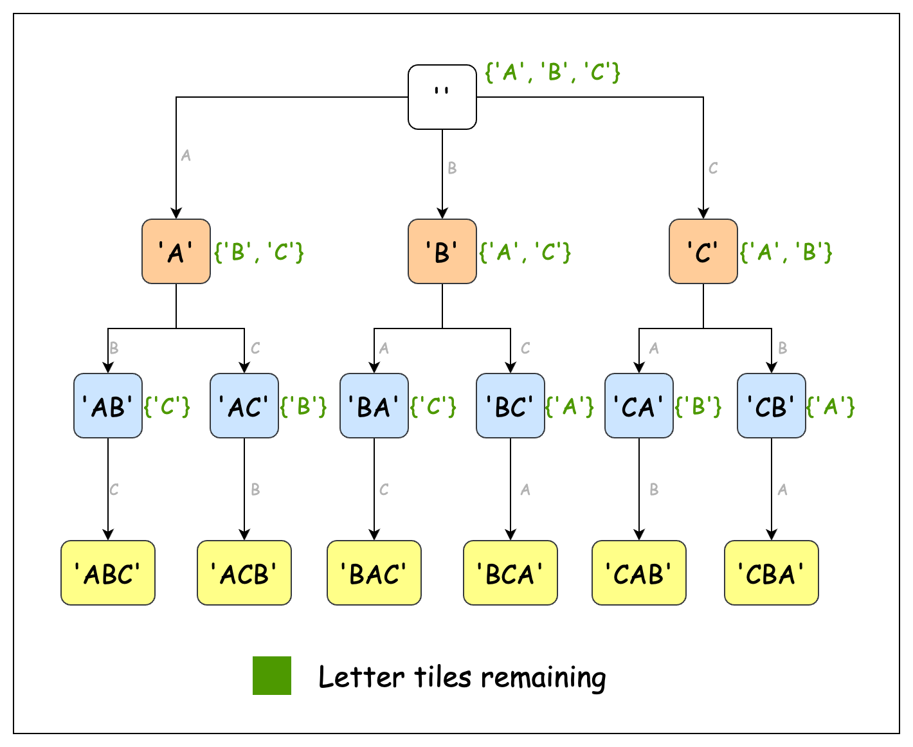

# 🔠 **LeetCode 1079: Letter Tile Possibilities**

## 📌 **Problem Overview**
Given a string `tiles`, where each tile contains **one uppercase English letter**, we need to determine the **number of unique non-empty sequences** that can be formed using the given letters.

### **Constraints**
- `1 <= tiles.length <= 7`
- `tiles` consists of **uppercase** English letters only.

### **Example Walkthrough**
#### **Example 1**
```python
Input: tiles = "AAB"
Output: 8
```
**Possible Sequences:**  
`"A"`, `"B"`, `"AA"`, `"AB"`, `"BA"`, `"AAB"`, `"ABA"`, `"BAA"`

#### **Example 2**
```python
Input: tiles = "AAABBC"
Output: 188
```

#### **Example 3**
```python
Input: tiles = "V"
Output: 1
```

## 🧠 **Understanding the Approach**
We can generate all possible sequences using **backtracking** while keeping track of letter frequencies. 

### **Key Observations**
✔ **Duplicate handling:** Since tiles may contain duplicates, we track character counts instead of generating raw permutations.  
✔ **Recursive exploration:** At each step, we **either include a letter** or **skip it**, ensuring all valid sequences are counted.  
✔ **Avoiding redundancy:** Using letter frequencies ensures that we generate unique sequences without sorting or manually tracking duplicates.

### **How Backtracking Works**
1. **Track Letter Counts:** Count occurrences of each character.
2. **Recursive Choice:** Try adding each available letter to the sequence.
3. **Decrement the Letter Count:** Ensure each letter is used the correct number of times.
4. **Backtrack:** Restore the count after recursion.

### **Visualsing the Recursion Tree**
To help visualise the **recursive backtracking approach**, consider the following recursion tree:



Each node represents a decision to use a letter, and the branches indicate subsequent choices.

## 🚀 **Python Solution**
```python
from typing import List

class Solution:
    """
    This class provides a method to count the number of possible non-empty sequences
    that can be formed using given letter tiles.
    """

    def numTilePossibilities(self, tiles: str) -> int:
        """
        Computes the number of possible sequences of letters using the given tiles.

        :param tiles: A string consisting of uppercase English letters.
        :return: The total number of unique non-empty sequences that can be formed.
        """
        # Track frequency of each uppercase letter (A-Z)
        char_count = [0] * 26
        for char in tiles:
            char_count[ord(char) - ord("A")] += 1

        # Find all possible sequences using character frequencies
        return self._find_sequences(char_count)

    def _find_sequences(self, char_count: List[int]) -> int:
        """
        Helper method to recursively find all possible sequences.

        :param char_count: A list containing counts of each letter (A-Z).
        :return: The number of valid sequences that can be formed.
        """
        total = 0

        # Try using each available character
        for pos in range(26):
            if char_count[pos] == 0:
                continue

            # Add current character and recurse
            total += 1
            char_count[pos] -= 1
            total += self._find_sequences(char_count)
            char_count[pos] += 1  # Backtrack

        return total
```

## ⏳ **Complexity Analysis**
| Step | Operation | Time Complexity |
|------|------------|----------------|
| **Count Characters** | `O(N)` | **O(N)** |
| **Recursive Backtracking** | `O(N!)` (in worst case) | **O(N!)** |
| **Overall Complexity** | **O(N!)** | ✅ Efficient for `N ≤ 7` |

## 📂 **Project Structure**
```
1079. Letter Tile Possibilities/
├── letter_tile_possibilities.py    # Python solution with backtracking
├── README.md                       # Explanation, approach, and analysis
└── images/
    └── recursion_tree.png           # Visual representation of backtracking
```

## 🎯 **Why This Approach?**
✔ **Handles duplicate letters efficiently** using a frequency counter.  
✔ **Avoids redundant calculations** by skipping used-up letters.  
✔ **Backtracking ensures all valid sequences are counted.**  

🚀 **Master backtracking with this intuitive and optimized solution!** 🔥