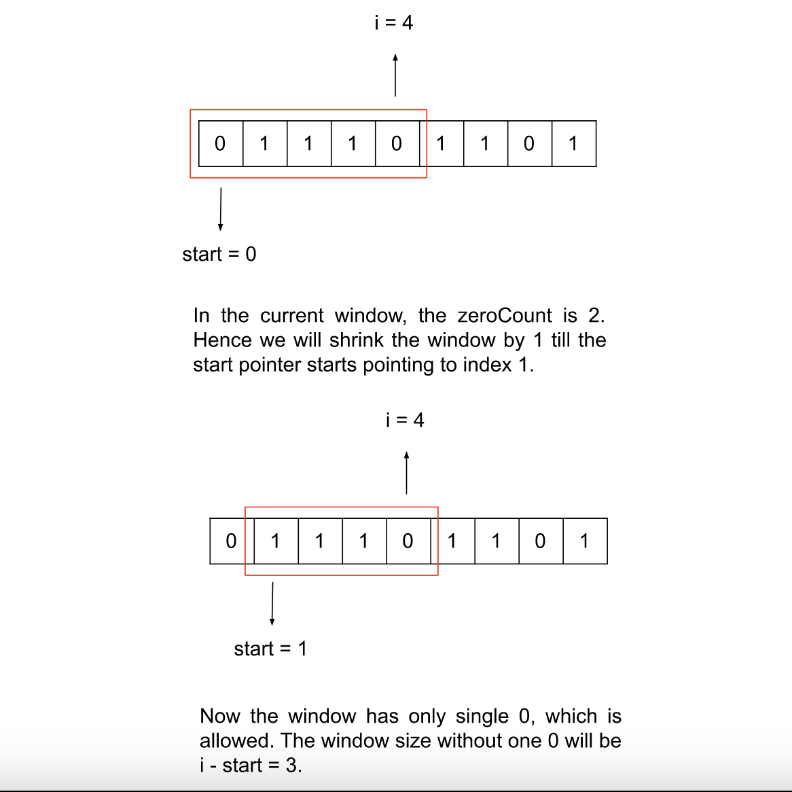

# 🔢 **LeetCode 1493: Longest Subarray of 1's After Deleting One Element**

## 📌 **Problem Overview**
Given a binary array `nums`, you must **delete exactly one element** and return the **length of the longest subarray** consisting only of `1`s in the remaining array. If there is no such subarray, return `0`.

## 🎯 **Example Walkthrough**

### **Example 1**
#### **Input:**
```python
nums = [1,1,0,1]
```
#### **Output:**
```python
3
```
#### **Explanation:**
- Deleting the `0` at position `2` results in `[1,1,1]`, which contains **3** elements of `1`.

### **Example 2**
#### **Input:**
```python
nums = [0,1,1,1,0,1,1,0,1]
```
#### **Output:**
```python
5
```
#### **Explanation:**
- Deleting the `0` at position `4` results in `[1,1,1,1,1]`, which contains **5** elements of `1`.

### **Example 3**
#### **Input:**
```python
nums = [1,1,1]
```
#### **Output:**
```python
2
```
#### **Explanation:**
- Since we **must** delete one element, the longest subarray is `[1,1]`, which has **2** elements.

## 💡 **Intuition**
We need to delete exactly **one** element (preferably `0`) to maximise the length of `1`s. Since we must always delete **one** element, if the array consists entirely of `1`s, the answer is `len(nums) - 1`.

A **sliding window approach** is ideal:
- Maintain a **window** that contains at most **one** `0`.
- Expand the window as long as the condition holds.
- If more than **one** `0` is encountered, **shrink** the window from the left.
- Keep track of the **largest window size** encountered.

## 🖼️ **Visual Intuition**



- We maintain a **window** containing at most **one** `0`.
- If a second `0` appears, **shrink the window** from the left.
- The length of the **largest window** we maintain is the answer.

## 🛠 **Approach**
1. **Use Two Pointers (Sliding Window):**
   - Maintain `left` pointer and `right` pointer to track the window.
   - Maintain a counter `zeros` to track the number of `0`s in the window.
   - Expand the `right` pointer as long as we have at most one `0`.

2. **When encountering a second `0`:**
   - Shrink the window from `left` until the number of `0`s is **1 or less**.

3. **Track the Maximum Subarray Length:**
   - Compute `right - left + 1 - zeros` (excluding the removed element).
   - Return `ans - 1` if the entire array was a valid subarray.

## 🚀 **Python Solution**
```python
from typing import List

class Solution:
    def longestSubarray(self, nums: List[int]) -> int:
        n = len(nums)                   # The size of the input array
        left = 0                        # The left pointer of the sliding window
        zeros = 0                       # Number of zeroes encountered
        ans = 0                         # Maximum length of the subarray

        for right in range(n):
            if nums[right] == 0:
                zeros += 1              # Increment the count of zeroes

            # Adjust the window to maintain at most one zero in the subarray
            while zeros > 1:
                if nums[left] == 0:
                    zeros -= 1          # Decrement the count of zeroes
                left += 1               # Move the left pointer to the right

            # Calculate the length of the current subarray and update the maximum length
            ans = max(ans, right - left + 1 - zeros)

        # If the entire array is the subarray, return the size minus one; otherwise, return the maximum length
        return ans - 1 if ans == n else ans
```

## ⏳ **Complexity Analysis**
| Step | Operation | Time Complexity |
|------|------------|----------------|
| Iterate through `nums` | `for right in range(n)` | **O(N)** |
| Shrinking the window | `while zeros > 1` | **O(N)** (worst case) |
| **Total Complexity** | **O(N) Time, O(1) Space** | ✅ Efficient |

## 📁 **Project Structure**
```
longest_subarray_ones/
├── longest_subarray_ones.py   # Python solution
├── README.md                  # Documentation
├── images/
│   ├── sliding_window.png     # Visualisation of sliding window approach
```

## 🏆 **Why This Works**
✔ **Sliding Window Approach** keeps track of `0`s efficiently.  
✔ **Runs in O(N) time complexity**, making it **optimal for large inputs**.  
✔ **Handles edge cases**, such as all `1`s or all `0`s.

🚀 **This approach ensures the longest contiguous sequence of `1`s after removing exactly one element!** 🔥