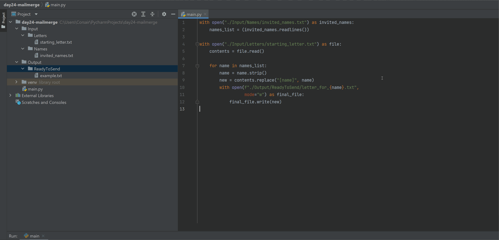

# ✉️ **Mail Merge Project** 📩  

## Overview  
The **Mail Merge Project** automates the process of **creating personalised invitation letters** by replacing placeholders in a template letter with actual names from a list. Instead of manually editing each letter, this program generates **ready-to-send** letters in just seconds!  

### 🌟 **Demo:**  
  

This project helps you:  
1. **📜 Automate repetitive tasks** – no need to edit each letter manually.  
2. **📂 Work with file handling** – read from and write to text files.  
3. **🔄 Use Python string manipulation** – dynamically replace placeholders.  
4. **🎯 Understand efficient loops** – process multiple names efficiently.  

## 🎯 **How It Works**  

### 📩 **Generating Personalised Letters**  
1. **Reads a list of invited names** from `invited_names.txt`.  
2. **Reads the template letter** from `starting_letter.txt`.  
3. **Replaces the `[name]` placeholder** with each invitee’s actual name.  
4. **Saves a new personalised letter** in `Output/ReadyToSend/`.  

## 📌 **How to Run**  

1. **Ensure your project folder is structured as follows:**  
   ```
   mail_merge_project/
   ├── main.py               # Main program script
   ├── Input/
   │   ├── Names/
   │   │   ├── invited_names.txt   # List of invited names
   │   ├── Letters/
   │   │   ├── starting_letter.txt # Letter template with placeholder
   ├── Output/
   │   ├── ReadyToSend/       # Generated letters will be stored here
   ├── images/
   │   ├── mail_merge.gif     # Demo GIF of the project
   ```

2. **Run the script using:**  
   ```bash
   python main.py
   ```  

3. **Check the `Output/ReadyToSend/` folder** – your personalised letters will be there!  

## 📝 **Example Files**  

### 📋 **`invited_names.txt`**  
```
Aang
Zuko
Appa
Katara
Sokka
Momo
Uncle Iroh
Toph
```

### 📜 **`starting_letter.txt`**  
```
Dear [name],

You are invited to my birthday this Saturday.

Hope you can make it!

Roger
```

### ✉️ **Generated Output Example (`letter_for_Aang.txt`)**  
```
Dear Aang,

You are invited to my birthday this Saturday.

Hope you can make it!

Roger
```

## 🚀 **Key Features**  

1. **📂 Automated File Handling** – Reads from `invited_names.txt` and writes to `ReadyToSend/`.  
2. **📝 Dynamic String Replacement** – Replaces `[name]` in `starting_letter.txt` with real names.  
3. **⚡ Bulk Letter Generation** – Handles **multiple invitees** instantly.  
4. **✅ Efficient & Scalable** – Easily adaptable for **any event** with **any number of names**.  

## 🌟 **Additional Notes**  

- 🔥 Try **changing the template letter** for **different types of invitations**.  
- 🎨 Modify the script to **add sender names or additional details**.  
- 🚀 Expand the project to **send emails instead of saving text files**!  

**🎉 Enjoy automating your invitations with Mail Merge! 📩🚀**