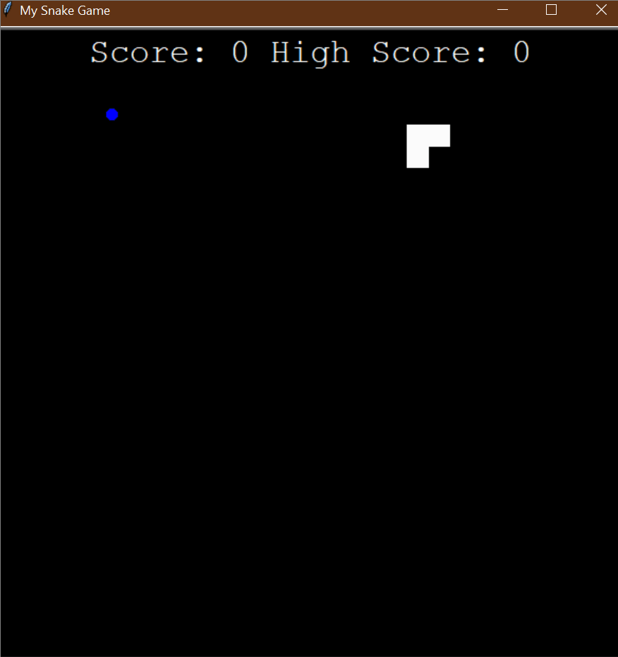

# 🐍 **Advanced Snake Game** 🎮  

## Overview  
The **Advanced Snake Game** is a classic arcade game where the snake moves around the screen, eats food to grow, and avoids hitting the walls or itself. This version introduces **high score tracking**, making it more competitive and replayable!  

### 🌟 **Demo:**  
  

This project helps you:  
1. **🎮 Understand game loops and event handling** – smoothly animate objects and handle user input.  
2. **🏗 Implement Object-Oriented Programming (OOP)** – modular code with `Snake`, `Food`, and `Scoreboard` classes.  
3. **🐍 Work with collision detection** – check when the snake collides with walls, food, or itself.  
4. **📊 Track High Scores** – store the highest score across games using a file.  

## 🎯 **How It Works**  

### 🏁 **Start the Game**  
- The game launches with a **small snake on the screen**.  
- The snake moves automatically in the **last given direction**.  

### 🎮 **Controls**  
| Action | Key |
|--------|-----|
| Move Up | `⬆️ Up Arrow` |
| Move Down | `⬇️ Down Arrow` |
| Move Left | `⬅️ Left Arrow` |
| Move Right | `➡️ Right Arrow` |

### ⚡ **Game Mechanics**  

1. **Snake Movement** 🐍  
   - The snake **moves continuously** in the direction set by the arrow keys.  
   - The snake **cannot move in the opposite direction immediately**.  

2. **Eating Food** 🍏  
   - When the snake **collides with food**, it grows in length.  
   - The **score increases** when food is eaten.  
   - A **new food item appears** at a random location.  

3. **High Score Tracking** 🏆  
   - The **highest score** is stored in `data.txt`.  
   - If a new high score is achieved, it **overwrites the previous record**.  

4. **Collision Handling** 💥  
   - If the snake **hits the wall**, the game resets.  
   - If the snake **collides with itself**, the game resets.  
   - The **current score resets**, but the **high score remains saved**.  

## 📌 **How to Run**  

1. Open a terminal or command prompt. 💻  
2. Navigate to the folder containing the files. 📂  
3. Run the program using:  
   ```bash
   python main.py
   ```  
4. Use the **arrow keys** to move the snake.  
5. **Try to beat the high score!**  

## 📝 **Example Gameplay**  

```plaintext
🐍 The snake starts small and moves automatically.
🍏 When it eats food, it grows in size.
💥 If it crashes into the wall or itself, the game resets.
🏆 The high score is saved even after the game resets.
```

## 🏗 **Project Structure**  

This project is structured using **Object-Oriented Programming (OOP)** for modularity and scalability.  

### `main.py`  
- **Handles game logic and updates the screen**.  
- Listens for **user input to move the snake**.  
- Detects **collisions and score tracking**.  

### `snake.py`  
- **Defines the `Snake` class**.  
- Controls **movement, growth, and resetting**.  

### `food.py`  
- **Defines the `Food` class**.  
- Spawns food in **random locations** when eaten.  

### `scoreboard.py`  
- **Tracks and updates score & high score**.  
- Saves the **highest score in `data.txt`**.  

### `data.txt`  
- **Stores the highest score achieved**.  
- Gets updated **only when a new high score is reached**.  

### `images/snake.gif`  
- **Demonstration GIF**.  
- Shows **the game in action!**  

## 📁 **Folder Structure**  

```
advanced_snake_game/
├── main.py             # Main program logic
├── snake.py            # Snake movement and controls
├── food.py             # Food spawning and behavior
├── scoreboard.py       # Score tracking and high score saving
├── data.txt            # Stores high score
└── images/
    ├── snake.gif       # Demo GIF of the game
```

## 🚀 **Key Features**  

1. **🐍 Smooth Snake Movement** – The snake moves forward automatically.  
2. **🍏 Dynamic Food Generation** – Food spawns randomly when eaten.  
3. **📊 Score & High Score Tracking** – Keeps **highest score** stored in `data.txt`.  
4. **💥 Collision Detection** – The game **resets if the snake crashes**.  
5. **🎮 Interactive Controls** – Use the **arrow keys** to change direction.  
6. **🔄 Continuous Game Loop** – The game **runs until the player exits**.  

## 🌟 **Additional Notes**  

- 🔥 Try **adjusting the speed** to make the game harder!  
- 🎨 Modify `snake.py` to **change the snake's color or shape**.  
- 🚀 Expand the game by **adding obstacles or power-ups**!  

**🎉 Enjoy the Snake Game with High Score Tracking! Can you set a new record? 🐍🏆**  