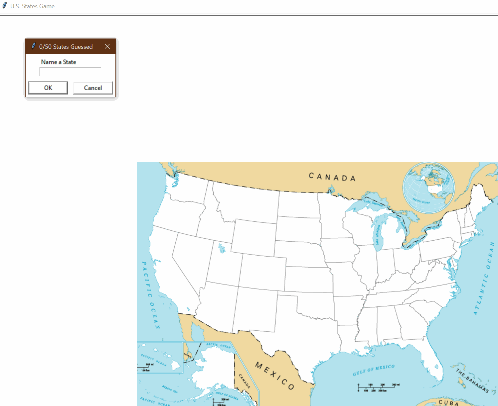

# 🗺️ **U.S. States Game** 🇺🇸  

## 📌 Overview  
The **U.S. States Game** is a fun and interactive way to test your knowledge of **all 50 U.S. states**! 🧠💡 Using **Python’s `turtle` module**, players try to **guess the names of states**, which are then displayed on a U.S. map.  

If you **don’t know all the states**, no worries! At the end of the game, a list of **missed states** is saved in a CSV file so you can study and improve. 📚✨  

## 🎥 **Demo**  
  

## 🎯 **How to Play**  
1️⃣ Run the program – a blank **U.S. map** will appear.  
2️⃣ Type a **state name** in the input box. 🏛  
3️⃣ If correct, the state **appears on the map** in its correct position. 📍  
4️⃣ Keep guessing until you’ve named all **50 states**! 🎉  
5️⃣ Type **"Exit"** at any time to **end the game** and generate a list of states you missed. 📜  

## 🚀 **How to Run the Game**  

1️⃣ **Clone the Repository** 🖥️  
```bash
git clone https://github.com/your-repo/us-states-game.git
cd us-states-game
```

2️⃣ **Run the Game** 🏃  
Make sure you have **Python installed**, then execute:  
```bash
python main.py
```

3️⃣ **Start Guessing!** 🎯  

## 📁 **Project Structure**  

```
us-states-game/
├── main.py                 # Main game logic
├── 50_states.csv           # U.S. states data (name & coordinates)
├── blank_states_img.gif    # U.S. map background
├── states_to_learn.csv     # File generated with unguessed states
├── images/
│   ├── us_states.gif       # Demo GIF
└── README.md               # This file!
```

## 🏗️ **How It Works**  

### 🎮 **Game Mechanics**  
- 🗺 **Displays a U.S. map** using Python’s `turtle` module.  
- ⌨ **Prompts the user** to enter state names.  
- ✅ **Correct answers appear** in their correct locations.  
- 📊 **Tracks progress** by showing how many states you’ve guessed.  
- 📂 **Saves unguessed states** into `states_to_learn.csv` for further study.  

### 🔥 **Cool Features**  
✔ **Interactive & Engaging** – Learn while playing!  
✔ **Dynamic Progress Tracking** – Displays the number of correct guesses.  
✔ **Self-Improvement** – Missed states are saved for future learning.  
✔ **No Repeats** – Prevents duplicate guesses.  
✔ **Simple & Fun!** 🎉  

## 📝 **Example Gameplay**  

```plaintext
🗺️ Welcome to the U.S. States Game!
🤔 Name a State: Texas
✅ Texas appears on the map!
🤔 Name a State: California
✅ California appears on the map!
...
❌ You typed "Exit" – Saving missed states to states_to_learn.csv 📜
```

## 🔧 **Future Enhancements**  
🔹 Add **timer-based challenges** ⏳  
🔹 Implement **state hints** (e.g., neighboring states) 🗺️  
🔹 Add **score leaderboard** 🏆  

## 🏁 **Final Thoughts**  
This project is a **fun way to learn U.S. states** while also practicing Python skills! 💡🐍  

**Can you guess all 50 states?** 🤔🇺🇸  
Give it a try and challenge your friends! 🎮  

Let me know if you want any changes! 🚀🔥