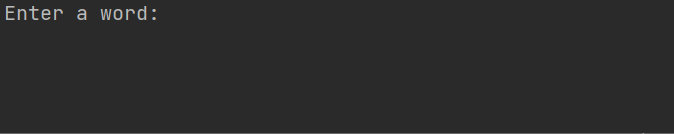

# 🔤 NATO Phonetic Alphabet Converter 🚀

## 📌 Overview
This project converts any word into its **NATO Phonetic Alphabet** equivalent. Simply type a word, and the program will output the NATO phonetic spelling for each letter.

### 🎬 **Demo**


## 🎯 **How It Works**
1. The program **reads a CSV file** containing the NATO phonetic alphabet.
2. It converts the data into a **dictionary** where each letter maps to its phonetic code.
3. The user enters a word, and the program **translates** it letter by letter.

## 📌 **Example Usage**
```plaintext
Enter a word: Python
['Papa', 'Yankee', 'Tango', 'Hotel', 'Oscar', 'November']
```

## 🏗️ **Project Structure**
```
13. NATO Alphabet/
├── main.py                     # Main script for phonetic conversion
├── nato_phonetic_alphabet.csv   # Data file with NATO alphabet
└── images/
    ├── nato_abc.gif             # Demo animation
```

## 🛠️ **How to Run**
1. Ensure you have **Python** installed (3.x recommended).
2. Install Pandas if you haven’t already:
   ```bash
   pip install pandas
   ```
3. Run the program:
   ```bash
   python main.py
   ```
4. Enter any word, and see its NATO phonetic equivalent!

## 📝 **Understanding the Code**
The program works by:
- **Reading** the CSV file using Pandas.
- **Creating** a dictionary from the data:
  ```python
  nato_dict = {row.letter: row.code for _, row in nato_data.iterrows()}
  ```
- **Generating** a phonetic spelling for the input word:
  ```python
  input_word = input("Enter a word: ").upper()
  answer = [nato_dict[letter] for letter in input_word]
  print(answer)
  ```

## 🚀 **Features**
✅ **Fast & Simple** – Instantly converts any word to NATO phonetic alphabet.  
✅ **Real-world Application** – Useful for aviation, military, and radio communication.  
✅ **Beginner-Friendly** – A great way to learn Python dictionaries & Pandas.  

## 🎯 **Next Steps**
🚀 Expand the program to **handle numbers and special characters**.  
🎙️ Add **text-to-speech (TTS)** for vocal pronunciation.  
📄 Build a **GUI** for a more interactive experience.  

💡 **Have fun converting words to the NATO Phonetic Alphabet! 🏆**

