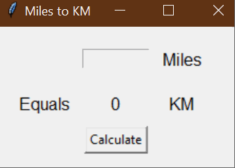

# 🌍 **Miles to Kilometers Converter** 🔢  

## 📌 **Overview**  

The **Miles to Kilometers Converter** is a simple **Tkinter GUI application** that allows users to convert distances from **miles** to **kilometers**. 🌎➡️📏  

It features a **clean and user-friendly interface**, with an input field for miles, a "Calculate" button, and a label displaying the converted value in kilometers.  

### 🎥 **Demo**  
  

## 🚀 **How It Works**  

1️⃣ **Enter a value in miles** into the input field.  
2️⃣ **Click the "Calculate" button** to convert miles to kilometers.  
3️⃣ The **equivalent distance in kilometers** is displayed instantly!  

💡 **Conversion Formula:**  
\[
1 \text{ mile} = 1.609 \text{ km}
\]

## 📌 **Features**  

✅ **User-Friendly Interface** – Simple layout with clear labels.  
✅ **Instant Conversion** – Click the button and see the result immediately.  
✅ **Accurate Calculations** – Uses the formula `km = miles × 1.609`, rounded to **two decimal places**.  
✅ **Python’s Tkinter Library** – No additional dependencies required!  

## 📁 **Project Structure**  

```
14. Miles to KM Converter/
├── main.py              # Main Python script with Tkinter GUI
├── images/
│   ├── miles_to_km.gif  # Demo GIF of the program in action
└── README.md            # Project documentation
```

## 🏗️ **How to Run the Project**  

### 1️⃣ **Ensure you have Python installed**  
This project runs with **Python 3.x**.  

### 2️⃣ **Run the Python script**  
Open a terminal or command prompt and navigate to the project folder:  

```bash
python main.py
```

### 3️⃣ **Use the converter!**  
- Enter a value in miles  
- Click **"Calculate"**  
- See the equivalent distance in kilometers! 🎉  

## 🛠️ **How It’s Built**  

This project uses **Tkinter**, Python’s built-in GUI toolkit.  

### 🔹 **Key Components**  

| Component        | Description |
|-----------------|-------------|
| **`Label`**     | Displays "Miles", "KM", and "Equals" labels. |
| **`Entry`**     | Input field where the user types the number of miles. |
| **`Button`**    | Triggers the conversion when clicked. |
| **`Label`**     | Displays the converted value in kilometers. |
| **`miles_to_km()`** | Function that performs the conversion and updates the result. |

## 🎨 **Possible Enhancements**  

💡 **Live Updates** – Convert as the user types (no need to click a button).  
💡 **Dark Mode UI** – Customize the background and fonts.  
💡 **Reverse Conversion** – Allow users to convert **KM → Miles** as well.  

## 🎯 **Final Thoughts**  

This project is a **great introduction** to **GUI programming** with Python. It’s simple yet effective, making it a perfect beginner-friendly project!  

**Ready to convert distances with ease? Try it out! 🚀📏**  

Let me know if you want any adjustments! 🎉🔢