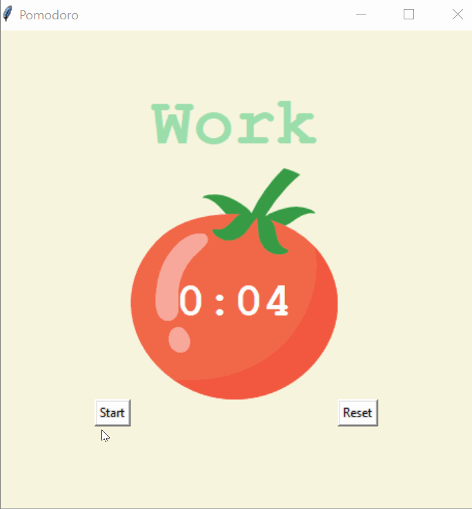

# 🍅 Pomodoro Timer ⏳

## Overview 📌
The **Pomodoro Timer** is a productivity tool that helps users manage their work and break intervals efficiently using the **Pomodoro Technique**. This app is built using **Python's Tkinter** for GUI and features an interactive countdown timer with work and break cycles.

## 🎥 Demo


## How It Works 🎯
The Pomodoro Timer follows a structured workflow:
1. **Work Session (25 mins)** - Focus on your task.
2. **Short Break (5 mins)** - Rest after a work session.
3. **Work Session (25 mins)** - Another focused session.
4. **Repeat Steps 1-3 for 4 cycles.**
5. **Long Break (20 mins)** - After 4 work sessions, take a longer break.

✔ After each completed session, a **checkmark (✔)** appears.
✔ Press **Start** to begin the cycle and **Reset** to restart the timer.

## 🛠️ Features
- **Work & Break Sessions** - Alternates between work and break cycles.
- **Countdown Timer** - Real-time visual countdown.
- **Checkmark Tracker** - Displays completed work sessions.
- **Interactive UI** - Built using **Tkinter** for a user-friendly experience.
- **Persistent Timing** - Runs in the background while you work.

## 📁 Project Structure
```
pomodoro_timer/
├── main.py             # Main program logic
├── images/             # Folder containing assets
│   ├── tomato.png      # Tomato image used in UI
│   ├── timer.gif       # Demo of the app
```

## 🖥️ How to Run
1. **Install Dependencies**
   ```bash
   pip install tk
   ```
2. **Run the App**
   ```bash
   python main.py
   ```

## 📝 Example Usage
```
🍅 Pomodoro Timer started!
✅ Work for 25 minutes...
⌛ Break time! Take a 5-minute rest.
🔄 Repeat cycles until a long break.
```

## 🎯 Why Use the Pomodoro Technique?
- 🚀 **Boosts Productivity** - Helps avoid distractions.
- 🧘 **Prevents Burnout** - Ensures regular breaks.
- ⏳ **Time Management** - Maximises efficiency in work sessions.

## 🚀 Future Improvements
🔹 **Custom Time Intervals** - Allow users to set custom work/break durations.
🔹 **Sound Notifications** - Play an alarm when a session ends.
🔹 **Data Persistence** - Save completed Pomodoro cycles for review.

💡 **Ready to take control of your time? Start your Pomodoro Timer now!** ⏳🔥