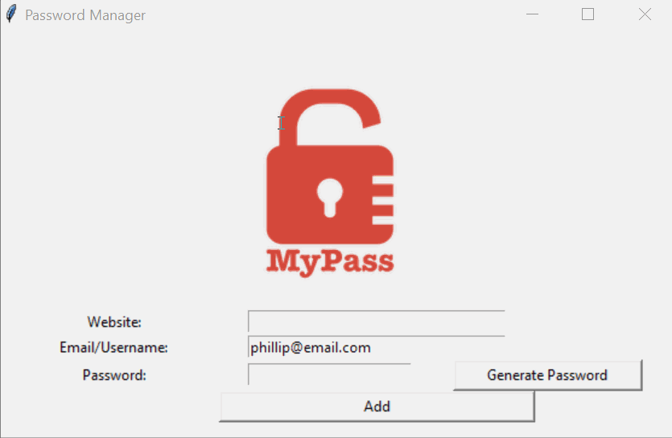

# 🔐 **Password Manager**  

## 📝 Overview  
The **Password Manager** is a secure and user-friendly application that helps you generate, store, and retrieve strong passwords for different websites. It provides a simple interface using **Tkinter** and integrates clipboard functionality via **Pyperclip** to quickly copy generated passwords.

### 🌟 **Demo:**  
  

## 🎯 **Features**  
✅ **Secure Password Generation** – Generates random passwords with a mix of letters, numbers, and symbols.  
✅ **Instant Copying** – Automatically copies the generated password to the clipboard for quick pasting.  
✅ **Data Storage** – Saves passwords securely in a local text file (`data.txt`).  
✅ **User-friendly Interface** – Intuitive design for easy password management.  
✅ **Error Handling** – Warns users if fields are left empty before saving.  

## 🚀 **How It Works**  
1. **Enter Website Name** 🌐 – Type the name of the website where the password will be used.  
2. **Enter Email/Username** ✉️ – Input your email or username for login.  
3. **Generate Password** 🔢 – Click the 'Generate Password' button to create a strong password.  
4. **Copy & Save** 💾 – The password is copied to the clipboard automatically and can be saved to a file.  

## 🛠 **How to Run**  
1. **Install Dependencies** (if not already installed):  
   ```bash
   pip install pyperclip
   ```  
2. **Run the Application**:  
   ```bash
   python main.py
   ```  
3. **Generate & Store Passwords** 🔑 – Start managing your passwords securely!  

## 📂 **Project Structure**  
```
password_manager/
├── main.py             # Main application script
├── data.txt            # Stored passwords (generated after first save)
├── images/
│   ├── logo.png        # Application logo
│   ├── pw_manager.gif  # Demo GIF
```  

## 🖼 **User Interface**  
The GUI is built using **Tkinter**, featuring:  
- **Entry fields** for website, email, and password input.  
- **Buttons** for generating and saving passwords.  
- **Visual branding** with an embedded logo.  

## 🛡 **Security Considerations**  
🔒 This password manager does **not encrypt stored passwords**. It is intended for local use only. For a more secure solution, consider integrating **encryption techniques** such as hashing or using a password manager with database encryption.  

## 🎉 **Future Enhancements**  
🚀 Add **search functionality** to retrieve stored passwords.  
🔑 Implement **encryption** for better security.  
📂 Support **database storage** instead of a text file.  


✨ **Start securing your online accounts today!** 🔐

