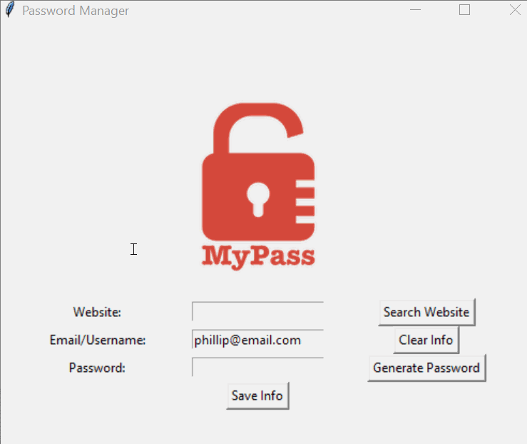

# 🔐 Password Manager [Enhanced]

## 📜 Overview

This **Password Manager** application helps users securely store, generate, and retrieve passwords for different websites. This enhanced version extends the basic password manager by incorporating **search functionality**, using a **JSON database** for persistent storage, and providing **clipboard copying** for easy password usage.

### 🎥 **Demo:**


## 🚀 Features

### ✅ **Generate Secure Passwords**
- Automatically creates **strong passwords** with letters, numbers, and symbols.
- Uses the `random` module to ensure high randomness.
- Automatically **copies the password** to the clipboard for easy pasting.

### 🔍 **Search & Retrieve Stored Credentials**
- Users can search for a stored website and retrieve **email and password details**.
- If the website isn’t found, an error message is displayed.

### 💾 **Save Login Information**
- Stores **website, email, and password** in a `data.json` file.
- **Appends new entries** to the JSON file instead of overwriting existing data.

### 🧹 **Clear Fields**
- A **Clear Info** button allows users to reset input fields quickly.

### 🛑 **Error Handling**
- Warns users when attempting to save blank fields.
- Alerts users if no stored data exists or if the search entry is missing.

## 📌 How to Use

1. **Start the Application** 🚀
   ```bash
   python main.py
   ```
2. **Enter the website name** and your **email/username**.
3. **Generate a password** or enter one manually.
4. Click **Save Info** to store credentials securely.
5. Click **Search Website** to find stored credentials.
6. Click **Clear Info** to reset input fields.

## 🏗️ Project Structure

```
password_manager_enhanced/
├── main.py           # Main program logic
├── data.json         # Stored passwords in JSON format
├── images/
│   ├── pw_manager.gif  # Demo GIF
│   ├── logo.png        # App logo
```

## 📸 UI Preview

### 🖥️ **Application Interface**

The app features a **Tkinter-based GUI**, making it user-friendly and intuitive.

- 🎨 **Graphical buttons** for quick interactions.
- 📂 **Persistent storage** with JSON files.
- 🔐 **Strong password generation** for enhanced security.

## 🛠️ Technologies Used

- **Python** 🐍
- **Tkinter** 🎨 (for GUI)
- **JSON** 📂 (for data storage)
- **Random Module** 🎲 (for password generation)
- **Pyperclip** 📋 (for clipboard copying)

## 🏆 Why Use This Password Manager?

🔹 **No cloud dependency** – Fully local storage for **better privacy**.
🔹 **Fast password retrieval** – Quickly find and use stored passwords.
🔹 **Secure storage** – Saves credentials **in an organized JSON file**.
🔹 **Easy to use** – Intuitive interface with clear instructions.

## 📌 Future Enhancements

💡 **Encryption for stored passwords** 🔐
💡 **Multi-user support** 👥
💡 **Export passwords as CSV** 📜

**Enjoy using the Password Manager! Stay secure online. 🔒💙**