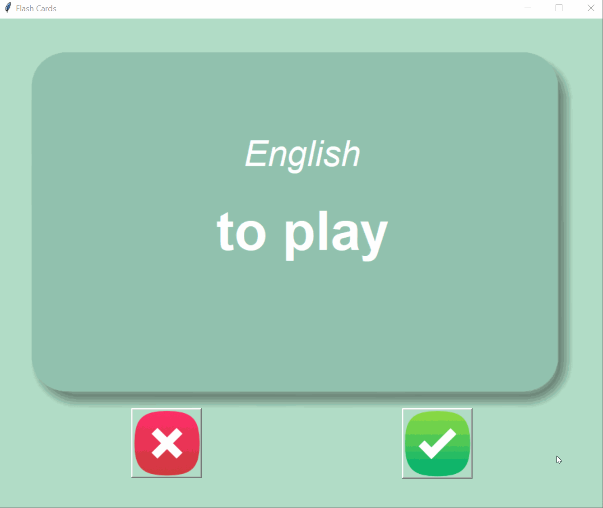

# 📚 Flash Card App

## 🎯 Overview
The **Flash Card App** is an interactive language-learning tool that helps users memorise French vocabulary. The app displays a French word, and after **3 seconds**, the card flips to reveal its **English translation**. Users can mark whether they **know** the word or **need to review it again**. The app ensures an efficient learning experience by saving unfamiliar words for further practice.

### 🌟 **Demo:**


## 🛠 Features
- 🏷 **French-to-English Flashcards** – Learn new words quickly.
- 🔄 **Automatic Card Flipping** – Reveals translation after 3 seconds.
- ✅ **Track Progress** – Saves unknown words for later revision.
- 💾 **Persistent Data** – Stores words in a file (`words_to_learn.csv`).
- 🎨 **Beautiful UI** – Uses `tkinter` for a clean, engaging interface.

## 📌 How It Works
1. **A random French word appears on a flashcard** 📖.
2. **After 3 seconds, the card flips**, revealing the English translation 🔄.
3. **You choose:**
   - ❌ **Don't know it?** Click the ❌ button – The word is saved for later practice.
   - ✅ **Know it?** Click the ✅ button – The word is removed from the study list.
4. **Repeat!** – Continue learning new words.

## 📝 Usage

### ▶️ **Running the App**
1. Ensure you have **Python** installed 🐍.
2. Navigate to the project folder 📂.
3. Run the following command:
   ```bash
   python main.py
   ```
4. Click the ❌ or ✅ button based on whether you know the word.

## 📁 Project Structure
```
flash_card_app/
├── main.py                  # Main program logic
├── data/
│   ├── french_words.csv      # Original word list
│   ├── words_to_learn.csv    # Words still to practice
├── images/
│   ├── card_front.png        # Flashcard front image
│   ├── card_back.png         # Flashcard back image
│   ├── wrong.png             # Incorrect button image
│   ├── right.png             # Correct button image
│   ├── flash_card.gif        # Demo GIF
```

## 📌 Key Features Explained

### 🃏 `next_card()`
- Displays a **random** French word.
- Resets the timer.
- Flips the card after **3 seconds**.

### 🔄 `flip_card()`
- Replaces the **French word** with its **English translation**.
- Updates the **background color**.

### ✅ `is_known()`
- Removes **learned words** from the study list.
- Saves remaining words in `words_to_learn.csv`.

## 🚀 Future Enhancements
🔹 Add **sound pronunciations** for each word 🔊.  
🔹 Implement **multiple language options** 🌍.  
🔹 Track user **learning progress with statistics** 📊.

## 🎉 Enjoy Learning!
The Flash Card App makes vocabulary learning **fun and effective**. Keep practicing and soon you’ll master all the words! 🚀💡