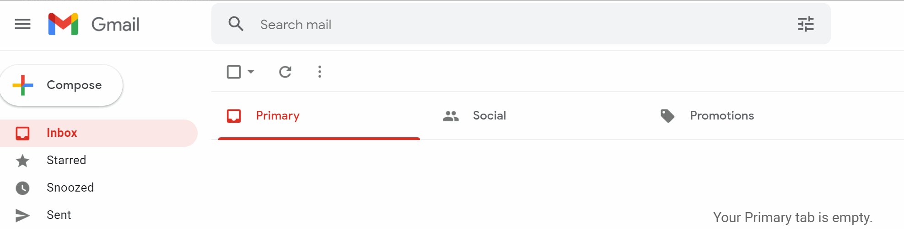

# 🎉 Automated Birthday Wisher 🎂

A Python script that **automatically sends personalised birthday wishes** via email! 🥳✨ 
This project reads a list of birthdays from a CSV file, selects a **random birthday wish template**, personalises it, and sends the email to the recipient. 

## 📌 Features
- ✅ **Automated Birthday Detection** – Sends wishes only on matching dates.
- 🎭 **Randomised Templates** – Uses one of three pre-written messages.
- 📧 **Email Integration** – Sends the message via SMTP (Outlook).
- 🔄 **Dynamic CSV Handling** – Easily update your birthday list.
- 🚨 **Error Handling** – Prevents crashes due to missing files.

## 🖥️ Demo
🎥 **See it in action!**



## 🚀 How It Works

1️⃣ **Stores birthday details in `birthdays.csv`** 📜

```csv
name,email,year,month,day
John Doe,john@example.com,1990,10,15
Jane Smith,jane@example.com,1985,12,20
```

2️⃣ **Selects a random message from `letter_templates/`** ✉️

Example of `letter_1.txt`:

```
Dear [NAME],

Wishing you a fantastic birthday filled with joy and laughter! 🎉

Best wishes,
Your Friend
```

3️⃣ **Personalises and sends the email** ✨📩

> ✅ If today matches a birthday in `birthdays.csv`, the script replaces `[NAME]` with the person's name and sends the email.

## 🏗️ Project Structure

```
🎂 Birthday Wisher/
├── main.py                  # Main script
├── birthdays.csv            # List of birthdays
├── letter_templates/        # Folder containing message templates
│   ├── letter_1.txt
│   ├── letter_2.txt
│   ├── letter_3.txt
├── images/                  # Demo GIFs and assets
│   ├── bday_wisher.gif
```

## ⚙️ How to Run

1️⃣ **Clone the repository** 🛠️
```bash
git clone https://github.com/your-repo/birthday-wisher.git
cd birthday-wisher
```

2️⃣ **Install dependencies** 📦
```bash
pip install pandas
```

3️⃣ **Set up your email credentials** ✉️
- Replace `MY_EMAIL` and `MY_PASSWORD` in `main.py` with your email login details.
- This project uses **Outlook SMTP** by default. If you’re using Gmail, Yahoo, etc., modify the SMTP settings.

4️⃣ **Run the script** ▶️
```bash
python main.py
```

## 🔒 Security Warning
⚠️ **Do not hardcode passwords in public repositories.** 
- Use **environment variables** or a **config file** for security.
- Consider using **OAuth for email authentication.**

## 🌟 Future Enhancements
✅ Add a **GUI interface** using Tkinter 🎨
✅ Enable **SMS notifications** via Twilio 📲
✅ Integrate with **Google Calendar API** 📅

## 🎉 Enjoy Automating Birthday Wishes! 🥳