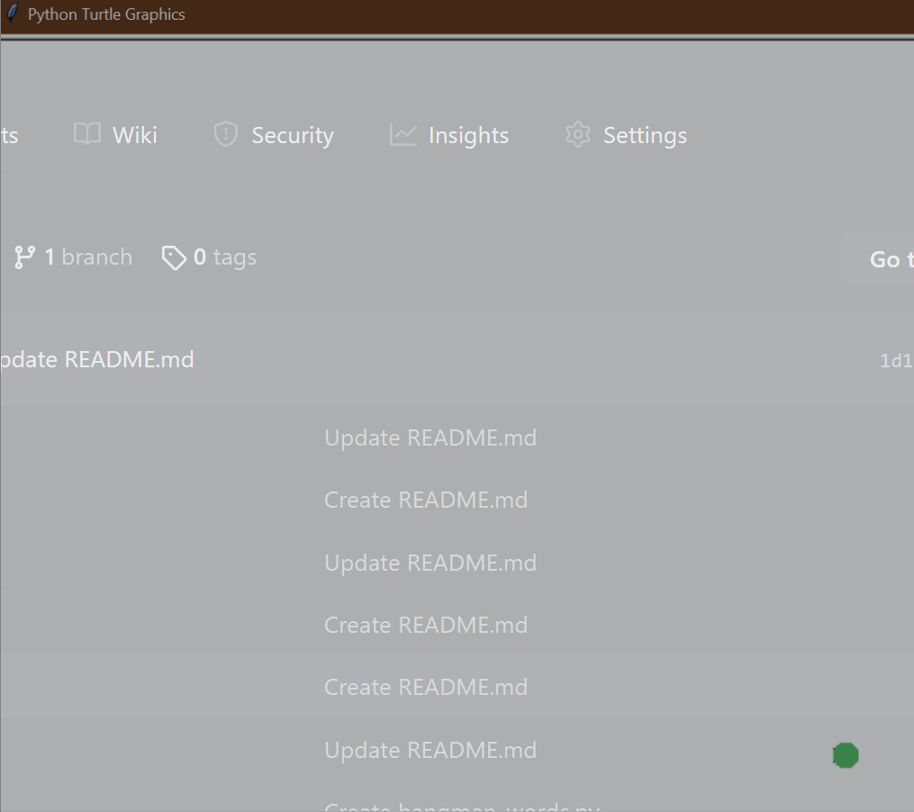

# 🎨 **Hirst Painting Generator** 🖌️  

## Overview  
The **Hirst Painting Generator** is a Python program that creates a **randomly colored dot painting**, inspired by the famous artist **Damien Hirst**. Using the `turtle` module, the program generates a **grid of colorful dots**, simulating Hirst's **pointillist** style.  

### 🌟 **Demo:**  
  

This project helps you:  
1. 🏗️ **Understand `turtle` graphics** – create digital art using Python.  
2. 🎨 **Learn about color manipulation** – work with RGB values.  
3. 🔄 **Use loops and functions** – improve **code structure** and **modularity**.  

## 🎯 **How It Works**  

1. **Turtle Setup 🐢**  
   - The `turtle` module is used to draw circles (**dots**).  
   - The pen is hidden and moves quickly for **efficient drawing**.  

2. **Random Colors 🎨**  
   - A predefined **color palette** is used to randomly select colors.  
   - The program picks colors from a list, simulating a real **Hirst painting**.  

3. **Grid Layout 📏**  
   - The dots are arranged in a **10 x 5 grid**.  
   - The turtle moves **left and right** across rows and shifts **up** to draw the next row.  

4. **Interactivity 🔄**  
   - The drawing remains on the screen **until clicked**, allowing you to view the masterpiece!  

## 📌 **How to Run**  

1. Open a terminal or command prompt. 💻  
2. Navigate to the folder containing the files. 📂  
3. Run the program using:  
   ```bash
   python main.py
   ```  
4. Watch as your **Hirst-style painting** comes to life! 🎨  

## 📝 **Example Output**  

```plaintext
[✓] Turtle starts painting...
[✓] Drawing a colorful 10x5 grid...
[✓] Generating random colors for each dot...
[✓] Hirst painting completed! 🎨
```

## 🏗️ **Project Structure**  

This project is structured using **functions** for better readability and efficiency:  

### `main.py`  
- **Main program file**  
- Handles **Turtle setup, dot placement, and grid movement**  

### `images/painting.gif`  
- **Demonstration GIF**  
- Shows the **final painting** in action!  

## 📁 **Folder Structure**  

```
hirst_painting/
├── main.py             # Main program logic
└── images/
    ├── painting.gif    # Demo GIF of painting process
```

## 🚀 **Key Features**  

1. **🎨 Artistic Grid Layout** – Creates a **10 x 5** colored dot painting.  
2. **🎲 Random Colors** – Uses a **preset color palette** for vibrant effects.  
3. **🐢 Turtle Graphics** – Utilizes **Python's built-in `turtle` module**.  
4. **⚡ Fast Execution** – Uses `speed("fastest")` to draw efficiently.  
5. **👀 Interactive** – The painting stays on screen **until clicked**.  

## 🌟 **Additional Notes**  

- 🛠️ Modify the **color list** to change the painting’s appearance.  
- 🎨 Adjust the **grid size** (rows & columns) to customize your artwork.  
- 🔥 Try experimenting with **different dot sizes** or **brush shapes**!  

**🎉 Enjoy your Hirst-style painting! Have fun creating digital art! 🖌️🎨**  