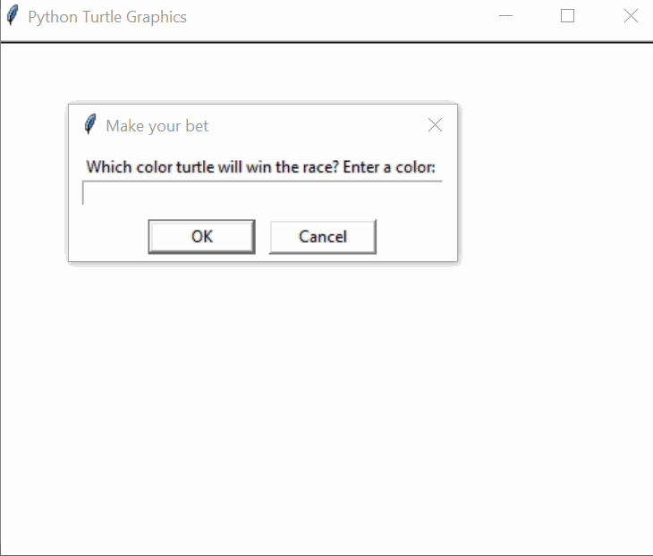

# 🏁 **Turtle Race Game** 🐢🎉  

## Overview  
The **Turtle Race Game** is a fun **Python-based racing simulation** where six colorful turtles compete in a race! Players can **place a bet** on which turtle will win before the race begins. The turtles move at **random speeds**, making every race exciting and unpredictable! 🎲  

### 🌟 **Demo:**  
  

This project helps you:  
1. 🏗 **Learn the `turtle` module** – draw, move objects, and interact with users.  
2. 🎮 **Build interactive Python games** – use user input and event-driven programming.  
3. 🔄 **Work with loops and randomness** – simulate dynamic game logic.  

## 🎯 **How It Works**  

1. **Start the Game** 🎬  
   - The program opens a race screen and **prompts you to bet** on a turtle color.  

2. **Meet the Competitors** 🏁  
   - Six **colorful turtles** (**red, orange, yellow, green, blue, purple**) are lined up at the starting position.  

3. **The Race Begins!** 🏎️  
   - Each turtle **moves forward randomly** to simulate an unpredictable race.  
   - The first turtle to cross the finish line **wins the race**.  

4. **Check the Results** 🏆  
   - If your chosen turtle wins, you **win the bet**! 🎉  
   - Otherwise, you get a **friendly message** and can try again.  

## 📌 **How to Run**  

1. Open a terminal or command prompt. 💻  
2. Navigate to the folder containing the files. 📂  
3. Run the program using:  
   ```bash
   python main.py
   ```  
4. Place your bet and **enjoy the race!** 🏁  

## 📝 **Example Gameplay**  

```plaintext
Which color turtle will win the race? Enter a color: blue
🎲 The race begins!
🎉 You've won! The blue turtle is the winner! 🏆
```

```plaintext
Which color turtle will win the race? Enter a color: red
😞 You've lost! The yellow turtle is the winner.
```

## 🏗️ **Project Structure**  

This project is structured using **functions and loops** for better readability:  

### `main.py`  
- **Main program file**  
- Handles **Turtle setup, race logic, and user interaction**  

### `images/race.gif`  
- **Demonstration GIF**  
- Shows the **turtle race in action!**  

## 📁 **Folder Structure**  

```
turtle_race/
├── main.py            # Main program logic
└── images/
    ├── race.gif       # Demo GIF of the turtle race
```

## 🚀 **Key Features**  

1. **🏁 Competitive Racing** – Six **colorful turtles** compete in a **randomized race**.  
2. **🎲 Betting System** – Players can bet on a turtle **before the race starts**.  
3. **🐢 Turtle Graphics** – Uses the `turtle` module for **interactive animations**.  
4. **🔄 Randomized Movement** – Each turtle moves at a **random speed** for an **unpredictable winner**.  
5. **⚡ Fast Execution** – Runs smoothly with real-time movement.  

## 🌟 **Additional Notes**  

- 🎨 Modify the `colors` list to **add more turtles**.  
- 🏗 Experiment with different **track lengths** or **obstacles**.  
- 🔥 Challenge yourself to **implement a multiplayer betting system**!  

**🎉 Enjoy the Turtle Race! Place your bets and may the fastest turtle win! 🐢🏁🔥**  