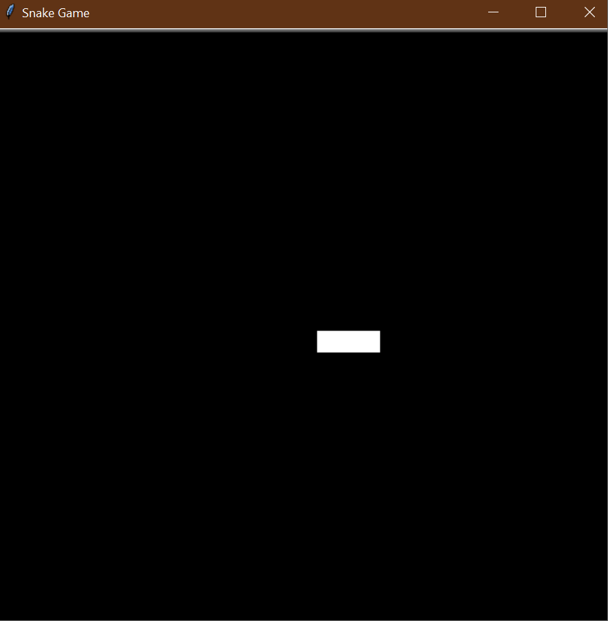

# 🐍 **Snake Game** 🎮  

## Overview  
The **Snake Game** is a classic arcade game where a snake moves across the screen, and the player controls its direction. This implementation is built using **Python's `turtle` module**, featuring smooth movement and interactive controls.  

### 🌟 **Demo:**  
  

This project helps you:  
1. 🎮 **Learn game development basics** – movement, event handling, and game loops.  
2. 🏗️ **Understand Object-Oriented Programming (OOP)** – modular code with a `Snake` class.  
3. 🐢 **Use the `turtle` module** – create interactive graphics in Python.  

## 🎯 **How It Works**  

1. **Start the Game** 🎬  
   - A white **three-segment snake** appears on the screen.  
   - The game runs in a **loop**, updating the snake’s position **every 0.1 seconds**.  

2. **Control the Snake** ⬆️⬇️⬅️➡️  
   - Use the **arrow keys** to move the snake in different directions.  
   - The snake **cannot move in the opposite direction immediately**.  

3. **Exit the Game** 🔚  
   - Press **`Escape`** to gracefully **stop the game**.  

## 📌 **How to Run**  

1. Open a terminal or command prompt. 💻  
2. Navigate to the folder containing the files. 📂  
3. Run the program using:  
   ```bash
   python main.py
   ```  
4. Control the snake using **arrow keys**, and press `Escape` to exit.  

## 📝 **Example Gameplay**  

```plaintext
🐍 The snake moves smoothly across the screen.
⬆️ Press Up to move up.
⬇️ Press Down to move down.
⬅️ Press Left to move left.
➡️ Press Right to move right.
⏹ Press Escape to exit the game.
```

## 🏗️ **Project Structure**  

This project is structured using **Object-Oriented Programming (OOP)** for modularity:  

### `main.py`  
- **Handles game logic**  
- Initialises the `Screen` and listens for user input  
- Runs the **game loop**  

### `snake.py`  
- **Defines the `Snake` class**  
- Handles **movement and direction changes**  

### `images/snake.gif`  
- **Demonstration GIF**  
- Shows the **game in action!**  

## 📁 **Folder Structure**  

```
snake_game/
├── main.py             # Main program logic
├── snake.py            # Snake movement and controls
└── images/
    ├── snake.gif       # Demo GIF of the snake game
```

## 🚀 **Key Features**  

1. **🐍 Smooth Snake Movement** – The snake moves forward automatically.  
2. **🎮 Interactive Controls** – Use the **arrow keys** to change direction.  
3. **🛑 Safe Movement Handling** – Prevents reversing into itself.  
4. **🐢 `Turtle` Graphics** – Uses Python’s built-in **turtle module** for animation.  
5. **🔄 Continuous Game Loop** – Runs until the player **exits the game**.  

## 🌟 **Additional Notes**  

- 🔥 Try adding **collision detection** to restart the game if the snake **hits a wall**!  
- 🎨 Modify `snake.py` to **change the snake's color** or **size**.  
- 🚀 Expand the game by **adding food and growth mechanics**!  

**🎉 Enjoy playing Snake! Can you master the movement? 🐍🏆**  